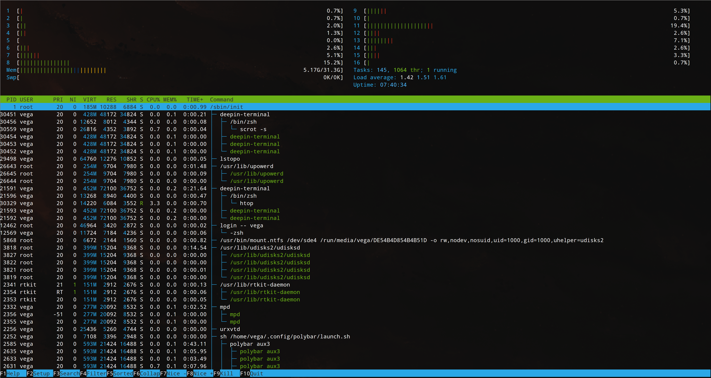
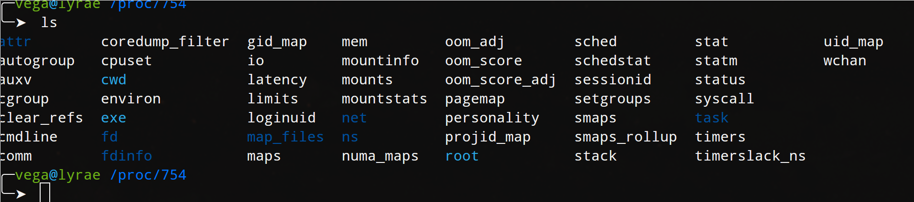
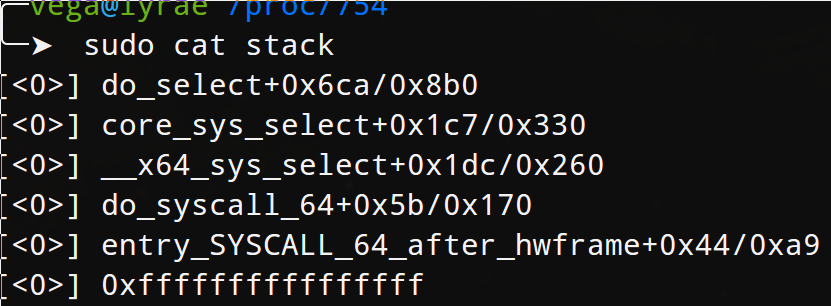
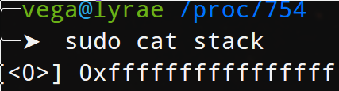

   * [Preface](#preface)
   * [Ⅰ - Community](#ⅰ---community)
   * [Ⅱ - Learn how to learn](#ⅱ---learn-how-to-learn)
   * [Chapter 1 - The first goal](#chapter-1---the-first-goal)
   * [Chapter 2 - Let's do it then, Installing Arch Linux](#chapter-2---lets-do-it-then-installing-arch-linux)
      * [So Why Did I do all of that exactly?](#so-why-did-i-do-all-of-that-exactly)
      * [Okay, so what?](#okay-so-what)
   * [Chapter 3 - Into the hardware](#chapter-3---into-the-hardware)
      * [The CPU](#the-cpu)
         * [Clock Speed](#clock-speed)
         * [Microcode](#microcode)
         * [Cache](#cache)
      * [RAM](#ram)
      * [The Motherboard](#the-motherboard)
         * [Chipset](#chipset)
         * [Expansion slots](#expansion-slots)
         * [ROM/BIOS/UEFI](#rombiosuefi)
         * [VRM](#vrm)
      * [Graphics Card (or integrated graphics)](#graphics-card-or-integrated-graphics)
      * [Storage](#storage)
         * [HDD](#hdd)
         * [SSD](#ssd)
         * [Cloud Storage (Some one elses' drives)](#cloud-storage-some-one-elses-drives)
         * [Portable](#portable)
         * [The Past](#the-past)
      * [Network Interfaces](#network-interfaces)
         * [Ethernet](#ethernet)
         * [WiFi](#wifi)
         * [High Bandwith](#high-bandwith)
         * [The Future](#the-future)
         * [The Past](#the-past-1)
      * [Power Supply](#power-supply)
      * [Cooling](#cooling)
      * [Peripherals](#peripherals)
         * [Keyborads](#keyborads)
         * [Legacy Connections](#legacy-connections)
      * [How to know what to buy](#how-to-know-what-to-buy)
   * [Chapter 4 - Back to the Root of Things](#chapter-4---back-to-the-root-of-things)
      * [Permissions](#permissions)
      * [/dev, the devices folder](#dev-the-devices-folder)
         * [TTY's, these are important:](#ttys-these-are-important)
      * [/proc, the fake file system](#proc-the-fake-file-system)
      * [/bin, /sbin, /lib, /lib64](#bin-sbin-lib-lib64)
      * [/usr](#usr)
      * [/boot](#boot)
      * [/etc](#etc)
      * [/home, /mnt, /run](#home-mnt-run)
      * [Users and Groups](#users-and-groups)
      * [Drivers](#drivers)
      * [File systems](#file-systems)
      * [Processes and Memory](#processes-and-memory)
      * [System Calls](#system-calls)
      * [Kernel Parameters](#kernel-parameters)
      * [SystemD and alternatives](#systemd-and-alternatives)
      * [Schedulers](#schedulers)
      * [Dbus](#dbus)
   * [Chapter 5 - Resistance, Capacitance, and Inductance](#chapter-5---resistance-capacitance-and-inductance)
      * [The Tools of the Trade](#the-tools-of-the-trade)
         * [The Multimeter](#the-multimeter)
            * [Resistance and the OHM meter](#resistance-and-the-ohm-meter)
            * [Voltage, Ground, and the Volt Meter](#voltage-ground-and-the-volt-meter)
            * [Current and the Ammeter](#current-and-the-ammeter)
            * [Continuity Tester](#continuity-tester)
         * [The Lab Power Supply](#the-lab-power-supply)
         * [The Frequnecy or Waveform Generator](#the-frequnecy-or-waveform-generator)
         * [The Oscilloscope](#the-oscilloscope)
         * [The Logic Analyzer](#the-logic-analyzer)
      * [Software Simulation](#software-simulation)
      * [OHM's law, Nodal &amp; Mesh Analysis, Superposition, Thevanins](#ohms-law-nodal--mesh-analysis-superposition-thevanins)
      * [Resistors](#resistors)
      * [Capacitors](#capacitors)
      * [Inductors](#inductors)
      * [Filters](#filters)
      * [Decibels](#decibels)
      * [Further Reading](#further-reading)
   * [Chapter 6 - Let's work on how we work](#chapter-6---lets-work-on-how-we-work)
      * [The Terminal](#the-terminal)
      * [Heads up,](#heads-up)
      * [Code editors](#code-editors)
      * [The Desktop Envrioment](#the-desktop-envrioment)
      * [The Physical Enviroment &amp; Hardware](#the-physical-enviroment--hardware)
      * [Various Programs:](#various-programs)
   * [Chapter 7 - Let's write some python](#chapter-7---lets-write-some-python)
      * [The building blocks of programming](#the-building-blocks-of-programming)
      * [Common methods used](#common-methods-used)
      * [Some simple programs](#some-simple-programs)
         * [Hello World](#hello-world)
         * [Even or Odd, prime,](#even-or-odd-prime)
         * [Calculating sine and pi](#calculating-sine-and-pi)
         * [Sorting a list](#sorting-a-list)
         * [Palindromes](#palindromes)
         * [Cypher](#cypher)
      * [Making a full project](#making-a-full-project)
         * [Part 1, Starting easy](#part-1-starting-easy)
      * [More advanced topics](#more-advanced-topics)
   * [Chapter 8 - Low Level Programming](#chapter-8---low-level-programming)
      * [Some simple programs, in C  ](#some-simple-programs-in-c)
         * [Hello World](#hello-world-1)
         * [Even or Odd, prime,](#even-or-odd-prime-1)
         * [Calculating sine and pi](#calculating-sine-and-pi-1)
         * [Sorting a list](#sorting-a-list-1)
         * [Palindromes](#palindromes-1)
         * [Cypher](#cypher-1)
         * [Part 2, Going Deeper](#part-2-going-deeper)
         * [What are we going to do?](#what-are-we-going-to-do)
         * [Tools to use](#tools-to-use)
         * [Pseudo code](#pseudo-code)
         * [Writing it](#writing-it)
         * [Debugging it](#debugging-it)
         * [Analyzing the Assembly](#analyzing-the-assembly)
         * [Patching it](#patching-it)
      * [C, C  , Rust, Go, ?](#c-c-rust-go-)
      * [Where to get more pracice with low level programming](#where-to-get-more-pracice-with-low-level-programming)
   * [Chapter 9 - Finishing up the project](#chapter-9---finishing-up-the-project)
      * [Part 3, more advanced high level](#part-3-more-advanced-high-level)
      * [Part 4, getting our toes wet with embeded systems](#part-4-getting-our-toes-wet-with-embeded-systems)
   * [Chapter 10 - Networking](#chapter-10---networking)
      * [A typical network](#a-typical-network)
      * [The physical Layer](#the-physical-layer)
         * [Coax, Fiber](#coax-fiber)
         * [Wireless](#wireless)
         * [Hubs, Repeaters](#hubs-repeaters)
      * [Data Link](#data-link)
         * [Ethernet](#ethernet-1)
         * [PPP](#ppp)
         * [Switch](#switch)
         * [Bridge](#bridge)
         * [Frames](#frames)
      * [Network](#network)
         * [Packets](#packets)
         * [IPV4, IPV6](#ipv4-ipv6)
         * [MAC](#mac)
         * [ICMP, IGMP](#icmp-igmp)
      * [Transport](#transport)
         * [TCP](#tcp)
         * [UDP](#udp)
      * [Session](#session)
         * [Authentication](#authentication)
         * [Sockets](#sockets)
         * [API's](#apis)
      * [Presentation](#presentation)
         * [Common Protocols](#common-protocols)
      * [Application](#application)
         * [HTTP](#http)
         * [FTP](#ftp)
         * [DNS](#dns)
         * [SSH](#ssh)
         * [IRC](#irc)
         * [EMail](#email)
      * [Time](#time)
      * [VPNs](#vpns)
      * [Networking Tools](#networking-tools)
         * [Etherape](#etherape)
         * [Wireshark](#wireshark)
         * [Nmap](#nmap)
      * [Really weird Networking, because why not!](#really-weird-networking-because-why-not)
   * [Chapter 11 - High Level Overview of Math, Physics, and Chemistry (Sorry...)](#chapter-11---high-level-overview-of-math-physics-and-chemistry-sorry)
      * [Ⅰ - Math](#ⅰ---math)
         * [1 - Algebra](#1---algebra)
         * [2 - Discrete Math](#2---discrete-math)
         * [3 - Trig](#3---trig)
         * [4 - Calculus](#4---calculus)
         * [5 - Differential Equations](#5---differential-equations)
         * [6 - Matrix Theory](#6---matrix-theory)
      * [Ⅱ - Physics](#ⅱ---physics)
      * [Ⅲ - Chem](#ⅲ---chem)
   * [Chapter 12 - Diodes,  Transistors, and Integrated Circuits](#chapter-12---diodes--transistors-and-integrated-circuits)
      * [Transformers, Variacs](#transformers-variacs)
      * [Diodes, the one way road](#diodes-the-one-way-road)
         * [Diode Logic](#diode-logic)
      * [Transistors](#transistors)
         * [PNP V NPN](#pnp-v-npn)
         * [IGBT, Mosfets?](#igbt-mosfets)
      * [Integrated Circuits](#integrated-circuits)
         * [555, OpAmp, 74-Series Logic](#555-opamp-74-series-logic)
      * [Optical Electronics](#optical-electronics)
      * [Crystal Oscilators](#crystal-oscilators)
      * [PWM](#pwm)
      * [ADC/DAC](#adcdac)
      * [Active Filters](#active-filters)
      * [Audio Devices](#audio-devices)
   * [Relating AC and Music](#relating-ac-and-music)
      * [Continued Reading:](#continued-reading)
   * [Chapter 13 - Embedded Systems](#chapter-13---embedded-systems)
      * [What is an Embedded System?](#what-is-an-embedded-system)
      * [PWM, SPI, I2C, What's going on?!](#pwm-spi-i2c-whats-going-on)
      * [Playing around - Hello World and blink](#playing-around---hello-world-and-blink)
      * [Making an Embeded System project - 1 - Humidity Sensor](#making-an-embeded-system-project---1---humidity-sensor)
      * [Making an Embeded System project - 2 - MIDI Controller (with piezzo)](#making-an-embeded-system-project---2---midi-controller-with-piezzo)
      * [Making an Embeded System project - 3 - Stepper Motor Music](#making-an-embeded-system-project---3---stepper-motor-music)
   * [Chapter 14 - Discrete Math and Algorithms](#chapter-14---discrete-math-and-algorithms)
      * [Discrete Math](#discrete-math)
      * [Complexity analsis](#complexity-analsis)
      * [Brute Force](#brute-force)
      * [Data structures](#data-structures)
      * [Practice](#practice)
   * [Chapter 15 - Writing a larger program](#chapter-15---writing-a-larger-program)
      * [Object Oriented Programming](#object-oriented-programming)
      * [Planning](#planning)
      * [Software Engineering](#software-engineering)
   * [Chapter 16 - Servers!](#chapter-16---servers)
      * [Why build a server](#why-build-a-server)
      * [DIY Networking: Routing, firewall, etc.](#diy-networking-routing-firewall-etc)
      * [Web hosting](#web-hosting)
      * [File Storage, Sharing, Backups](#file-storage-sharing-backups)
      * [Remote Access](#remote-access)
      * [Git, Games, and Glory](#git-games-and-glory)
      * [Virtual Machines](#virtual-machines)
      * [Containerization](#containerization)
      * [Fault tollerence](#fault-tollerence)
   * [Chapter 17 - Databases](#chapter-17---databases)
   * [Chapter 18 - Debugging, Automated Building and Testing](#chapter-18---debugging-automated-building-and-testing)
      * [Automated Building](#automated-building)
      * [Debugging](#debugging)
         * [Software Debugging](#software-debugging)
         * [Hardware Dubugging](#hardware-dubugging)
      * [Testing](#testing)
         * [Software Testing](#software-testing)
         * [Hardware Testing](#hardware-testing)
   * [Chapter 19 - Compilers and Assemblers](#chapter-19---compilers-and-assemblers)
      * [Making an interpreted language](#making-an-interpreted-language)
      * [Making a compiled language](#making-a-compiled-language)
      * [Continued Reading](#continued-reading-1)
   * [Chapter 20 - Automated Building and Testing](#chapter-20---automated-building-and-testing)
   * [Chapter 21 - Exploitation](#chapter-21---exploitation)
      * [Types of exploits](#types-of-exploits)
         * [Software](#software)
            * [Networking](#networking)
         * [Hardware](#hardware)
         * [Social Engineering](#social-engineering)
         * [Physical security](#physical-security)
      * [Malware](#malware)
      * [Tools of the trade](#tools-of-the-trade)
      * [Getting some practice](#getting-some-practice)
         * [CTF-Time](#ctf-time)
         * [PWNie Island](#pwnie-island)
      * [Where to learn even more:](#where-to-learn-even-more)
   * [Chapter 22 - Security](#chapter-22---security)
   * [Chapter 23 - Open Source, Licences, and Copyright](#chapter-23---open-source-licences-and-copyright)
   * [Chapter 24 - Let's make our own PCB](#chapter-24---lets-make-our-own-pcb)
   * [Chapter 25 - We've got cores, let's use em'](#chapter-25---weve-got-cores-lets-use-em)
   * [Chapter 26 - Graphical Programming](#chapter-26---graphical-programming)
   * [Chapter 27 - (((())(()((()(()))))))](#chapter-27---)
   * [Chapter 28 - Let's try out programmable logic](#chapter-28---lets-try-out-programmable-logic)
   * [Chapter 29 - Let's make our own CPU](#chapter-29---lets-make-our-own-cpu)
   * [Chapter 30 - 3D printing, cases, and making real things](#chapter-30---3d-printing-cases-and-making-real-things)
   * [Chapter 31 - Fine, I'll talk about AI](#chapter-31---fine-ill-talk-about-ai)
   * [Wrapping up - Where to go from here](#wrapping-up---where-to-go-from-here)
      * [Integrating other interests](#integrating-other-interests)
      * [Projects to work on](#projects-to-work-on)
      * [Contributing to Open Source](#contributing-to-open-source)
   * [Appendix A- Using the Linux Shell](#appendix-a--using-the-linux-shell)
      * [The Basic Commands](#the-basic-commands)
      * [Tab Completion and faster navigation](#tab-completion-and-faster-navigation)
      * [I/O redirection](#io-redirection)
      * [Wild Cards &amp; Regex](#wild-cards--regex)
      * [Job Control](#job-control)
      * [Shortcuts](#shortcuts)
      * [Aliases and customization](#aliases-and-customization)
      * [Shell Scripting](#shell-scripting)
      * [Alternative Shells](#alternative-shells)
      * [Alternative commands](#alternative-commands)
      * [Useful Non-Stock CLI Tools](#useful-non-stock-cli-tools)
      * [Common Graphical Linux Utils](#common-graphical-linux-utils)
      * [Graphical Enviroments  ](#graphical-enviroments)
      * [Free Graphical Utilities](#free-graphical-utilities)
         * [Office &amp; Daily](#office--daily)
         * [A/V](#av)
         * [Social](#social)
         * [Programming](#programming)
         * [Engineering](#engineering)
         * [System](#system)
         * [IRL](#irl)
         * [Other](#other)
      * [Paid Graphical Utilities](#paid-graphical-utilities)
      * [Self hosted / Services](#self-hosted--services)
   * [Appendix B - Common electrical parts (appearence and numbers)](#appendix-b---common-electrical-parts-appearence-and-numbers)
   * [Appendix C - BOM](#appendix-c---bom)
      * [Getting things for cheap](#getting-things-for-cheap)
   * [Appendix D - The Politics of it all](#appendix-d---the-politics-of-it-all)
   * [Appendix E - Things to avoid](#appendix-e---things-to-avoid)
   * [Other Great Resources](#other-great-resources)
      * [Learning Linux](#learning-linux)
      * [Youtube](#youtube)
      * [Podcasts](#podcasts)
      * [Github info pages](#github-info-pages)
      * [Books](#books)
      * [Non-Technical](#non-technical)
    DELIMITEDFORTOC

# Preface

Hey there.

My name is Vega. I know there are plenty of tutorials and ways to learn online be it on YouTube, SkillShare, or online classes provided for free by various universities. The difference here is there is no bullshit, no babysitting, and lots of bias as a result of personal experience. My views of things like what programming languages are bad or what hardware you should buy to learn on will be expressed directly and bluntly. This isn't to say I won't explain my reasoning, just that I'm not going to be apologetic when I say javascript, php, java, arduino, and Windows 10 are trash - though I will still likely talk about all of these things.

I by no means expect you to share my same biases, in fact, I hope you do not and that at one point or another we can discuss why you think I am wrong, as that is the only way I can learn.

With that said, what is this exactly?

This is a guide for understanding the power the humble electron has in our lives. Electricity, digital logic, code, computers, embedded systems, these things are all around us every second of everyday. As I type this I'm wearing a smart watch, I have a smart phone in my pocket, and I'm directly using a desktop computer. Each of these devices contains dozens of smaller computers, power supplies, wireless interfaces, etc. My goal with this is to teach you how all of this works and how to use it from transistors to high level code to useful user applications.

I will be assuming you are of reasonable technical ability already- that is the concept of how to proficiently use most types of software, navigation of a file manager, etc-  furthermore, I will avoid going into high level math, chemistry, and physics as much as is practical- mostly because knowing these things is typically not actually useful in the daily life of someone who works on any of this beyond those that are doing cutting edge research or are planning to teach, in which case you should actually go to college instead of reading this. For everyone else, welcome. This is the document which can save you going to college and taking classes full of useless information you will inevitably forget and for which employers don't care about to begin with.

Following along will require a few things. The first of which is dedication and time. If you don't have the desire to put in at least a little bit of work there is simply no way I can help, that said, if you're reading this instead of watching Netflix I believe that's already proof enough you want to learn. Next is hardware and software, namely you'll be needing a few development boards and linux, but I'll get into those with time; however, for convince, everything referenced to be downloaded or physical items to be purchased are all listed in Appendix C

Before we get started there are a few things I recomend reading and watching first. These should give you a bit of an overview of some of the things that will be covered to give you at least a tiny bit of familiarity as each concept comes up.

---

I recomend this overview of the topics covered in CS: [Map of Computer Science](https://www.youtube.com/watch?v=SzJ46YA_RaA) by Dominic Walliman

Also by Walliman, a video on [How to Read Math](https://www.youtube.com/watch?v=Kp2bYWRQylk) and the cheat sheet from it:

[How To Read Math, Cheat Sheet](https://live.staticflickr.com/4671/40544016221_61cf8944d1_h.jpg)

# Ⅰ - Community

The only way to be successful in this journey is to make friends along the way. Some of this get's really, really difficult. You will get stuck. Having friends to help makes it possible. Find group chats on telegram, join IRC channels, get on some forums, and ask questions on Reddit. Working with people is a lot more fun and you'll learn so much more.

Beyond that, having inspiration each day can be a huge booster shot to your motivation and creativity. Some sites I use nearly daily to finding good new material are:

https://news.ycombinator.com/

https://hackaday.io/ | www.hackster.io/

https://www.bleepingcomputer.com/

https://www.humanreadablemag.com/morningcupofcoding

While much less active, I've found some of these to have great information as well

https://n-o-d-e.net/index.html

https://www.alchemistowl.org/pocorgtfo/

https://www.youtube.com/user/DEFCONConference

Oh, and to mention it now


Yes, there is always a relevant XKCD, and yes, you will always feel like everyone knows more than you. Don't stress about asking stupid questions:

> Frequently in chats, whether telegram, IRC, slack, or discord, someone says something like this:
>
> <AnonOtter> Anyone know rust? Having an issue.
>
> How that question is often read:
>
> <AnonOtter> Can someone to commit to being able to solve my problem with rust, spending as much time as necessary, without them even knowing what the actual problem is or if it's even a rust problem?
>
> Hopefully it's clear why questions like this rarely result in direct answers.
>
> - There are very few people who could be called experts in every facet of whatever is being asked
> - Imposter syndrome is common
> - Most people won't write that blank check for time/help commitment
>
> Instead, share:
>
> - The goal - "Trying to query for a list of tags on a post" - See [The XY Problem](http://xyproblem.info/)
> - The problem - "I'm getting back these results"
> - The expectation - "but it should be these results"
> - Any context or previous research you've done
> - If possible, a simplified example. 3v4l for php, jsfiddle for html/js/css, etc. are great, otherwise a paste site.
> - What you've already tried
>
> This allows anyone there to try to help. Many skills transfer well to other languages or platforms. At minimum, you might get an idea for something you haven't tried yet. Sometimes you'll even solve your own problem while narrowing down the simplest possible test case.
>
> Oh, and don't snark at well-intentioned answers. It's rude and discourages participation.

--from https://bad.pet/q/

The technical community can be ruthless with it comes to expecting people to have 'basic' knowledge sometimes, but don't let it get to you. I do want to provide some general ideas that, while not universally, are generally shared among the engineering and sounding community:

Ⅰ - Any good solution is fast, easy to understand, and above all elegant.

Ⅱ - Any task which can be automated should be - if a computer can do it faster than you than you shouldn't do it by hand

Ⅲ - Any problem that has been solved in a way that satisfies the above two rules should be looked at for reuse before reinventing the wheel

Ⅳ - Any question which has already been answered should not be left to a human to answer again.

Ⅴ- All knowledge should be free†

† within practicality, trade secrets are obviously a thing, and I'm not crazy. I mean like publicly funded research and what not. While the specifics of this rule vary amongst engineering types it is generally a core belief.

On the note of point Ⅲ...


Though the one I was stressing here was really Ⅳ, you should **always** check the internet before asking in chat. It's not that we're being rude, it's just a matter of courtousy. If you're unsure of the answer or it's validity in your case, by all means ask, but asking good questions, and only when necessary, will quickly help you make friends in chat much faster. Note, there is one exception: if chat is currently talking about something that you know don't know about and it's already relevent to the conversation, it's totally reasonable to interject and ask for a superquick primer on what's going on or a relevent link. This may seem obvious, but a good number of technical chats die because of exectaly the afforementioned problems. (or gatekeeping, but that's a whole different matter...) so please don't ask things a search engine can already answer (but don't feel bad asking a question when the all mighty Google can't)

TLDR: RTFM & STFW http://www.catb.org/esr/faqs/smart-questions.html#rtfm

**Finally, **and I can't stress this enough, I think balancing your creativity among other interests and looking for ties between them can lead to more good than any of thing mentioned above. I enjoy playing music, reading, and writing, so I find inspiration in these media. There are countless electrical hardware and software tools that use hands on programming when playing music. In books I find ideas for what an author may have thought only futuristic when written. I never know when my mind will strike similar gold when writing for myself. Find a hobby and bend it to this as you go along. Like photography? Lean about the internals of a camera. Like cars? Look up how the ODB2 interface actually works. Nothing is magic and the internet will likely have answers and give you ways to apply this knowledge that you care about.

In general I've found site specific forms and reddit to be the best platforms for most things, with some others finding their main following in other places though. For example I'm in a large technical chat group with Furries on Telegram and some open source tools still thrive on IRC.

# Ⅱ - Learn how to learn

I'm going to keep this short and sweet: Nobody learns (effectively) by being shown what to do. You can watch hundreds of hours of people playing guitar, even explaining how they do it, but you wont be able to randomly pick one up and play if you never have before. Furthermore, as much as you can learn from direct reading and instruction, it has it's place and limits. This guide, book, whatever you want to call it, was never meant to be followed like instructions. You should go out on your own and poke around as you go though. If you find a topic dull, don't read it as in depth. I don't want you wasting your time. Break things. Make mistakes. By the end of this you should know what a burning resistor smells like, what it's like to try to recover a slightly busted linux system, and how it feels when a bug has been eluding you for hours and your code still doesn't work. The only way that happens (unless I made a mistake which is also probable) is if you try ideas when you get them and do more than what's in this book.

This struggle is part of learning and proof that you're doing well. These experinaces should teach you things in their own right. The smell of burning elcetronics may help you diagnose a future circuit, the lesson to not fall into a pit of technical debt may help when a bug has engulfed your code, and the late night of terminal only based work as you try to get your computer working again will teach you more than this book ever can.

To quote someone much smarted than myself:


Finally, there's

> **Cunningham's Law** states "the best way to get the right answer on the internet is not to ask a question; it's to post the wrong answer." ([source](https://meta.wikimedia.org/wiki/Cunningham's_Law))

but note, you should keep in mind the standard warning that comes when first using `sudo` if you plan to use Cunningham's law to your advantage:

> We trust you have received the usual lecture from the local System
> Administrator. It usually boils down to these three things:
>
>     #1) Respect the privacy of others.
>     #2) Think before you type.
>     #3) With great power comes great responsibility.

# Chapter 1 - The first goal

Every journey needs a place to start, and while many may like to start slow I think a head first approach is best. So that's exactly what we're gonna do. The very first thing we're going to do is install a new operating system (OS) on your computer.

> Quote boxes like these will provide notes throughout the guide, often definitonal. If you already understand everything prior to each box, you can probably safely ignore it, though it will occasionally be used for actual quotes as seen prior to this
>
> Operating System: According to wikipedia, "An operating system (OS) is system software that manages computer hardware and software resources and provides common services for computer programs." put simply on your hardware this is probably Windows or Mac OS, and it's what everything else runs ontop of

You should really make a full backup of your computer before doing this, as installing an operating system can rather easily lead to lost files when you reformat or reparation your drive or when you change settings in the BIOS/UEFI and swap the bootloader.

> Reformat: the bulk storage device in your computer, the hard drive or solid state drive, needs to be formated before use, this sets up a way for the computer and the drive to agree on a base system for how partitions should be setup, speaking of which:
>
> Repartion: To partition a drive means to take all the space on the hard drive and divide it into partitions onto which you can put a file system. Most operating systems like Windows, Mac OsX, or Linux, use multiple partitions for the operating system to function. Usually a filesystem is set up on each of these partitions, in windows this is typically NTFS for Hard Drives and FAT32 for flash drives, these file systems are effectively the index for all the files you'll put on the drive, and as you may have multiple partitions and multiple file systems on one disk each will have an index to match. As complicated as it may seem this means the partition table can be seen as an 'index of inecies' of sorts. Don't worry if that's a lot to understand right now, we'll come back to this topic in depth.
> BIOS/UEFI: The Binary Input Output System or Unified Extensible Firmware Interface is the thing you see before you computer loads the operating system, usually prompting to press delete or f2 to change settings. This is the system that is used to change the way all the components around the computer talk to one another and at what speed.
> Bootloader: The bootloader sits at a special place on the hard drive selected for boot in the UEFI or BIOS, and is what the computer uses to load the full operating system, most will let you chose what operating system you want to boot if you have multiple installed on you computer at once

 Alright, so why do I want you to install a new OS to begin with? Well, the OS we'll be using is called Linux. Linux is actually what powers both android and chomeOS, and is a common descendant of the same system as Mac OsX as well as almost all of the servers on the internet from massive website like Facebook and Google to small Minecraft servers you can rent online to play with friends. What's cool about Linux is it lets you get much closer to the hardware and see what's going on, and it just generally makes writing code much easier. Furthermore, it's super easy to set up an amazing development environment in Linux for getting work done with code or electronics, and at the end of the day you can still watch YouTube, play *most* games that are on steam, or open up an office suite, just like Windows or Mac.

# Chapter 2 - Let's do it then, Installing Arch Linux


First of all, Linux is actually just the name of the underlying 'core' of the system, known as the kernel, as such, there are literally thousands of Linux variations. The one I'm going to have you install is know as one of the hardest to work with, but also one of the most powerful: Arch Linux.

Because the various distributions or 'distros' of Linux all have this common core the particular brand of choice is of little consequence. For most distros like Ubuntu or OpenSuse (feel free to look these up, this page isn't going anywhere) there's a nice graphical, point and click installer which helps you install the system and somewhat mitigates potential risk of killing your original OS (Mac/Win) or losing data; however, the goal of this guide is to learn. Arch's install process is hard, but that difficulty leads to a deeper understanding and respect for the system as a whole.

Install instructions will vary dependent on your hardware, but I'm going to assume you have a desktop or laptop which shipped with Windows 10 and has a UEFI system. Most laptops newer than ~2016 should be in this category. If your system uses a BIOS or Legacy boot instead, or if you have a mac, this won't apply to you.

Alright, so what exactly are you getting yourself into? Well, I'll be real with you, a lot. Installing Arch sucks. Things can go wrong, it's not user friendly at all, and is generally a pain, and if you screw up you'll need someone who can restore your computer to at least having Windows on it again so I'll say it again- **Make a backup of your entire hard drive before proceeding, if you don't know how to do this, google it.**

Okay, so, with that said let's dive into it. After you have a backup, you'll need to head on over to https://www.archlinux.org/download/ and if you have a torrent client installed use the provided BitTorrent Downloads, if you have no idea what that is, look at the below box

> BitTorrent: Torrenting is type of download that runs over a distruibuted peer to peer, this means you're directly downoalding the file from multiple people rather than from one large server. Popular clients on Windows include uTorrent, qBittorrent, and Deluge

You may want to go grab a coffee while it downloads depending on your connection, though the image should be rather small. Once that's done downloading your torrent client should automatically confirm the image by checksum, but as this is a good learning opportunity let's do a manual double check as well.

> checksum: a mathmatical summing of the bits in a file combined with some sort of cypher to produce a 'hash' which can be checked to against one that is known, any modification would result in a differnt hash. This protects against malacious actors putting bad things in the code as well as from a corrupted download.

To do so open up a command prompt on windows, and we'll need to navigate to the location of the downloaded file it should be nammed something along the lines of archlinux-20xx.xx.xx-x86_64.iso and be in your Downloads folder. When you open a command prompt on Windows it should start out in your user folder (C:\Users\%username%\). To list the folders in this folder you can type 'dir' and press enter. You should, at minimum, see folders like 'Downloads' 'Desktop' and 'Documents' to enter the Downloads folder simply type 'cd Dow' and press tab, the line should auto-complete to 'cd Downloads', then press enter. Now you can run 'certutil -hashfile arch' , presstab to complete it to 'certutil -hashfile archlinux-20xx.xx.xx-x86_64.iso' then add 'sha1' on the end so the finally command looks like

```bash
certutil -hashfile archlinux-20xx.xx.xx-x86_64.iso sha1
```

> Note, if this spits out "The process cannot access the file because it is being used by another process." you'll need to close your torrent client or stop seeding the file first!

So let's look at this command. The first part, certutil, is a program on your computer, '-hashfile' says the next string of text is the name of the file we want to examine, and the last part sha1 is the checksum as mentioned before. Finally, if you go back to https://www.archlinux.org/download/ and look under 'Checksums' you can compare the output of the command you just ran against the SHA1 sum provided to be sure you didn't have any errors in the file. This is mostly a security check as in theory someone could provide a 'bad' version of the OS containing malware, but such a version would produce an incorrect checksum, in practice this is extraordinarily uncommon.

Okay, so we have the OS, how do you install the damn thing? Well, get ready for a fun time. The first thing you'll need is a flash drive with nothing on it you care about, as it's going to be reformated, which will wipe any data on it. To install an OS you have to create 'bootable media' this used to be done with a CD, though mostly it's done with flash drives now. You'll actually be putting the OS on the flash drive and then using that to put it on your hard drive.

Let's not get ahead of ourselves though, we need room to put the new operating system in! Thankfully Linux is small- really small. Even 50Gb should be plenty for the OS, all your programs, and tons of room to spare for data, but I typically recommend at least 100GB, and since we'll be installing a lot of development tools, it makes sense to do this right to begin with. When you got your computer with windows is likely that all of the room on your hard drive was pre allocated for windows (as it should be!) so we'll need to shrink this down and make room for windows. Open the start menu and type 'disk manag' and hopefully "create or format hard drive partitions" will show up as an option. At the bottom you should see a few bars showing partitions on your disk(s). If you have multiple hard drives there will be multiple rows of bars, otherwise there will be only one row. If you have multiple drives it's likely that one is a larger hard drive (HDD) and the other a smaller solid state drive (SSD), if you have room on your SSD use that, if you don't using the HDD will be fine, but the OS may feel slower than you're accustomed to. If you only have one drive, ignore this. Right click in what is likely the largest box, labeled 'primary partition' and chose 'Shrink Volume'. After it finishes querying available disk space enter 102400 as the amount of room to shrink (This is 100GB as there are 1024MB in a GB) or a lower or higher value as you please, but realize this is data you will not be able to access from windows.

> If the window shows 0MB of available shrink space first try running disk cleanup and choose cleanup system files, try turning off system restore, and finally disable the page file. In my experince it's usually the pagefile, which kinda sucks.
> If none of this works, you do have another option: wiping everything and installing linux. This is actually easier, however, it's a bit more extreme, as you won't be able to boot back to windows for anythig. You may instead want to try linux out on an old usused computer first. Either way, you do you, but I'm not liable if things go wrong.
> https://medium.com/@terajournal/increasing-size-of-available-shrink-space-for-hard-drive-partition-in-windows-8fffa50535d3

Alright, we're getting there I promise. You should now have a gray block next to that blue block of space that shows unused space, that's perfect. Next up we'll need to turn Fast Boot off. In my experience turning this off doesn't effect windows boot time at all, and by having it off we'll be able to access window's file from inside linux later. To do this: go to 'edit power plan', then in the top bar navigate back to 'Power Options', select 'Chose what the buttons do' on the left side, click 'Change settings that are currently unavailable' and then un check 'Turn on Fast Startup'.

Okay, now we're finally ready to copy the OS to a flash drive so we can install Arch, to do this, you'll need to download a program called rufus https://rufus.ie/. Download, run, etc. When it opens select the flash drive as your 'device' , press the select button under that and select the archlinux-20xx.xx.xx-x86_64.iso file we downloaded earlier. Everything else should be fine, so click start. This may take a second, in the mean time, open this guide on **another computer** as the next few steps will require a lot of restarting and doing things outside of windows.

> of note, the following guide will be assuming you're installing linux on the same drive as Windows, making it applicable for most systems right away; however, I strongly recomend getting an extra SSD and giving linux it's own disk outright instead. This is far easier to do in a desktop, but if you have a laptop with a CD drive you may be able to put a SSD in it's place. SSD prices have been steadily declining over the pas few years, but as of the time of writing a 250Gb ssd should be available for under 50 USD. I'd recomend a larger disk though, with 500Gb being plenty for most people

While this guide should lead you though step by step, it may be helpful to follow the offical installation guide as well, which is available at https://wiki.archlinux.org/index.php/installation_guide. Furthermore, while slightly outdated, this flow chat is a nice refrence as well (from https://i.imgur.com/Hokk8sK.jpg)


despite the technically complexity to get to it, the best place for Arch Linux support, even for installation, is in the IRC (Internet Relay Chat) channel #archlinux on Freenode. https://wiki.archlinux.org/index.php/Arch_IRC_channels

Obviously if you need this you'll need IRC open on a differnt device than the one you're installing from. There are plenty of IRC clients available for any platform though.

☠☠☠☠☠☠☠☠☠☠☠☠☠☠☠☠☠☠☠☠☠☠☠☠☠☠☠☠☠☠☠☠☠☠☠☠☠☠☠☠☠☠☠☠☠☠☠☠☠☠☠☠☠☠☠☠☠☠☠☠

> ▓▓▓▓▓▓▓▓▓▓▓▓▓▓▓▓▓▓▓▓▓▓▓▓▓▓▓▓▓▓▓▓▓▓▓▓▓▓▓▓▓▓▓▓▓▓▓▓▓▓▓▓▓▓▓▓▓▓▓▓▓▓▓▓▓▓▓▓▓▓▓
> Seriously, backup your shit. I've done this countless times and have still managed to accidentally wipe a drive. There's a good chance you're about to completely murder your windows install. This is a necssary evil to learn, and I assure you'll be happy you've done all this, but this next bit is actual hell for people. I'm sorry it gets so bad so early. I promise it's worth it, okay?
> ▓▓▓▓▓▓▓▓▓▓▓▓▓▓▓▓▓▓▓▓▓▓▓▓▓▓▓▓▓▓▓▓▓▓▓▓▓▓▓▓▓▓▓▓▓▓▓▓▓▓▓▓▓▓▓▓▓▓▓▓▓▓▓▓▓▓▓▓▓▓▓
>
> The next section requires a lot of reboots and has steps where you can't have this guide open on the computer you're working on. Don't be stupid.

Now you'll need to power off your computer. Turn it back on and as you do mash the everliving hell out of both f2 and delete (unless you know what key gets you into the UEFI / BIOS settings). This should bring up a menu that either looks super fancy or looks stright out of the 80's. Either is fine. The setting we're looking for is 'Secure Boot' it's probably under a menu called 'Boot' or 'Security'. You'll need to shut this off. In theory secure boot should protect against a nasty kind of virus called a rootkit, in practice it doesn't and only serves to make installing linux more annoying, don't worry, I'm a security nut and am comfortable leaving it off. Exit and save settings, and as your computer boots again mash F11 or whatever key gets you to a boot menu, and select your USB key. If it shows up twice try the first one first, if that doesn't work try the other one. (If you end up back in Windows just restart and go back into the bios settings, go to 'Boot' and reorder the boot menu entries so your flash drive is the first option) The system should boot first to a screen with a few options, pick Arch Linux if you have to or just wait for it to move on. You should, with any luck, see a list of text flash down the screen that looks roughly like

```
[OK] doing thing
[OK] starting thing
[OK] did thing
```

Then, you should be greeted by a mininal prompt that looks like

```
root@archiso ~ #
```

and that's it. Congrats, you've already made massive progress.

This is arch, but it's not actually installed yet, right now your entire computer is running off the flash drive. So let's get it installed.

You'll need an internet connection to do anything, if you can connect you computer to the network though ethernet directly, that should be much, much easier than doing things though wifi. If you absolutely must do things though wifi, well, first, really don't. I mean, you can, but's a solid pain. I'm going to assume you're not. Cool.

If you didn't connect your computer to ethernet before you started arch, the first thing you should type in this prompt is

```
systemctl dhcpcd restart
```

this manually restarts the service that asks the network for an IP address, which you need to do since currently the system is in such a minimal state it won't do that automatically.

Now, try

```
ping archlinux.org
```

if you see something like '64 bytes from apollo.archlinux.org', congrats! You're online! If not, you may try a different network or wireless if applicable (seriously, it's a pain)

From here, you'll need to see the names of the hard drives on your system. run 'lsblk -f'.

but what does that even mean? well, let's learn about another command! 'man'

for most commands on linux if you type 'man' before the command with no flags (the -x things after the command) it'll open a manual page for the command. Read here to figure and try to figure out what lsblk is and what -f does.

> lsblk lists information about all or the specified block devices. The lsblk command reads the sysfs filesystem to gather information.
> The command prints all block devices (except RAM disks) in a tree-like format by default. Use lsblk --help to get a list of all available columns.
> ...
> The default output as well as default output from options like --topology and --fs is subject to change, so whenever possible you should avoid using default outputs in your scripts. Always explicitly define expected columns by --output columns in environment where a stable output is required.
> ...
> -f, --fs
> Output info about filesystems. This option is equivalent to "-o NAME,FSTYPE,LABEL,MOUNTPOINT". The authoritative information about filesystems and raids is provided by the blkid(8) command.

Okay? Well, that probably doesn't mean much so lets focus on the important bits

"lsblk lists information about all or the specified block devices. The lsblk command reads the sysfs filesystem to gather information."

Block devices are devices that have 'blocks' of information, like hard drives, flash drives, solid state drives, sd cards, etc.

"-f, --fs ... Output info about filesystems."

This means we'll be able to see what type of file system is on each block device.

So, we can use this command to see information like we saw graphically back when we opened disk management in windows, only now with their linux names. In linux each block device is actually stored as a file, as bizarre as that may seem. This file is actually located in the dev folder which sits on top the root folder. The root folder is simply designated by a single '/' so a normal file structure may look like '/home/USERNAME/Documents/office/' and so on. It's worth noting that '/' is actually a folder in itself, it's just the absolute bottom folder, hence it's called the root folder. So the dev folder is located at /dev. In /dev there's a lot of things, but at the moment what we're really concerned about is the storage devices. so, looking at this example output from `lsblk` you'll see three storage devices /dev/sda /dev/sdb and /dev/nvme0n1

```
vega@linux ~ # lsblk -f
NAME    FSTYPE LABEL    UUID                                 FSAVAIL FSUSE% MOUNTPOINT
sda
├─sda1
├─sda2
├─sda3
└─sda4
sdb
├─sdb1
└─sdb2
nvme0n1
├─nvme0n1p1  ntfs   Recovery 36C8A86BC8A82B57
├─nvme0n1p2  vfat            E2AB-10F2
├─nvme0n1p3  ntfs            DE54B4D854B4B51D
└─nvme0n1p4
```

What do these mean? Well, most drives in linux are simply designated by a /dev/sdX where x is just the next available letter in the alphabet, though on some newer systems like mine, you may find some blazing fast SSDs actually use that other odd nvme syntax. Both work exactly the same way for what were doing.

looking at that output again you'll see each device has multiple things under it. For example /dev/sda has /dev/sda1 all the way though /dev/sda4. Each of these are the separate partitions. In this particular example, sda is actually the flash drive we're running off of, so you can see that it is currently where our root file is '/' on /dev/sda1 and that it's an ext4 file system (I'll explain this a bit more in a bit) you'll also see there's another partition that's formatted as fat32 for boot, but all of these are on the flash drive because they're on sda.

For Simplicity now we're actually going to look at a simpler 'lsblk -f' output with only /dev/sda and sdb. sda is still the boot usb stick you're on, but sdb is now the singular drive in a laptop that has windows installed and available free space in accordance with this guide.

```
root@archiso ~ # lsblk -f

sdb
├─sdb1      ntfs   Recovery 36C8A86BC8A82B57
├─sdb2      vfat            E2AB-10F2
├─sdb3        ntfs            DE54B4D854B4B51D
└─sdb4
```

alright, so now on sdb we see there's 4 partitions (sdb1,2,3,4) where in this case we have sdb2 as a ~512Mb vfat partition, sdb3 as a 300Gb NTFs partition, and then that blank partition we made on sdb4. That 512Mb partition contains the bootloader for both windows and soon linux. The larger NTFS file system is where Windows and all your programs documents and other things you've done on your computer in the past live. I hope now it's obvious why I urged backups, as we're about to play around with things a bit.

We're going to need to make some changes this list tough, as we actually need one more small division in the partition table. run the command

```
root@archiso ~ # cfdisk /dev/sdb
```

this should bring up a strange command line based almost graphical interface which you can used to edit, add, or remove partitions. With that 100Gb (or whatever you chose free space we made earlier), let's divide it into two partions, one that's 8GB and the other that's just what's left. We're doing this so we have somewhere to put SWAP in a second, but let's get to that later, for now just use your arrow keys and highlight the large empty block and select new, select primary, then make it 8GB, which is 8*1024Mb or 8192, and then select end. Finally write it, then quit. Whew. Bit stressful even for me. Don't worry, Linux get's much much easier, especially when we get our graphical tools back.

now, run lsblk again. You should see something like

```
root@archiso ~ # lsblk
sdb
├─sdb1      ntfs   Recovery 36C8A86BC8A82B57
├─sdb2      vfat            E2AB-10F2
├─sdb3        ntfs            DE54B4D854B4B51D
├─sdb4
└─sdb5
```

so now we need to format these partitions with a file system. For the root file system, where we're gonna put all the programs, files, and the OS itself we'll use the ext4 file system. It's by far the most common file system for linux. To do this look at the lsblk output and look for the large empty space we left (not the 8Gb space we just made!) and run

```
root@archiso ~ # mkfs.ext4 /dev/sdxy
```

where xy is the correct letter and number for your partition, in the above example that's /dev/sdb4, as sdb5 is the 8Gb partition we just made

alright, that's actually most of the really hard stuff done. Now we need to mount both the file system we just made and the boot filesystem. run:

```
mount /dev/sdbx /mnt
mount /dev/sdby /mnt/boot
```

where x is the same as the above x and y is the number of the partition with the windows boot manager. sdby should be roughly 500 megabytes and be vfat, it may appear as 'EFI partiton' in cfdisk if you're unsure.

Next up we need to install the base of the os to these drives, this is actually pretty easy just run

```
pacstrap /mnt base base-devel
```

then, we need something that tells the system the names of our partitions and how to mount them at boot. Thankfully, the system can generate (most) of this for us, just run

```
genfstab -U /mnt > /mnt/etc/fstab
```

what this command does is looks at the id's of the drives in /mnt (the ones we manually mounted when we ran mount a few commands ago) and redirects those id's and the settings used to mount them (which were default) and writes that output using '>' as a redirect to a file stored in /mnt/etc/fstab. Because /mnt is the location where we mounted the harddrive, it's actually writing a file to the hard drive now, just as pacstrap just did.

Alright, next we need to use a command that you'll probably never use again- chroot. This changes your root directly to be higher up the chain, effectively cutting off access to lower files, though we need to do this to install our bootloader, again this is easy

```
root@archiso ~ # arch-chroot /mnt
```

which will change the above to look like: ' root@archiso ~ # ' to ' root@archiso / # ' as that '~' was actually a shorter representation of being in /home/root (there's actually a user nammed root by default, and the user has it's own home directory. It's easy to confused root the user with root the directory, but you'll get it eventually if you don't now that's okay c: )

now we can install the bootlooder with

```
root@archiso / # bootctl install
```

Now we need to add a bootloader entry for arch. We're going to use a very simple command line text editor called nano. it's sorta like notepad on windows.

```
root@archiso / # nano /boot/loader/loader.conf
```

this will bring up a text editor, it says how to operate it at the bottom (ctr+o to write out = save, crt+x to exit, etc)

enter, exactly: (Note line 2 says linuZ-linux, that's not a typo, and replace the x with your root partiton)

```
title        Arch Linux
linux         /vmlinuz-linux
initrd         /initramfs-linux.ing
options     root=/dev/sdbx rw
```

and for our last trick before we reboot save and exit nano with ctr+o, ctl+x then, run

```
root@archiso / # nano /boot/loader/loader.conf
```

and enter

```
timeout 3
default arch
```

then, we're ready to reboot into the new OS!

run consecutively,

```
root@archiso / # exit
root@archiso / # reboot
```

and pull the flash drive out. If all went well your system should boot to Arch. If it didn't, first make sure it's set to boot to arch in the BIOS/UEFI's boot settings, and then if things are still broken try to figure out why, there are plenty of people in the community willing to help, including me.

Assuming it booted back up to a similar looking prompt but with no flash drive we have to do some house keeping but you'll have a bad ass system in no time.

First things first enter 'root' for the user name, this should let you login.

then run 'passwd' this will prompt you to set a password. For the love of god don't forget it.

Next you'll need to set a hostname, this is how your computer id's itself on the network, so might help if you make it something sensible like 'usernamelinux' to do this run

```
echo 'mynewawesomehostname' > /etc/hostname
```

then let's add a user, as using root all the time is very unsafe. To do so run:

(I recommend using the same password you used for root)

```
useradd -m -G wheel mycrappyusername

followed by,

passwd mycrappyusername
```

I swear to you we're getting there.

run

```
EDITOR=nano visudo
```

then find the line that says

```
# %wheel ALL=(ALL) ALL
```

and remove the '#'

As an explanation, the '#' is turning that line in that file into a comment, in programming it's common practice to use comments to disable sections of code so say we had a program:

```python
for i in range(5)
    #print(i)
    print(i/2)
```

the `#` before `print(i)` is preventing it from actually executing so the output of this would be {1/2,1,3/2,2,5/2} instead of {1,1/2,2,1,3,3/2,4,2,5/2,5}

Anyway, with that out of the way let's find fix up networking so we can get online and run updates

run `ip link` and look for the name of your network interface. If it's a wired adapter it should be enpXsY where X and Y are number, wif is similar but uses wlp instead of enp. To make sure the network brings itself up on each boot let's enable `dhcpcd` - that service we restarted way back when- on that interface. Just run

```
systemctl enable dhcpcd@enpXsY.service

this enable it at each boot however we should
start it now because this is the frist time

systemctl start hdcpcd@enpXsY.service
```

next up, we should make sure things know what language we speak. Assuming you want to use US english just run

```
locale-gen

followed by,

localectl set-locale LANG=en_US.UTF-8
```

Timezones, run each independently

```
tzselect

timedatectl list-timezones

timedatectl set-timezone Zone/SubZone

hwclock -systohc -utc

timedatectl set-ntp true
```

It's worth noting Linux and Windows use differenent clock standards so every time you reboot between the two windows will messup the clock, to fix it in WINDOWS you can run

```
reg add "HKEY_LOCAL_MACHINE\System\CurrentControlSet\Control\TimeZoneInformation" /v RealTimeIsUniversal /d 1 /t REG_DWORD /f
```

in an admin command prompt

Alright, we're getting close to graphical stuff now, I swear. Remember that 8Gb partion we made a while ago, time to use it. Now that we're in the full OS the're a good chance the location names of the partitions changed so run `lsblk -f`  again and figure out where that 8Gb portion is

```
lsblk -f

mkswap /dev/sdXY

swapon /dev/sdxy
```

then, we need to edit the fstab file we generated earlier.

Let's look at what the fstab file looks like right now. We can read a file from the command line without opening it up for editing with `cat`, so run

```
cat /etc/fstab
```

and you can see what it looks like. See all those super long UUID's? We need the right one of those for our new swap area. Thankfully there's an easier way to do this than writing it down on a sticky note.

if we run `lsblk -no UUID /dev/sdxy` (obviously substitute x and y) you'll get this UUID, so let's just append it onto the end of the fstab file!

Remember how we used the '>' character before to write the output of genfstab to /etc/fstab, well you can also use two of that same character to *append* an output to a file. However, before we do that let's be safe rather than sorry and make a backup of the fstab file by first moving to the /etc directory then making a copy of the file

```
cd /etc
cp fstab fstab.bak
lsblk -no UUID /dev/sdxy >> fstab
```

note we didn't need to type /etc/ before each fstab because that's a file in the folder we're already in.

but we're not done yet. use `nano` to open up the fstab file and edit it so the last line we just appended looks more like:

```
UUID=whateverthisis none swap defaults 0 0
```

Save and close nano and then to finish up swap all we need to do is edit one more file

```
nano /etc/sysctl.d/99-sysctl.conf

and add the single line

vm.swappiness=10
```

Alright, lets run an update and reboot!

For now to do updates we'll use pacman (short for package manager)

run 'pacman -Syyu'

The -S says to Sync, or actually apply the updates, the double y's say to force grab the newest database (usually only use one y) and u means upgrade. If you want more detail run `man pacman`

Once that's done you can run `systemctl reboot`

Finally, we're going to get a graphical environment running.

Once the system reboots login with your username, not root. When you type your password **you won't see anything**, but it is actually typing!

then run:

```
sudo pacman -S xf86-video-vesa mesa
```

This command uses sudo or 'superuser do' because you're now logged in as a user, and as such need admin privileges to install software. This is part of why Linux is so secure. Pacman, again, is just 'package manager' , `-S` tells pacman to sync the requested packages from the server and the other two things are the two packages we want right now, both are used for video output.

To install the correct driver for your graphics hardware you can run

```
these next few commands use 'pipe' the character above enter on most US keyboards

lspci | grep -i VGA

and if that doesn't turn up anything

lspci | grep -i 3D
```

to find the vendor of your graphics card. If the output contains NVIDIA run

```
sudo pacman -S xf86-video-nouveau
```

for INTEL run

```
sudo pacman -S xf86-video-intel
```

and for AMD run

```
sudo pacman -S xf86-video-amdgpu
```

if you have multiple, it's safe to install both.

Alright, now we need to install the desktop environment. Because this guide to this point is probably already melting your brain I'll take it easy for a bit and we can install KDE-Plasma.

KDE Plasma is pretty big though, so we're gonna want to be sure we're using fast mirrors before we do anything else

```
sudo pacman -S reflector
```

then we're going to temporarily switch to the root account using `su` all you have to do is type su and enter, then type the password

now run

```
reflector -c us -n 25 -f 5 > /etc/pacmand.d/mirrorlist
```

Finally to install Plasma run

```
sudo pacman -S xorg-server xord-utils xorg-xinit xterm plasma kde-applications

then

sudo systemctl enable ssdm

amixer sset Master unmute

and finally, lets see the epic payoff of all the effort

sudo systemctl start ssdm
```

Note that KDE Plasma is fairly large to download and a bit resource intensive. As an alternative if on older hardware

```
sudo pacman -S xorg-server xorg-utils xorg-xinit xterm mate mate-extra lightdm

then

sudo systemctl enebale lightdm

amixer sset Master unmute

and finally, lets see the epic payoff of all the effort

sudo systemctl start lxdm
```

Alright, now you can take a few minutes to get used to how your new computer works, play with settings, etc.

before you wrap up lets do a tiny bit of houskeeping

```
sudo pacman-key --init
sudo pacman-key --populate
sudo pacman -S git --needed
git clone https://aur.archlinux.org/yay.git
cd yay
makepkg -Acs
sudo pacman -U
yay -S zsh
chsh -s /bin/zsh
```

from now on you can just open a terminal and type `yay` followed by your password to run updates.

## So Why Did I do all of that exactly?

Linux makes development of code particularly easy, so, let's write some code!

The first language we're going to try out is called python. Python is an interpreted language, meaning each block to be executed can be run one at a time, to show you, let's install it.

Because we installed yay earlier you could use either that or pacman, but let's just use yay for simplicity. From here on out I'll be coping directly from what my terminal prompt looks like. Yours, for now, probaly looks similar to:

```
username@root /current/folder : command -to -be executed
```

However, mine looks like

```
╭─vega@lyrae /current folder
╰─➤  command -to -be -executed
```

so, install python just like we've installed other programs with python or yay

```
╭─vega@lyrae ~
╰─➤  yay -S python
```

once that's done you should be able to start the python interpreter by simply typing `python` and pressing enter. This will give you a new prompt that takes python code as input

```
╭─vega@lyrae ~
╰─➤  python
Python 3.7.2 (default, Jan 10 2019, 23:51:51)
[GCC 8.2.1 20181127] on linux
Type "help", "copyright", "credits" or "license" for more information.
>>>
```

the `>>>` is the prompt asking for input, go ahead and just try `1 + 1` for now

```python
>>> 1 + 1
2
```

Okay, who cares though, right? let's try something a bit cooler. Say you wanted to add up all the odd numbers up to 72? This isn't something that's trivial to do on most calculators and would be a real pain by hand, but it's trivial to do in python. The code to run this in python is

```python
#note, this is to 73 becasue the range function include the first number and excludes the last
sum = 0
for i in range(1,73):
    sum = sum + i

print(sum)
```

when you type this in the prompt you'll actually be able to enter multiple lines when you write the for loop. There's no clear way to explain this in text, you'll just have to try it and see how it works, note the way python set up looping is by indentation, so you'll need to press tab when the prompt lets you type the line `sum = sum + i` so that it's obviously a 'child' of the for loop.

after you run the print statment you should see the output

```bash
╭─vega@lyrae ~
╰─➤  python
Python 3.7.2 (default, Jan 10 2019, 23:51:51)
[GCC 8.2.1 20181127] on linux
Type "help", "copyright", "credits" or "license" for more information.
>>> sum = 0
>>> for i in range(1,73):
...     sum = sum + i
...
>>> print(sum)
2628
>>> exit()
╭─vega@lyrae ~
╰─➤
```

telling us the answer is 2628. To make you feel like a bad ass, you actually just wrote code that's equivalent to this math    $$\sum_{n=1}^{72} n$$   pretty cool right? But that's math? Who cares? Let's do something cool!

Python code doesn't have to be written in line by line, you can put it an a file and the computer will run that file as a program, so let's do that! But to do that we're gonna need something better than a terminal editor or an equivalent to notepad. There are actually text editors that make writing code much easier. Let's go grab the 'Visual Studio Code' editor. Hopefully by now you know the command! (The name of the package is just `code`)

super quick detour: while you can open graphical programs though the start menu down in the lower left hand corner just like on Windows, you can actually open a program directly from the terminal. Interestingly, this can make a program that opens in a new window a 'child process' of the terminal, which is why we normally don't do this. What this normally means is that if you start a program from the terminal - the parent- and then close the terminal, the child process, in this case the graphical program you started, will die too. Strangely, VSCode actually separates itself from it's parent process almost immediately, which is why we can start it from a terminal and then close the terminal and it should stay running. so, let's do that.

```
╭─vega@lyrae ~
╰─➤ code
```

and a new window should pop up. It'll probably open with a few tabs welcoming you, asking if you want to install a theme, if you are okay sending VSCode usage info, etc. Uncheck boxes so these don't come up each time and answer questions as you please. Then, we're going to go up to the top and chose

 `file -> new file`  Then, down at the bottom right of the editor you should see something that says `plain text` click that and a box will appear asking for the name of the language you're working with. Obviously chose python.

alright, now we're ready to code! Let's put a bit more interesting of a progam in and then we'll talk about what it does line by line. I stole this code from https://matplotlib.org/2.0.2/examples/animation/animate_decay.html

```python
#!/bin/python3
import numpy as np
import matplotlib.pyplot as plt
import matplotlib.animation as animation


def data_gen(t=0):
    count = 0
    while count < 1000:
        count += 1
        t += 0.1
        yield t, np.sin(2*np.pi*t) * np.exp(-t/10.)


def init():
    ax.set_ylim(-1.1, 1.1)
    ax.set_xlim(0, 10)
    del xdata[:]
    del ydata[:]
    line.set_data(xdata, ydata)
    return line,

fig, ax = plt.subplots()
line, = ax.plot([], [], lw=2)
ax.grid()
xdata, ydata = [], []


def run(data):
    # update the data
    t, y = data
    xdata.append(t)
    ydata.append(y)
    xmin, xmax = ax.get_xlim()

    if t >= xmax:
        ax.set_xlim(xmin, 2*xmax)
        ax.figure.canvas.draw()
    line.set_data(xdata, ydata)

    return line,

ani = animation.FuncAnimation(fig, run, data_gen, blit=False, interval=10,
                              repeat=False, init_func=init)
plt.show()
```

So you can just copy and paste all of this into VSCode, then use ctrl+s to save it, and let's save it in the Documents folder as test.py - the .py extension is for python files.

Before we talk about our code, let's see it run!

Open up a terminal, and run `cd Documents` to get to your documents folder, `ls` to see what's in there, then `./test.py` to run the program.

```
╭─vega@lyrae ~
╰─➤ cd Documents
╭─vega@lyrae ~/Documents
╰─➤ ls
test.py
╭─vega@lyrae ~/Documents
╰─➤ ./test.py
```

Oops! that probably didn't run. If you look at the errors it will tell you you're missing matplotlib ad numpy, let's go get those

```
╭─vega@lyrae ~/Documents
╰─➤ yay -S python-matplotlib python-numpy
```

Now it should work! run `./test.py` again, and now you should see a decaying sine wave. Still not exactly something that get's the heart racing, but it does prove the power of programming! The code did all of that in under 50 lines of text!

Frankly, the code that makes this work is a bit complicated but we can go over some of the important bits

at the very top there are four important lines:

```python
#!/bin/python3
import numpy as np
import matplotlib.pyplot as plot
import matplotlib.animation as animation
```

the first line uses a shebang `#!`  followed by python's location, this tells Linux to use python (specifically python3) to run the code underneath, actually, that's the location of the python program we installed earlier. In Linux, most of your programs can be found in /bin

Next we have a bunch of imports. In most programming lanuges you don't want to reinvent the wheel so you'll use libraries. These are well documented, heavily tested, and optimized blocks of code you can use that you don't really need to understand how work under the hood, only how to use them. Although not used here, the most basic example would be advanced math in the math library, like

```python
╭─vega@lyrae ~
╰─➤  python
Python 3.7.2 (default, Jan 10 2019, 23:51:51)
[GCC 8.2.1 20181127] on linux
Type "help", "copyright", "credits" or "license" for more information.
>>> import math
>>> math.sin(1)
0.8414709848078965
>>> math.pow(2,4)
16.0
>>> exit()
```

on line 6 the math library, which gave us access to sin and exponent functions, was imported. We don't know how `math.sin()` works, but we know it does, and that's fine.

The same is true for `numpy` and `matplotlib` above, both of these are libraries, matplot lib is what handled actually putting the data on the screen, and numpy as can be seen on line 12 of the program:

```
yield t, np.sin(2*np.pi*t) * np.exp(-t/10.)
```

is used for doing some of the math. Numpy is a common python library used for doing more advanced math really fast, we're not going to worry about that right now though.

the next thing you should notice is how the code is organized into blocks with `def name():` like `def data_gen(t=0):` or `def init():` these blocks of code are called functions and they let programmers break up code into re-usable pieces or just wrap up a lot of complicated things to make code more readable, for example imagine a function that takes two numbers and does hundreds of lines of complicated math with them (eww)

```python
def mathyMess(num1, num2)
    num1 = math.sin(num1) + math.pow(num1,num2)
    # imagine hundreds more lines here
    return result
```

this would make it so latter in your code anytime you needed to do this math again you could just use

```python
thing = mathyMess(42, 12)
otherThing = mathyMess(0, 2)
finalThing = thing + otherThing
```

this is much, much easier to read than a copy and pasted version without these functions or 'blocks of code' furthermore, if you accidentally made a mistake somewhere in the math in mathyMess you can fix it there rather than in each independent copy individually.

For now, we're going to take a bit of a break from code, but we'll be back.

## Okay, so what?

So, yeah, you can develop python just fine in windows. Installing it is just a matter of going online and fetching an exe installer and checking the right boxes. There's nothing here you can't do in windows. If that's the case why do any of this.

Frankly the answer is complicated. The gist of it is that linux actually exposes things in a way that while might be possible in windows will probably be much more difficult. Even in the above, when we installed python and a few libraries there was no need to open a web browser and each package is maintianied and verified in a way that makes installation easy, secure, and reproduceable.

But more than that, linux actually exposes the system to the user and doesn't try to hide it's inner workings, rather, for many things linux implies that you should manually edit the config files, look at how programs use various resources, and peer into how the system actually handles any given task.

You'll start to see this more as we move forward though these next few chapters. Speaking of...

# Chapter 3 - Into the hardware

One of the nifty things about linux is you don't need to install extra software to check out the deeper parts of your hardware. While on windows you might need a tool like CPU-Z to look at information about the CPU on linux you can do it out of the box. Let's get started on that then!

## The CPU


These are CPUS or Central Processing Units. They're the beating heart of your computer, doing the day-to-day number crunching. The rectangular one of one of the first CPU's in the lineage leading up to CPU's like the ones used in desktop's today, with further sucessors shown in order from top left to the bottom right. The metal-capped one at the bottom right, while old, is visulally quite representative of a moden desktop CPU, though the CPUs in a laptop or smart phone do look quite differnt still.

One of the nifty things we do pretty easily in linux is get information about our hardware directly. Just as when we were installing Arch and we used `lsblk` to see an overview of the disks on the system, we can use some other tools to find out some other information about the system. Let's start off basic and see what CPU you have. Go ahead and run

```
╭─vega@lyrae ~
╰─➤  cat /proc/cpuinfo
```

This is actually just using that same `cat` command we used before to read the system generated file that tells us about the processor in this system. I'm going to provide the output from my system for refrence

```
processor       : 0
vendor_id       : AuthenticAMD
cpu family      : 23
model           : 1
model name      : AMD Ryzen 7 1700 Eight-Core Processor
stepping        : 1
microcode       : 0x8001137
cpu MHz         : 2018.119
cache size      : 512 KB
physical id     : 0
siblings        : 16
core id         : 0
cpu cores       : 8
apicid          : 0
initial apicid  : 0
fpu             : yes
fpu_exception   : yes
cpuid level     : 13
wp              : yes
flags           : fpu vme de pse tsc msr pae mce cx8 apic sep mtrr pge mca cmov pat pse36 clflush mmx fxsr sse sse2 ht syscall nx mmxext fxsr_opt pdpe1gb rdtscp lm constant_tsc rep_good nopl nonstop_tsc cpuid extd_apicid aperfmperf pni pclmulqdq monitor ssse3 fma cx16 sse4_1 sse4_2 movbe popcnt aes xsave avx f16c rdrand lahf_lm cmp_legacy svm extapic cr8_legacy abm sse4a misalignsse 3dnowprefetch osvw skinit wdt tce topoext perfctr_core perfctr_nb bpext perfctr_llc mwaitx cpb hw_pstate sme ssbd sev ibpb vmmcall fsgsbase bmi1 avx2 smep bmi2 rdseed adx smap clflushopt sha_ni xsaveopt xsavec xgetbv1 xsaves clzero irperf xsaveerptr arat npt lbrv svm_lock nrip_save tsc_scale vmcb_clean flushbyasid decodeassists pausefilter pfthreshold avic v_vmsave_vmload vgif overflow_recov succor smca
bugs            : sysret_ss_attrs null_seg spectre_v1 spectre_v2 spec_store_bypass
bogomips        : 7688.44
TLB size        : 2560 4K pages
clflush size    : 64
cache_alignment : 64
address sizes   : 43 bits physical, 48 bits virtual
power management: ts ttp tm hwpstate eff_freq_ro [13] [14]
```

Alright, that's a whole lot of information, let's break it down.

First of all, almost all modern Central Processing Units (CPUs) have multiple cores, and as with most things in computers the're counted from 0, so on a 4 core computer you'll have cores 0, 1, 2, and 3. Multiple cores simply let your computer do things in parallel, running multiple programs or tasks at the same time

Next is the vendor ID, family, model, name, and stepping. My processor is an AMD Ryzen 7 1700. There's a pretty good chance your CPU will be made by Intel, and as such the family, model, name, and what not will reflect that. AMD and Intel are practically the only two laptop and desktop CPU providers, though in the feature we'll work with boards that use CPU's made by other manufactures. Really, most of this doesn't matter. Some CPUs are nicer than others, and if you follow the market or care it's easy to get a sense of a CPU's speed just based on it's name, but let's move on for now.

Next is

```
microcode       : 0x8001137
cpu MHz         : 2018.119
cache size      : 512 KB
```

Each of these things is very important, but I'm going to start with cpu MHz as it's probably the easiest to understand, however, to understand this we'll need to get even a bit lower level than this and learn about the electronic component that changed humanity: the transistor.

### Clock Speed


However, to get to that we've gotta go just a bit further down the rabbit hole to the relay. Relays are super simple to understand, they're just a metal switch that is pulled open or closed using another input signal, basically imagine a light switch, where the switch itself is controlled by yet another electrical signal. Relays are slow though, they require a physical metal plate to move to change the connection. Because of this they have limited reliability and worth note they're actually loud. You can hear an audible click of the switch as they change state.

Enter the vacuum tube. Though rarely used today outside of high end audio and old radios, for a period of time the logic inside a computer used these tubes. Essentially theres three important parts of the tube, the Cathode, Plate and Grid. Put very simply the Cathode emits electrons and the Plate collects them. Where it get's interesting is the grid in between. By applying a voltage to the grid a signal can be controlled giving us the same ability to turn something on or off by a third wire as in the relay.

> Worth note but irreverent for digital electronics, tubes and transistors can actually pass only a percentage of the input back out, based proportionally on the input. This actually means that both tubes and transistors can act as an amplifer, using a small input range to control a much larger signal. A single tube or transistor in conjunction with other components can be used to make a functional amplifier.

Though the real break though here was the fact that this was no longer a mechanical system. With relays there was a very slow limit on the rate at which they could respond reliably, but with tubes this increased exponentially. Tubes were still expensive, large, and power hungry though. However, with their advent early computers saw a massive boost in speed with a decrease in cost

Finally, enter the transistor. The physics here isn't that far removed from the vacuum tube, only now instead of a vacuum the electrons are moving though a semiconductor - typically silicon. Again this brought a massive shrink in physical size and increase in that rate at which it could respond. Pictured above are two discrete transistors, however, this is where this get's mind blowing:

The Ryzen 1700 CPU in the computer I'm typing this on has 4,800,000,000 transistors in a package that is only 213 mm², and finally, we can refrence the number output by `cat /proc/cpuinfo`

At the moment I got that output the transistors where being turned on and off at a rate of 2018Mhz. or 2Ghz. However, this system can run up to roughly 3.8Ghz. The faster this speed the faster your computer; however, your CPU will also use more power and run hotter. It's for this reason that most systems adjust the speed based on load. Doing simple things like writing this document and as seen with that output my system runs at nearly half speed which is actually the slowest it can run. Because the computer is hardly doing anything right now the majority of that switching is actually just doing nothing but using power running 'no operation instructions' the functional equivalent of just running 0+0 while it it waits for something to do.

The OS itself actually tells the processor what speed it should be running at. In Windows, when you change your power plan to 'high performance' one of the major things it does is not allow the processor to run at a slower speed, and in Linux you can similarly control this using some cpu speed commands. We'll get to that later though.

Finally it's worth note that on some systems, primarily high end desktops, you can actually run your processor outside of factor specifications by increasing the maximum clock rate of the processor. Doing this can lead to system stability issues and obviously leads to a higher power usage and heat output though. This process is known as 'overclocking'  as your taking the internal clock of the processor beyond it's rating. My CPU, a Ryzen 1700, has actually been over clocked in order to get 3.8Ghz at all times on all of the cores.

### Microcode

Modern processors are very, very complicated. So complicated in fact that there is a full very tiny computer in your processor. This computer does multiple things, but the main one we'll talk about is the translation between types of machine code. In order to understand this we'll need to look a basic program written in the language 'C'.

```c
int main() {
  int a;
  int b;
  a = 8;
  b = 16;
  a = a + b;
  return 0;
}
```

This code first makes two integers, a and b, gives them values, then adds them together and stores the result back into a. Finally, the program returns a 0 to the operating system in order to say "I ran without errors".

Unlike python which get's converted to something the computer can understand as it executes C is compiled before hand. This makes it so programs written in C are much, much faster than those written in python, though obviously C code is more difficult to write. Compilation is the process of turning a program into a file full of instructions the computer actually understands. This happens in two steps, first the program is turned into assembly code, for the above code this results in an output that looks like

```
        push    rbp
        mov     rbp, rsp
        mov     DWORD PTR [rbp-4], 8
        mov     DWORD PTR [rbp-8], 16
        mov     eax, DWORD PTR [rbp-8]
        add     DWORD PTR [rbp-4], eax
        mov     eax, 0
        pop     rbp
        ret
```

As you can see, this is incredibly difficult to read to a 'normal' person, so even though we're not there yet.

This in turn gets turned into binary as can bee seen by this screenshot generated using https://godbolt.org/


See the weird numbers next to each instruction? like 4004b255? That's a base 16 number or hexadecimal usually refered to as 'Hex'. Hex is what is used by most computer guys to represent numbers because computers operate in base 2, or binary- like 01001100, which is very difficult to read and type accurately, however, base 10, the normal numbering system your used to, makes translating between binary and decimal a bit uncomfortable as the common factor is 5, an number that is both odd and in turn not a factor of two, where as 16 is $2^4$ so that means we can easily represent binary like this:

| Binary | Hex | Decimal |
| ------ | --- | ------- |
| 0000   | 0   | 0       |
| 0001   | 1   | 1       |
| 0010   | 2   | 2       |
| 0011   | 3   | 3       |
| 0100   | 4   | 4       |
| 0101   | 5   | 5       |
| 0110   | 6   | 6       |
| 0111   | 6   | 7       |
| 1000   | 8   | 8       |
| 1001   | 9   | 9       |
| 1010   | A   | 10      |
| 1011   | B   | 11      |
| 1100   | C   | 12      |
| 1101   | D   | 13      |
| 1110   | E   | 14      |
| 1111   | F   | 15      |

Okay, so now those 1's and 0's are what your computer actually reads to run instructions. We'll come back to this later, but since we're here I'll drop this [link]( https://www-user.tu-chemnitz.de/~heha/viewchm.php/hs/x86.chm/x86.htm)

Where you can see how these 1's and 0's are arranged to tell the computer what to do. That is super advanced for where we are now though, so let's get back on track- what the hell is micro code already?

Well, it turns out that modern processors are still compatible with some really, really old code. All the way back to the first 8086 processor made by Intel in 1978. It was here that the x86 instruction set - the instructions like 'mov' , 'push', and 'add' above that define the x86 architecture were born. Originally these were 16bit CPUs, that is each instruction only had 16 1's and 0's but soon the i386 came along and used 32bits. Back when 32 bit computers were common this is what this was in reference to. As with all things technology progressed and 64bit cpu's came along. Many attempts were made to make 32bit programs run with backwards comparability at high speeds on these CPU's, though in the end AMD made the method used today, dubbed the x86_64 instruction set. Overtime this instruction set was expanded with various additions. We can actually see the names of these additions that are available on the CPU in the system by looking yet again at the output of `cat /proc/cpuinfo` and looking at the flags section. While not all of these signify instruction set additions, many do. The most common 'famous' if you will is SSE, of which there have been multiple revision, the first version alone adds [70 instructions](https://en.wikipedia.org/wiki/Streaming_SIMD_Extensions), which are used to make math faster

Alright, so finally, enter Mircocode. At some point all of this became a lot to manage and processor designs evolved even further, getting exponentially more complicated and faster with more and more instructions, so they added this little computer which has the primary duty of turning the mess of countless possible instructions into yet even smaller instructions that the heavy duty 'real' processor does. Every once in a while a problem will be found in the way this is done, or a security vulnerability in the hardware itself may be found, and your CPU manufacture will release a microcode update.

That update version is what you see on that line of `cat /proc/cpuinfo`

### Cache

Okay, next up is cache. Cache, just like in the real world, is a small place to store things. Most people like to think the majority of what a computer does is raw number crunching, doing hard math, but the truth is more often than not it's just moving data around. This follows a path from slowest and cheapest storage up to the fastest but most expensive. Typically this order looks a bit like

Hard Drive -> Solid State Drive -> Ram -> Cache -> Registers , where the price for storage on a hard drive can be under \$0.10Gb, Ram upwards of \$10Gb, and Cache and registers, which are storage baked directly onto the GPU, cost much, much, more to implement.  It's of note that these not only are digitally faster with each jump, but also usually physically close. A hard drive can be 10's of feet of wire from the CPU while the RAM can be a few inches at best, and the cache and registers are physically in the CPU dye. Most of the data above the HDD/SSD level is actually just smaller subsets of each previous pool. In fact, on modern CPU's there are actually 3 levels of cache, each with a progressively smaller size but increase in proximity to the executed instruction.

Put simply, just as with adding more Random Access Memory (RAM) to your system, having more cache means more information can be within arm's reach of the cpu to do work on at any moment.

Let's take a look. install the `hwloc` package using yay and then run `lstopo` and you should get an output that looks a bit like this


The stuff on the right are connections around the system, you can ignore those for now, but see the various cache layers, designated by L3, L2, L1d and L1i, and you can see how each core has it's own cache. Finally, you can see that each core has two processing units? Hey, wait, what's that all about?

Hyper threading, or SMT, or whatever the new term is for it, is a way of adding paths for doing things to keep every part of the CPU active. We'll go into this more later, but for now, suffice it to say it's a way of getting just a bit more performance out of a system.

[TODO] add cpu power

**Physically, what is this thing?**

The CPU is on a square or rectangular board that is usually covered by a large heat sink used to keep it cool under load. It connects to the motherboard via hundreds of small, gold plated pins to send and receive signals (which well will discuss in depth later) from all around the system. Even though most modern CPUs are x86_64, generation to generation and cross manufacturer there are changes in the number of pins and the way they are arranged, meaning getting a new processor that's not from the same generation usually won't work. Furthermore, most laptops have soldered on processors that can not be upgraded to begin with.

## RAM


 This is RAM or Random Access Memory. The above two sticks are the normal sized used in desktop PCs, this form factor is called a DIM while the bottom two are from laptops and are called SO-DIMS, the placement of the notch is an indicator of the generation of RAM, with neraly all modern ram being a consecutive generation of the DDR standard. At the time of writing (Q2,2019) DDR4 is common in new, medium to high end devices, with many DDR3 devices still being used. Of note many more compact devices solder the ram chips directly to the board, meaning there is no form factor to consider.

Just like the CPU, RAM has a speed at which it operates as well, Typically it's listed in MHz still, but speeds range from ~1.8Ghz to ~3.8Ghz at the time of writing, dependent DDR3 or 4. While DDR4 has faster clock speeds, it does typically have a higher overall latency, meaning theres a longer delay between when when data is requested to when it's delivered, albeit at a much higher total throughput. This is a massive topic in of itself, yet is also pretty niche as outside of some pretty specialized applications RAM speed and latency has a relatively minor impact, though faster is typically better.

okay, let's move on to ram in Linux.

While support for this will vary depending on your motherboard, you should be able to see information about your ram by running `sudo dmidecode --type 17`

The output will probably repeat multiple times, printing once for each physical stick of ram in your system. I actually have 4 sticks, but I'll just be showing one:


You should note that many of the things mentiond above can be seen here, though I do want to look at some things here.

First, size. This is an 8Gb or 8192Mb stick of ram. Obviously the more ram the better, but you may find strange ram configurations where there's a mix of ram sizes in a system. This can be bad for performance though, because of memory channels.

Most modern systems use 2 or 3 memory channels, to simplify a bit, it makes it so two sticks of ram can have their speed be used in parallel. Think about it like a parking lot, if you have a total of 4 parking lots you could, theoretically, hook them all up in a straight line with one entrace/exit shared among them. This would be pretty stupid though, as it would severely bottleneck traffic going though. Instead you may want to add a seprate entrace exit for each, but that quickly becomes expensive. Instead, most systmes use a mix of the two, connecting a pair of sticks together, allowing for added capacity, but allowing for multiple pairs to be inserted independantly. A lot of people don't fully fill all the available memory slots on their motherbord though, so instead of having 4 lots with 2 entrances you should be able to have 2 and 2, unless you mistakingly put the sticks in wrong, leaving one 'entrance' closed entirely while the other now has a ton of capacity. On my motherboard these 'lots' are labeld A1, A2, B1, and B2. Looking above you can see the stick we're looking at here is the A1 lot. It's because of this that you should ideally have a multiple of as many sticks of ram as you do momory channels, For example, if you have a two channel motherboard. For example if you have a 2 channel of memory motherboard/cpu than you want either 2, 4, or 8 sticks of ram. Most motherboards top out at 4 sticks though, with 2 channel being the most common.

Next, I want to look at the line that says 'Type Detail: Synchronous Unbuffered (Unregistered)' this is refrencing another type of ram, which is buffered and error correcting (ECC) memory. This type of ram is almost strictly used in servers and is specical because there's actually an extra physical memory die on the card. If you look above you'll notice each stick has sets of 8 black memory dies. ECC memory atually has 9 dies. The reason there are normally 8 dies is simple- there's 8 bits in a byte. Servers don't work on some magic 9-bit in a byte system, instead, this extra bit per byte is used to ensure the data hasn't been corrupted. The math behind this can get complicated and weird, but for now let's just go with it. Buffered memory is bascically just adding an extra 'buffer' between the read/write and again, it's a server thing.

Finally I want to point out the voltage. Much like a CPU the voltage a Ram module runs at is important, and needs to be kept very stable. However, it may need bumped up if the RAM is running at a particually high speed or if it's set higher than factory (overclocked).

Some RAM actually includes a special memory profile, often called XMPP, which can be applied in the BIOS/UEFI settings to make sure you're getting the absolute best performance out of you RAM before manual overclocking. This may actually overclock your CPU a bit as well as a bit of a side effect.

Moving out of hardware,

There's a program on your system called `free` which can be used to see how much RAM you have, how much is in use, etc. Let's run free with the -h flag so we can see the amounts with nice units.

```
╭─vega@lyrae ~
╰─➤  free -h
              total        used        free      shared  buff/cache   available
Mem:           31Gi       4.5Gi        23Gi       488Mi       3.3Gi        26Gi
```

You can see I have 32Gb of RAM total (it get's truncated to 31 because it's actually like 31.99, units are weird), with ony 4.5Gb used. Most people complain about Chorme eating all their RAM but the truth is unused RAM is wasted RAM. The OS will manage RAM for you, and if you run out start using swap (that partition we made eariler).

Let's take a deeper dive, reading the man page for free with `man free` we can see it uses information from /proc/meminfo, so lets look at that file ourselves using `cat /proc/meminfo`.

One of the most interesting things to point out here is the concept of Dirty and Writeback,

Dirty is [TODO]

Writeback is [TODO]

Pagefaults [TODO]

Going back to when cache was mentioned though, RAM's primary job is to hold bulk information that's in use a bit closer to the CPU. For example if you load a large image file it'll first get copied to ram and then be processed though cache in chunks, this is because there just simply isn't enough cache on the CPU to hold a large image.

## The Motherboard


This is an older motherboard, but still new enough to have modern parts. Let's start by looking at the the most obvious physical features and move to smaller things from there.

The most obvious thing to point out is the size of the motherboard. This is a mATX motherboard, which is considered the normal size for most systems. Most gaming or DIY computers will use full size ATX motherboards, which look very similar but are a bit longer vertically, allowing for more expansion slots - those horizonal black bars - among other features. Other formfactors include ITX, a smaller form factor with only a single expansion slot, eATX (extended ATX) which is rarely used now, and SSI and EEB which are both server motheboard sizes.

The large, white square is the CPU socket. This is an older board made for an AM3+ processor. The AM3+ processor line, as well as most consumer processors from AMD use a PGA or Pin Grid Array socket. these CPUs have many pins on the bottom wich fall into these holes to make contact. Before the CPU is inserted the metal leaver arm, seen at the bottom of the socket if you look carefully, is raised and the CPU should smoothly plop right in, after which the arm can be lowered. modern Intel CPUs follow a similar-ish mechanism, only instead of having a bunch of pins that go into holes the 'pins' are actually tiny springy pieces of metal on the motherboard which make contact with pads on the CPU, that socket looks a bit like this, albeit this is an old one:


([source](https://commons.wikimedia.org/wiki/File:CPU_Socket_775_T.jpg))

If you're looking at a server or high end workstation you may actually run into a single motherboard with multiple CPU sockets. These are becoming less common with time, but even though there are multiple CPUs the system still operates as one larger system. For example, I have access to a system with 4, 8 core, 16 thread cpu's to giv for a total of of 64 threads. Giving this beautiful sight:

Clearly, a server with that much horsepower will use a lot of electricity though, and there is some overhead for the system when getting information from one physical CPU to another.

Above and left of the CPU on you'll see a bunch of copper coils in little boxes and some small metal cylinders, as well as a cluster of these with a large, 4-hole plug a bit further left, directly above the big aluminium heat sink. This all makes up the VRM or Voltage Regulation Module. The connector there is where the CPU power plug from the PC power supply would be plugged in. The power needs to be carefully controlled, filtered, and adjusted based on the needs of the CPU, that's what all of this is for. Generally the beefier and faster a cpu, the larger the VRM. The VRM also needs to disipate a good amount of heat on higher end systems so many nicer motherboards will cover this up with a large heatsink.

Moving on from the CPU you'll see 4 vertical slots next to socket, these are where the RAM sticks are inserted. You'll notice they're color coded as to indicate which slots share the communication channel, so in this case you'd want to put the first memory stick in the blue slot closest to the socket, followed by the black slot closest to the socket, then repeat.

While we're looking at this side of the board- next to the RAM slots you'll see two things of note. First, that black circular thing is actually a little buzzer. A lot of even modern systems have these on board to buzz error codes out in morse code if something goes wrong. Below that is a large, 20 or 24 pin connector (most modern systems use the 24pin varient) which is where the power supply is pluggend in to provide power to the motherboard (with the exception of the CPU) as well.

On the other side of the CPU and down a little you'll see a sizeable metal heatsink. This is covering the chipset. We'll come back to what the chipset does in a bit. This motherboard is actually a bit weird, on most motherboards the chipset is found underneath the RAM, but in general look for a large heatsink and it's probably under that.

Below the chipset here are 4 expansion slots, all of which use the PCI-e standard in this case. We'll come back to these in a bit.

In the bottom right of the motherboard there are 6 SATA connectors, here each is a different color (for no apparent reason?). These are for connecting storage like hard drives.

Vertically in line but closer to the center of the board you'll also spot a coin cell battery. This is so the system can keep time even when fully powered down and diconnecected from wall power.

Along the bottom you'll see various connectors with pins sticking out, these are mostly for front pannel connections- where the USB, audio, power button, etc. from the front of your case connect.

Finally, along the top of the back left edge you'll see the metal tops of the main 'rear i/o' for the computer. These are all the main connections for your system. The bulk of the system's USB ports, networking, and audio ports will be found here.

So, how do we get any information from the motherboard? Well, in case it wasn't already obvious, the motherboard isn't really one thing. It's more a common inteconnect point and routing system than anything; however, it does have some of it's own responsibilites. To start small let's look at one small, but excedingly import role of the motherboard: fan and tempature control.

To see what your fans are doing on linux you'll need to grab the package `lm_sensors` with yay, then you can run run `sudo sensors-decect` and mash enter until it's done. After this you should be able to run `sensors` and see an output similar to this one:

Of note, depending on your system, there's a small chance nothing will be detected at all or that some information will be wrong. Even in my case this is true as my CPU fan is reporting 0 RPM. Actually entering your motherboard's UEFI or BIOS settings may expose more information, but we'll talk about that more later.

Alright, so that's coll and all, but what else can you do?

Alright, let's move on to seeing the system buses, namely, the pci bus.

The pci bus is where most of the system's add in cards, controllers, and the like connect. Here's a shortened version of the ouput of `lspci` from my system

```
00:00.0 Host bridge: Advanced Micro Devices, Inc. [AMD] Family 17h (Models 00h-0fh) Root Complex
00:00.2 IOMMU: Advanced Micro Devices, Inc. [AMD] Family 17h (Models 00h-0fh) I/O Memory Management Unit
00:01.0 Host bridge: Advanced Micro Devices, Inc. [AMD] Family 17h (Models 00h-1fh) PCIe Dummy Host Bridge
00:01.1 PCI bridge: Advanced Micro Devices, Inc. [AMD] Family 17h (Models 00h-0fh) PCIe GPP Bridge
 ...
00:08.1 PCI bridge: Advanced Micro Devices, Inc. [AMD] Family 17h (Models 00h-0fh) Internal PCIe GPP Bridge 0 to Bus B
00:14.0 SMBus: Advanced Micro Devices, Inc. [AMD] FCH SMBus Controller (rev 59)
00:14.3 ISA bridge: Advanced Micro Devices, Inc. [AMD] FCH LPC Bridge (rev 51)
00:18.0 Host bridge: Advanced Micro Devices, Inc. [AMD] Family 17h (Models 00h-0fh) Data Fabric: Device 18h; Function 0
 ...
00:18.7 Host bridge: Advanced Micro Devices, Inc. [AMD] Family 17h (Models 00h-0fh) Data Fabric: Device 18h; Function 7
01:00.0 Non-Volatile memory controller: Phison Electronics Corporation E12 NVMe Controller (rev 01)
02:00.0 USB controller: Advanced Micro Devices, Inc. [AMD] X370 Series Chipset USB 3.1 xHCI Controller (rev 02)
02:00.1 SATA controller: Advanced Micro Devices, Inc. [AMD] X370 Series Chipset SATA Controller (rev 02)
02:00.2 PCI bridge: Advanced Micro Devices, Inc. [AMD] X370 Series Chipset PCIe Upstream Port (rev 02)
03:00.0 PCI bridge: Advanced Micro Devices, Inc. [AMD] 300 Series Chipset PCIe Port (rev 02)
 ...
03:07.0 PCI bridge: Advanced Micro Devices, Inc. [AMD] 300 Series Chipset PCIe Port (rev 02)
07:00.0 USB controller: ASMedia Technology Inc. ASM1143 USB 3.1 Host Controller
08:00.0 Ethernet controller: Intel Corporation I211 Gigabit Network Connection (rev 03)
0a:00.0 PCI bridge: Advanced Micro Devices, Inc. [AMD] Device 1470 (rev c3)
0b:00.0 PCI bridge: Advanced Micro Devices, Inc. [AMD] Device 1471
0c:00.0 VGA compatible controller: Advanced Micro Devices, Inc. [AMD/ATI] Vega 10 XL/XT [Radeon RX Vega 56/64] (rev c3)
0c:00.1 Audio device: Advanced Micro Devices, Inc. [AMD/ATI] Vega 10 HDMI Audio [Radeon Vega 56/64]
0d:00.0 VGA compatible controller: NVIDIA Corporation GP106 [GeForce GTX 1060 6GB] (rev a1)
0d:00.1 Audio device: NVIDIA Corporation GP106 High Definition Audio Controller (rev a1)
0e:00.0 Non-Essential Instrumentation [1300]: Advanced Micro Devices, Inc. [AMD] Zeppelin/Raven/Raven2 PCIe Dummy Function
0e:00.2 Encryption controller: Advanced Micro Devices, Inc. [AMD] Family 17h (Models 00h-0fh) Platform Security Processor
0e:00.3 USB controller: Advanced Micro Devices, Inc. [AMD] Family 17h (Models 00h-0fh) USB 3.0 Host Controller
0f:00.0 Non-Essential Instrumentation [1300]: Advanced Micro Devices, Inc. [AMD] Zeppelin/Renoir PCIe Dummy Function
0f:00.2 SATA controller: Advanced Micro Devices, Inc. [AMD] FCH SATA Controller [AHCI mode] (rev 51)
0f:00.3 Audio device: Advanced Micro Devices, Inc. [AMD] Family 17h (Models 00h-0fh) HD Audio Controller
```

Alright, clearly there's a lot going on here, and on first glance it doesn't even look all that useful. But let's look deeper. From this output we can see some intereresting things. Starting from the top you'll see there's a lot of internal AMD things that are just handeling routing, really these probably don't matter. the first interesesting things to look at is `01:00.0 Non-Volatile memory controller: Phison Electronics Corporation E12 NVMe Controller (rev 01)` which is telling me that my super speedy NVMe solid state drive is at the address 01:00.0 on the pci bus and despite being made by a consumer brand (I think mine's a Silicon Power? though I have another that's made by Samsung) the actual controller on the device is made by Phison, a reputable brand for NVMe controllers.

next thing of note is

```
02:00.0 USB controller: Advanced Micro Devices, Inc. [AMD] X370 Series Chipset USB 3.1 xHCI Controller (rev 02)
02:00.1 SATA controller: Advanced Micro Devices, Inc. [AMD] X370 Series Chipset SATA Controller (rev 02)
```

You can see here that I have a seprate controller for my USB 3.1 ports and that it's sharing pci lanes with my sata controller. In theory, this means If I'm working one or both of these really hard, the other may be slower.

next is:

```
07:00.0 USB controller: ASMedia Technology Inc. ASM1143 USB 3.1 Host Controller
08:00.0 Ethernet controller: Intel Corporation I211 Gigabit Network Connection (rev 03)
```

What's interesting here is I have another 3.1 controller, on an entirely differnt set of lanes. Really, this is a fault of USB that it's not very clear, this is actually a USB 3.1 gen 2 controller, so each port has a top speed of 10gb/s, compared to the 5gb/s of the other controller.

You'll also see thet my network interface is being handled by an intel network controller, despite this system having an AMD CPU.

moving on:

```
0c:00.0 VGA compatible controller: Advanced Micro Devices, Inc. [AMD/ATI] Vega 10 XL/XT [Radeon RX Vega 56/64] (rev c3)
0c:00.1 Audio device: Advanced Micro Devices, Inc. [AMD/ATI] Vega 10 HDMI Audio [Radeon Vega 56/64]
0d:00.0 VGA compatible controller: NVIDIA Corporation GP106 [GeForce GTX 1060 6GB] (rev a1)
0d:00.1 Audio device: NVIDIA Corporation GP106 High Definition Audio Controller (rev a1)
```

Here you'll see some devices can actually use multiple IDs for one physical device. both of the 0c:00.x 'devices' are actually for the 'Vega56' graphics card (Often called GPU for graphics processing unit) made by AMD Radeon, while the 0d:00.x devices are for the GTX1060 card made by Nvida that I have in this system as well. Of note, having both of these in one system is excedingly uncommon, and my use case is strange; however, It is common to see systems which have a gpu integrated into the CPU (which will still appear in this list) and have a seprate larger GPU in the system as well.

If you continue down this list you'll see there's yet another USB controller and a audio controller among other things.

What's cool is this information relates back to something we saw earlier when looking at the CPU:


See all those PCI ids on the right side, those directly corrolate with a lot of the above.

Finally, if you want a lot more information you can run `sudo lspci -v` to see even more info about anything, for example, here's the output about my GTX1060 GPU:

```
0d:00.0 VGA compatible controller: NVIDIA Corporation GP106 [GeForce GTX 1060 6GB] (rev a1) (prog-if 00 [VGA controller])
    Subsystem: Micro-Star International Co., Ltd. [MSI] GP106 [GeForce GTX 1060 6GB]
    Flags: bus master, fast devsel, latency 0, IRQ 78
    Memory at f6000000 (32-bit, non-prefetchable) [size=16M]
    Memory at c0000000 (64-bit, prefetchable) [size=256M]
    Memory at d0000000 (64-bit, prefetchable) [size=32M]
    I/O ports at c000 [size=128]
    Expansion ROM at f7000000 [disabled] [size=512K]
    Capabilities: [60] Power Management version 3
    Capabilities: [68] MSI: Enable+ Count=1/1 Maskable- 64bit+
    Capabilities: [78] Express Legacy Endpoint, MSI 00
    Capabilities: [100] Virtual Channel
    Capabilities: [250] Latency Tolerance Reporting
    Capabilities: [128] Power Budgeting <?>
    Capabilities: [420] Advanced Error Reporting
    Capabilities: [600] Vendor Specific Information: ID=0001 Rev=1 Len=024 <?>
    Capabilities: [900] Secondary PCI Express <?>
    Kernel driver in use: nouveau
    Kernel modules: nouveau
```

The most notable thing here is actually at the end:

```
Kernel driver in use: nouveau
Kernel modules: nouveau
```

tells us I'm using the nouveau driver and kernel modules instead of one of the alternatives on the Nvida card in my system If I wanted to I could switch this over to the propiretary Nvidia driver to get a pretty nice speed boost in some applications.

> I'm not really worried about this because I'm mostly just using the Vega56 card. The nvidia card is there strictly for CUDA support in some workloads.

Much like lspci, there's also `lsusb`, which as you can imagine, tells us informaiton about the USB devices on the system. I have a LOT of usb devices on this system so I'll just paste in a snippet:

```
Bus 002 Device 001: ID 1d6b:0003 Linux Foundation 3.0 root hub
Bus 001 Device 003: ID 0c45:6340 Microdia Camera
Bus 001 Device 008: ID 28de:1142 Valve Software Wireless Steam Controller
Bus 001 Device 006: ID 258a:0013
Bus 001 Device 005: ID 05e3:0745 Genesys Logic, Inc. Logilink CR0012
```

You'll see here that USB hubs, input devices, webcams, etc. all show up. Anything that's hooked upthough USB should appear here. The device with ID 258a:0013 isn't really telling us anything though. What we do know is the first part is the USB Vendor ID. This is an ID that vendors of USB devices have to purchase to uniquely id their products.

upon looking this id up online, it appears it's used for a generic USB keyboard.

For completeness I'll mention, the first part of the id, the x's in xxxx:yyyy is the vendor id, while the y's are the product id.

Finally, I'd like to mention `dimdecode`. according to the manual page:

> dmidecode is a tool for dumping a computer's DMI (some say SMBIOS) table contents in a human-readable format. This table contains a description of the system's hardwarecomponents, as well as other useful pieces of information such as serial numbers and BIOS revision. Thanks to this table, you can retrieve this information without having to probe for the actual hardware. While this is a good point in terms of report speed and safeness, this also makes the presented information possibly unreliable.

we've already used this to get information about the system ram, but other things can be read as well. For example, going back to the pci slots from above running `sudo dmidecode --type 9` will tell you what physical slots corospond to what bus address among other information, for a full list of available types simply look at the dmidecode man page with `man dmidecode`.

### Chipset

lane division, other responsibilities, AMD!=AMD, etc

multi gen-cpu support

### Expansion slots

Most modern expansion cards connect though the PCI Express or PCIe bus. This standard, much like DDR, has gone though multiple generations of bandwith doubbling. Currently consumer devices offer up to PCIe 3.0 but devices with both 4.0 and 5.0 should be on the market shortly.

PCIe cards are used for just about anything you could imagine, form adding a more powerful graphics card, more usb ports, a higher end sound card, to some more esoterric things like specific task accelorators (encryption, compression) or even a software defined radio.

No matter what the device is you have to keep in mind its physical and electrical requirements. That is, do you have a slot long enough to accomadate the card and can you provide power to it.

This may seem odd, but unlike most connections (think USB or Ethernet) which may support varrying speeds (usb2 vs 3) but are still physically the same size, the more bandwith hungry a PCIe device, the larger the physical connection. The largest available is a 16x connection, while the smallest is a 1x. The most commonly used lane arrangements are 1x, 4x 8x, and 16x. The motherboard shown above has one 16x connector and three 1x connectors. If you have a card that is electrically wired for 4x it will definitly work in any slot physically designed for 4x or greater, and it will still work in a 1x slot of that slot is open ended- this means the 'back' of the slot is open, allowing the card's connector to go past the actual physicall connection. Similarly, many 16x physical slots only have 8x actually wired. If you use a card which elecrically needs more connections it will almost certainly still work, but may have degraded performance. Similarly, if you have a card which expects a PCIe gen 3 16x connection but the best you have available is a PCIe gen 2 connection, it will run at half speed. To be extra clear:

PCIe 1 @ 16x == PCIe 2 @ 8x == PCIe 3 @ 4x

Similarly, putting a card which only supports PCIe Gen 2 into a Gen 3 slot will not suddenly make the card faster, even if it was to compensate, that is, if the card is made for PCIe Gen 2 @ 16x and you put it in a PCIe Gen 3 @ 8x slot, it will still run at half speed because it's the lowest gen number of the card or the slot that determines how many lanes are actually needed.

Unfortunately, PCIe lanes, that is if you add together all the available 16x's and 8x's etc. on a given CPU are usually pretty limited. If the only extra card you plan on adding is a graphics card, you'll be fine, but if you intend to add a graphics card, sound card, network card, etc. all at once you may find that you've either run out of pyhsical slots or that a card is running with less than ideal bandwith as a 16x slot may 'give up' 8 of it's lanes becoming an 8x slot so that another card can function at all.

Of note, the number of physical lanes and slots the mother board has probably greatly excedes the number of lanes actually going to the CPU, so even if it appears you have plenty of room to add cards you may end up accidently starving one for bandwith.

Finally, from a power perpcetive most motherboards will supply up to 75 watts to a card through the motherboard, but power hungry cards like the Nvidia and AMD graphics cards in my system may require external power connections. Also, some server boards cap PCIe power delivery to only 25watts without an external power supply, so just be careful with compatibility.

There are some other standards other than PCIe worth mentioning though.

Older standards such as PCI, AGP, and ISA were all used before the widespread addoption of PCIe and while their availibility is declining, PCI cards are still often for sale, you need to be very careful to only get PCIe cards and not PCI cards if your system doesn't support them.

Both AGP and ISA have been phased out a long time ago, but very old cards may poke up now and then. If you're into vintage computers you may want to look the standards up to learn more.

[TODO] add picture of older cards here

### ROM/BIOS/UEFI

physical chips, battery for RTC

### VRM

external VRM, over/under volting

## Graphics Card (or integrated graphics)

## Storage


[TODO] mention hdd, ssd, sata, nvme, usb-storage, sd, scsi, u.2, m.2, tape, floppy, zip

hdparm

### HDD

### SSD

Optane, NVMe, Sata, technically all flash

### Cloud Storage (Some one elses' drives)

### Portable

### The Past

Floppy, Zip,

## Network Interfaces


Pictured here are three Network Interface cards or a NIC. The three on the left are for WiFi (though some of this form factor may include bluetooth as well) while the one on the right has an ethernet port for wired access. Most comptuer's will not have a seprate card for the wired inteface though, as most motherboard's have a wired network interface built in.

NICs also include the wireless chipset used for connecting to a cell tower and really any radio communication device in general.

Older NICs include those used for Dial-Up connections and some obscure wireless methods that predate wifi.

### Ethernet

### WiFi

### High Bandwith

### The Future

wifi6, 10gbe rj45 and beyond, cellular, sdr

### The Past

coax network, infrared, sneakernet

## Power Supply

power efficency, size, voltage stability

## Cooling

Blower, air flow vs static pressure, fan size liquid, heat pipes, pwm vs DC control

## Peripherals

### Keyborads

5pin din, PS2, USB

### Legacy Connections

Paralell, Serial, Tape, CD,

## How to know what to buy

# Chapter 4 - Back to the Root of Things

We've been using file in /proc and /dev thoughout this, but we never really looked to see what else is in there. Let's do that.

We'll actually start with /dev

```
╭─vega@lyrae ~
╰─➤  cd /dev
╭─vega@lyrae /dev
╰─➤  ls -la
total 4
drwxr-xr-x  22 root root         4600 Feb  8 06:03 .
drwxr-xr-x  18 root root         4096 Jan 26 22:05 ..
crw-rw-rw-   1 root root      10,  56 Feb  8 06:03 ashmem
crw-r--r--   1 root root      10, 235 Feb  8 06:03 autofs
crw-rw-rw-   1 root root     511,   0 Feb  8 06:03 binder
drwxr-xr-x   2 root root          520 Feb  8 06:02 block
drwxr-xr-x   2 root root          200 Feb  8 06:02 bsg
crw-------   1 root root      10, 234 Feb  8 06:03 btrfs-control
drwxr-xr-x   3 root root           60 Feb  8 06:02 bus
lrwxrwxrwx   1 root root            3 Feb  8 06:03 cdrom -> sr0
drwxr-xr-x   2 root root         5700 Feb  8 06:03 char
crw-------   1 root root       5,   1 Feb  8 06:03 console
lrwxrwxrwx   1 root root           11 Feb  8 06:02 core -> /proc/kcore
drwxr-xr-x   2 root root           60 Feb  8 06:02 cpu
crw-rw----   1 root realtime  10,  60 Feb  8 06:03 cpu_dma_latency
crw-------   1 root root      10, 203 Feb  8 06:03 cuse
drwxr-xr-x   8 root root          160 Feb  8 06:02 disk
crw-rw----+  1 root audio     14,  73 Feb  8 06:03 dmmidi4
crw-rw----+  1 root audio     14,  89 Feb  8 06:03 dmmidi5
crw-rw----+  1 root audio     14, 105 Feb  8 06:03 dmmidi6
crw-rw----+  1 root audio     14, 121 Feb  8 06:03 dmmidi7
drwxr-xr-x   3 root root          140 Feb  8 06:03 dri
crw-------   1 root root     242,   0 Feb  8 06:03 drm_dp_aux0
crw-------   1 root root     242,   1 Feb  8 06:03 drm_dp_aux1
crw-------   1 root root     242,   2 Feb  8 06:03 drm_dp_aux2
crw-------   1 root root     242,   3 Feb  8 06:03 drm_dp_aux3
crw-------   1 root root     242,   4 Feb  8 06:03 drm_dp_aux4
crw-rw----   1 root video     29,   0 Feb  8 06:03 fb0
lrwxrwxrwx   1 root root           13 Feb  8 06:02 fd -> /proc/self/fd
crw-rw-rw-   1 root root       1,   7 Feb  8 06:03 full
crw-rw-rw-   1 root root      10, 229 Feb  8 06:03 fuse
crw-------   1 root root     254,   0 Feb  8 06:03 gpiochip0
crw-------   1 root root     254,   1 Feb  8 06:03 gpiochip1
crw-------   1 root root     240,   0 Feb  8 06:03 hidraw0
------------------------------------------------------------------------------------
to make this output shorter I stripped out hidraw 1-5,10-12
------------------------------------------------------------------------------------
crw-rw----+  1 root root     240,   6 Feb  8 06:03 hidraw6
------------------------------------------------------------------------------------
to make this output shorter I stripped out hidraw 7-9
------------------------------------------------------------------------------------
crw-rw----   1 root realtime  10, 228 Feb  8 06:03 hpet
drwxr-xr-x   3 root root            0 Feb  8 06:03 hugepages
crw-------   1 root root      10, 183 Feb  8 06:03 hwrng
lrwxrwxrwx   1 root root           12 Feb  8 06:03 initctl -> /run/initctl
drwxr-xr-x   4 root root          880 Feb  8 06:03 input
crw-rw-rw-   1 root render   241,   0 Feb  8 06:03 kfd
crw-r--r--   1 root root       1,  11 Feb  8 06:03 kmsg
crw-rw-rw-   1 root kvm       10, 232 Feb  8 06:03 kvm
drwxr-xr-x   2 root root           60 Feb  8 06:02 lightnvm
lrwxrwxrwx   1 root root           28 Feb  8 06:03 log -> /run/systemd/journal/dev-log
crw-rw----   1 root disk      10, 237 Feb  8 06:03 loop-control
drwxr-xr-x   2 root root           60 Feb  8 06:03 mapper
crw-rw----   1 root video    239,   0 Feb  8 06:03 media0
crw-r-----   1 root kmem       1,   1 Feb  8 06:03 mem
crw-------   1 root root      10,  57 Feb  8 06:03 memory_bandwidth
crw-rw----+  1 root audio     14,  66 Feb  8 06:03 midi4
crw-rw----+  1 root audio     14,  82 Feb  8 06:03 midi5
crw-rw----+  1 root audio     14,  98 Feb  8 06:03 midi6
crw-rw----+  1 root audio     14, 114 Feb  8 06:03 midi7
drwxrwxrwt   2 root root           40 Feb  8 06:02 mqueue
drwxr-xr-x   2 root root           60 Feb  8 06:03 net
crw-------   1 root root      10,  59 Feb  8 06:03 network_latency
crw-------   1 root root      10,  58 Feb  8 06:03 network_throughput
crw-rw-rw-   1 root root       1,   3 Feb  8 06:03 null
crw-------   1 root root     243,   0 Feb  8 06:03 nvme0
brw-rw----   1 root disk     259,   0 Feb  8 06:03 nvme0n1
brw-rw----   1 root disk     259,   1 Feb  8 06:03 nvme0n1p1
brw-rw----   1 root disk     259,   2 Feb  8 06:03 nvme0n1p2
crw-r-----   1 root kmem       1,   4 Feb  8 06:03 port
crw-------   1 root root     108,   0 Feb  8 06:03 ppp
crw-------   1 root root     248,   0 Feb  8 06:03 pps0
crw-------   1 root root      10,   1 Feb  8 06:03 psaux
crw-rw-rw-   1 root tty        5,   2 Feb  8 16:37 ptmx
crw-------   1 root root     247,   0 Feb  8 06:03 ptp0
drwxr-xr-x   2 root root            0 Feb  8 06:03 pts
crw-rw-rw-   1 root root       1,   8 Feb  8 06:03 random
crw-rw-r--+  1 root rfkill    10,  55 Feb  8 06:03 rfkill
lrwxrwxrwx   1 root root            4 Feb  8 06:03 rtc -> rtc0
crw-rw----   1 root realtime 250,   0 Feb  8 06:03 rtc0
brw-rw----   1 root disk       8,   0 Feb  8 06:03 sda
brw-rw----   1 root disk       8,   1 Feb  8 06:03 sda1
brw-rw----   1 root disk       8,   2 Feb  8 06:03 sda2
brw-rw----   1 root disk       8,  16 Feb  8 06:03 sdb
brw-rw----   1 root disk       8,  17 Feb  8 06:03 sdb1
brw-rw----   1 root disk       8,  32 Feb  8 06:03 sdc
brw-rw----   1 root disk       8,  33 Feb  8 06:03 sdc1
brw-rw----   1 root disk       8,  34 Feb  8 06:03 sdc2
brw-rw----   1 root disk       8,  48 Feb  8 06:03 sdd
brw-rw----   1 root disk       8,  64 Feb  8 06:03 sde
brw-rw----   1 root disk       8,  65 Feb  8 06:03 sde1
brw-rw----   1 root disk       8,  66 Feb  8 06:03 sde2
brw-rw----   1 root disk       8,  67 Feb  8 06:03 sde3
brw-rw----   1 root disk       8,  68 Feb  8 06:03 sde4
brw-rw----   1 root disk       8,  80 Feb  8 06:03 sdf
brw-rw----   1 root disk       8,  81 Feb  8 06:03 sdf1
brw-rw----   1 root disk       8,  82 Feb  8 06:03 sdf2
brw-rw----   1 root disk       8,  96 Feb  8 06:03 sdg
brw-rw----   1 root disk       8,  97 Feb  8 06:03 sdg1
brw-rw----   1 root disk       8,  98 Feb  8 16:37 sdg2
drwxr-xr-x   4 root root           80 Feb  8 06:03 serial
crw-rw----+  1 root optical   21,   0 Feb  8 06:03 sg0
crw-rw----   1 root disk      21,   1 Feb  8 06:03 sg1
------------------------------------------------------------------------------------
to make this output shorter I stripped out sg2-6
------------------------------------------------------------------------------------
crw-rw----   1 root disk      21,   7 Feb  8 06:03 sg7
drwxrwxrwt   2 root root           80 Feb  8 16:37 shm
crw-------   1 root root      10, 231 Feb  8 06:03 snapshot
drwxr-xr-x   4 root root          760 Feb  8 06:03 snd
brw-rw----+  1 root optical   11,   0 Feb  8 06:03 sr0
lrwxrwxrwx   1 root root           15 Feb  8 06:02 stderr -> /proc/self/fd/2
lrwxrwxrwx   1 root root           15 Feb  8 06:02 stdin -> /proc/self/fd/0
lrwxrwxrwx   1 root root           15 Feb  8 06:02 stdout -> /proc/self/fd/1
crw-rw-rw-   1 root tty        5,   0 Feb  8 15:49 tty
crw--w----   1 root tty        4,   0 Feb  8 06:03 tty0
------------------------------------------------------------------------------------
to make this output shorter I stripped out tty1-62
------------------------------------------------------------------------------------
crw--w----   1 root tty        4,  63 Feb  8 06:03 tty63
crw-rw-rw-   1 root uucp     166,   0 Feb  8 06:03 ttyACM0
crw-rw----+  1 root tty        4,  64 Feb  8 06:03 ttyS0
crw-rw----+  1 root uucp       4,  65 Feb  8 06:03 ttyS1
crw-rw----+  1 root uucp       4,  66 Feb  8 06:03 ttyS2
crw-rw----+  1 root uucp       4,  67 Feb  8 06:03 ttyS3
crw-------   1 root root      10,  61 Feb  8 06:03 udmabuf
crw-------   1 root root      10, 239 Feb  8 06:03 uhid
crw-rw-rw-+  1 root root      10, 223 Feb  8 06:03 uinput
crw-rw-rw-   1 root root       1,   9 Feb  8 06:03 urandom
drwxr-xr-x   2 root root          200 Feb  8 06:03 usb
crw-------   1 root root      10, 240 Feb  8 06:03 userio
drwxr-xr-x   4 root root           80 Feb  8 06:03 v4l
crw-rw----   1 root tty        7,   0 Feb  8 06:03 vcs
crw-rw----   1 root tty        7,   1 Feb  8 06:03 vcs1
------------------------------------------------------------------------------------
to make this output shorter I stripped out vcs2-6
------------------------------------------------------------------------------------
crw-rw----   1 root tty        7,   7 Feb  8 06:03 vcs7
crw-rw----   1 root tty        7, 128 Feb  8 06:03 vcsa
crw-rw----   1 root tty        7, 129 Feb  8 06:03 vcsa1
------------------------------------------------------------------------------------
to make this output shorter I stripped out vcsa2-6
------------------------------------------------------------------------------------
crw-rw----   1 root tty        7, 135 Feb  8 06:03 vcsa7
crw-rw----   1 root tty        7,  64 Feb  8 06:03 vcsu
crw-rw----   1 root tty        7,  65 Feb  8 06:03 vcsu1
------------------------------------------------------------------------------------
to make this output shorter I stripped out vcsu2-6
------------------------------------------------------------------------------------
crw-rw----   1 root tty        7,  71 Feb  8 06:03 vcsu7
drwxr-xr-x   2 root root           60 Feb  8 06:03 vfio
crw-------   1 root root      10,  63 Feb  8 06:03 vga_arbiter
crw-------   1 root root      10, 137 Feb  8 06:03 vhci
crw-rw----+  1 root kvm       10, 238 Feb  8 06:03 vhost-net
crw-------   1 root root      10, 241 Feb  8 06:03 vhost-vsock
crw-rw----+  1 root video     81,   0 Feb  8 06:03 video0
crw-rw----+  1 root video     81,   1 Feb  8 06:03 video1
crw-rw-rw-   1 root root       1,   5 Feb  8 06:03 zero
```

Alright, I know what you're thinking.

What. The. Actual. Fuck.

And honestly, yeah. But first, lets talk about what we just did.

## Permissions

if you run `ls` it normally shows you the all the folders, shortcuts, and files in a directory, except it excludes any hidden files. In linux you can make a file or folder hidden simply by naming the folder with a '.' at the beginning, so naming a folder `.nsfw` will mark it has hidden. Hidden doesn't really mean much though as most file managers allow you to view hidden files/folders by checking a box, and in this case, we can see hidden items by using the -a flag for ls. running `man ls` you'll see the -a flag just stands for 'all' and does exactly what I've said.

further down you'll see the '-l' flag gives a "long listing format" which is an almost impressively bad description. This means that on each listing will be displayed like this:

```
Permissions   numOfLinks owner group size month date time name

example:
drwxr-xr-x    2 vega vega     4096 Jul  7  2018 Documents
```

So let's break that up further. Linux permissions are incredibly powerful, and are set up like this

d rwx rwx rwx , the d, or lack there of, species weather a file is a directory (folder) or file.

Less commonly you may see 'l', 'c', or 'b', as we do here in the /dev folder.

'l' is the easiest to understand, it's a link or shortcut. That's why you'll see an arrow pointing to where it leads at the end

'c' is a character special file, 'b' is a special block file.

There are other possibilities here two, of which you can learn about by running `info ls`

The vast majority of the time you will only see 'd' or '-' designating a file or directory though

Moving on to the 'rwx' blocks, these stand for read, write, and execute respectively and each block in order states the permission of the owner of the file, those that are in the same group as the owner, and everyone else, for this reason these permissions will almost exclusively be set such that permissions are lost with each level, for example a file with

-rwxr--r-- , is a file (no 'd'), which may be read, written, or if it is a program ran by, the owner, yet by anyone else in the same group as the owner or anyone else on the system may only be read. So if we changed the permissions on that python file we wrote back in Chapter 2 to be this then while anyone else could see the code, they couldn't run it without making a copy.

with that let's skip over the number of links, as I've never found it particularly useful and jump to the owner and group fields. The owner of a file is a single user, usually the one who created it. The root user is often the owner of important system files, which is why we have to temporarily use root account when we do many admin actions, such as updating or installing programs using `sudo`.

(note, yay calls sudo automatically and you should NOT run yay with sudo)

The group is almost nonsensical on single user systems, though many Linux systems today still have many users, so you may have user groups such as 'students' and 'staff' at a school.

Next is size, this is pretty self explanatory, as its just the size of the file. Directories do take some space on the disk as they have to store the bit of their own permissions, name, and so on. On this note, directories are a bit strange in regards to the 'execute' flag that was previously mentioned. On a directory, rather than stating if a user can execute a directory (this wouldn't make any sense!) it says weather or not a user can see what's in the directory at all, almost like a lock on a file cabinet.

Next is the file modification time, finally followed by the items name, both of which are self explanatory.

To round this off we need to talk about how to change these permissions using `chown` and `chmod`

`chown`, as the name implies, changes the owner, note, you need to also have permission to change the owner, so often times this require using `sudo` as well.

For example running

```
╭─vega@lyrae ~
╰─➤  sudo chown vega:vega someFile
```

would change both the owner and group to me, vega (assuming I exist on your system)

but what if you want to change every file in a directory?

```
╭─vega@lyrae ~
╰─➤  sudo chown -R vega:vega someFolder
```

the -R flag (Recursive) means to apply the change to every sub folder and directory

Using `chmod` is pretty easy too, though there are two ways to use it.

The first, which is easier to understand is with direct flags such as

```
╭─vega@lyrae ~
╰─➤  chmod +x on a file to mark it as executable
```

The other uses the octal system to set flags. Octal has 3 bits:

| Octal |        |            |
| ----- | ------ | ---------- |
| Octal | Binary | Permission |
| 0     | 000    | ---        |
| 1     | 001    | --x        |
| 2     | 010    | -w-        |
| 3     | 011    | -wx        |
| 4     | 100    | r--        |
| 5     | 101    | r-x        |
| 6     | 110    | rw-        |
| 7     | 111    | rwx        |

Now, you should notice some of those options are nonsenes? being able to write to a file you can't read? being able to execute a file you can't read? In practice this leads to only some of these being used, but I digress to use these in chmod simply run

```
╭─vega@lyrae ~
╰─➤  chmod 764 someThing
```

which would set permissions to -rwxrw-r--

Finally one last oddity. Using `ls -la` you'll see two more files that are very strange one named '.'  and another '..' ; '.' is actually the current folder, as bizzare as this sounds, effectively when you run a command with '.' as an argument it is replaced with the full path to the current folder. In practice this isn't used much, but it means running something like `cd .` just takes you nowhere. I assure you are practical uses though. More relevant is '..' which is the previous directory. so if you're currently in /a/b/c/d and you run `cd ..` you'll be taken to /a/b/c

To round this conversation off , as previously mentioned, '~' represents your home directory. This usually means it expands out to /home/yourUsername which can be particualy helpful if you are say, in /dev and want to get to your documents folder you can use `cd ~/Documents` instead of `cd /home/user/Documents`

With all of that out of the way let's finally look at /dev !

## /dev, the devices folder

Alrighty then, first, a heads up. My /dev folder will have some things yours wont. I'm on a desktop with a lot of hardware, drives, input devices, etc. And I've installed hundreds of programs, some of which interface with the system at a low enough level to necessitate extra files in here. For that reason some are going to be skipped over let's take these in blocks of 10

```
drwxr-xr-x  22 root root         4600 Feb  8 06:03 .
drwxr-xr-x  18 root root         4096 Jan 26 22:05 ..
crw-rw-rw-   1 root root      10,  56 Feb  8 06:03 ashmem
crw-r--r--   1 root root      10, 235 Feb  8 06:03 autofs
crw-rw-rw-   1 root root     511,   0 Feb  8 06:03 binder
drwxr-xr-x   2 root root          520 Feb  8 06:02 block
drwxr-xr-x   2 root root          200 Feb  8 06:02 bsg
crw-------   1 root root      10, 234 Feb  8 06:03 btrfs-control
drwxr-xr-x   3 root root           60 Feb  8 06:02 bus
lrwxrwxrwx   1 root root            3 Feb  8 06:03 cdrom -> sr0
drwxr-xr-x   2 root root         5700 Feb  8 06:03 char
crw-------   1 root root       5,   1 Feb  8 06:03 console
lrwxrwxrwx   1 root root           11 Feb  8 06:02 core -> /proc/kcore
```

Here I've included . and .. in the output for reference, but we'll immediately move on.

'ashmem' is something that is on my system as a part of a project with the end goal of running android apps natively on linux called 'anbox' it's still in early development, and is very difficult to run on arch

'autofs' is a configurable system for mounting and unmounting storage as it is used

'binder' is another component of 'anbox'

'block' is a directory which contains numbered links to the file system blocks used previously (such as sda)

'bsg' is a directory with files that, again, represent your drives at a hardware level. You can open the bsg folder and run `ls` followed by `lsscsi` and compare the outputs to understand. This is practially just an artifact of older systems now.

'btrfs-control' is used when you have drives on the system formated with the btrfs file system, this is a file system that is still in heavy development primarily targeted at storage arrays that are resilient to drive failures

'bus' is a folder which contains a folder 'usb' which contains folders for each usb host controller on the system, and then their devices

'cdrom' is actually a link to the new location of cdroms- sr0 , but, still, it's use it pretty duh

'char' is a folder which contains links to a lot of other things in /dev for use with legacy things

'console' is again a legacy component and is effecively the same as tty, which is always the current terminal. to be explained more when we get to the tty's

'core' a link to /proc/kcore is a direct way to read memory, used mostly for debugging

```
drwxr-xr-x   2 root root           60 Feb  8 06:02 cpu
crw-rw----   1 root realtime  10,  60 Feb  8 06:03 cpu_dma_latency
crw-------   1 root root      10, 203 Feb  8 06:03 cuse
drwxr-xr-x   8 root root          160 Feb  8 06:02 disk
crw-rw----+  1 root audio     14,  73 Feb  8 06:03 dmmidi4
...
crw-rw----+  1 root audio     14, 121 Feb  8 06:03 dmmidi7
drwxr-xr-x   3 root root          140 Feb  8 06:03 dri
crw-------   1 root root     242,   0 Feb  8 06:03 drm_dp_aux0
...
crw-------   1 root root     242,   4 Feb  8 06:03 drm_dp_aux4
```

'cpu' is a folder which contains a character file named mircocode. If you enable msr it can also allow you to r/w model specific registers. I don't even know what this means. You'll never work on this directly, moving on.

'cpu_dma_latency' is something to do with making sure changing between power states (sleep) doesn't take to long, otherwise the system will just refuse to do. Not used directly by anyone really

'cuse' is fuse for character devices, ref fuse below

'disk' is the way most modern things access the disk, with separate folders for by id, label, path, or uuid

'dmmidi' is for MIDI or Musical Instrument Digital Interface devices. I have multiple on this system.

'dri' contains links to your graphics cards, this is part of the direct rendering manager for video things (3D, games, etc)

'drm_dp_aux' each represent an output from the GPU, so think of these as the actual cables between the monitor and the computer

```
crw-rw----   1 root video     29,   0 Feb  8 06:03 fb0
lrwxrwxrwx   1 root root           13 Feb  8 06:02 fd -> /proc/self/fd
crw-rw-rw-   1 root root       1,   7 Feb  8 06:03 full
crw-rw-rw-   1 root root      10, 229 Feb  8 06:03 fuse
crw-------   1 root root     254,   0 Feb  8 06:03 gpiochip0
crw-------   1 root root     254,   1 Feb  8 06:03 gpiochip1
crw-------   1 root root     240,   0 Feb  8 06:03 hidraw0
------------------------------------------------------------------------------------
to make this output shorter I stripped out hidraw 1-5,10-12
------------------------------------------------------------------------------------
crw-rw----+  1 root root     240,   6 Feb  8 06:03 hidraw6
------------------------------------------------------------------------------------
to make this output shorter I stripped out hidraw 7-9
------------------------------------------------------------------------------------
```

'fb0' is your framebuffer - I can't do this justice https://www.kernel.org/doc/Documentation/fb/framebuffer.txt, in practice you're unlikely to ever use this, but it's very good to know

'fd' is for file descriptors, which are now in /proc this is part of how the system internally handles file reads and writes

'full' literally just returns no space left when accessed, used to test how a program responds to a disk full error

'fuse' Filesystems in User Space is a system which allows for interesting virtual drives (think things like GoogleDrive) to be accessible to the native system among other things. This is a very heavily used part of the system and worth a deeper look if you're interested

'gpiochip' is for general purpose input/output like with exposed pins that can be used on development board such as the raspberry pi

'hidraw' is for raw communication with Human Interface Devices (mouse, keyboard, gamepad) and allows for custom drivers, like those necessary for RGB backlit keyboards

```
crw-rw----   1 root realtime  10, 228 Feb  8 06:03 hpet
drwxr-xr-x   3 root root            0 Feb  8 06:03 hugepages
crw-------   1 root root      10, 183 Feb  8 06:03 hwrng
lrwxrwxrwx   1 root root           12 Feb  8 06:03 initctl -> /run/initctl
drwxr-xr-x   4 root root          880 Feb  8 06:03 input
crw-rw-rw-   1 root render   241,   0 Feb  8 06:03 kfd
crw-r--r--   1 root root       1,  11 Feb  8 06:03 kmsg
crw-rw-rw-   1 root kvm       10, 232 Feb  8 06:03 kvm
drwxr-xr-x   2 root root           60 Feb  8 06:02 lightnvm
lrwxrwxrwx   1 root root           28 Feb  8 06:03 log -> /run/systemd/journal/dev-log
crw-rw----   1 root disk      10, 237 Feb  8 06:03 loop-control
```

'hpet' "High Precession Event Timer" is for internal timer-y things

'hugepages' - read this https://wiki.debian.org/Hugepages , these are actually pretty important as they can make a large impact on performance, especially with virtual machines

'hwrng' hardware random number generator, rarely used directly, often not trusted due to known faults, typically used though the soon to be mentioned 'urandom' interface - https://main.lv/writeup/kernel_dev_hwrng.md

'initctl'  part of the init system, just dont touch it

'input' is a directory which contains links to all input devices, going to /dev/input/by-id can explicitly tell you how some devices are connected, and can be a way to extract input form devices for input in your own programs

'kfd' has little documentation- appears to be for AMD GPU accelerated compute

'kmsg' is the i/o of `dmesg` which itself is the main system log

'kvm' is the kernel virtual machine, used for running virtual machines. We'll talk about this more much later.

'lightnvm' use for NVMe drives

'log' no shit, access using `sudo journalctl`

'loop-contol' - http://man7.org/linux/man-pages/man4/loop.4.html, effectively used to mount images or or other file systems to be read as a separate block device

```
drwxr-xr-x   2 root root           60 Feb  8 06:03 mapper
crw-rw----   1 root video    239,   0 Feb  8 06:03 media0
crw-r-----   1 root kmem       1,   1 Feb  8 06:03 mem
crw-------   1 root root      10,  57 Feb  8 06:03 memory_bandwidth
crw-rw----+  1 root audio     14,  66 Feb  8 06:03 midi4
crw-rw----+  1 root audio     14,  82 Feb  8 06:03 midi5
crw-rw----+  1 root audio     14,  98 Feb  8 06:03 midi6
crw-rw----+  1 root audio     14, 114 Feb  8 06:03 midi7
drwxrwxrwt   2 root root           40 Feb  8 06:02 mqueue
drwxr-xr-x   2 root root           60 Feb  8 06:03 net
crw-------   1 root root      10,  59 Feb  8 06:03 network_latency
crw-------   1 root root      10,  58 Feb  8 06:03 network_throughput
```

'mapper' is primarily used for LVM systems, https://wiki.archlinux.org/index.php/LVM, which is used for more advance disk management but comes with disadvantages in complexity and inter-OS compatibility

'media0' is the i/o file for a webcam

'mem' is direct access to the system's physical memory. This is dangerous. There's almost no reason to do this directly, unless you're writing a low level driver

'memory_bandwidth' - as the name implies. Rarely used

'midi' direct access to midi devices. Documentation on dmmidi vs midi unclear

'mqueue' used for interprocess comunnication

'net' contains virtual network adapters, will likely contain 'tun' by default, used for interprocess communication in weird ways.

'network_latency' and 'network_thoughput' is primary used to specify current minimum necessary requirements for the network, used for power saving on wireless adapters

```
crw-rw-rw-   1 root root       1,   3 Feb  8 06:03 null
crw-------   1 root root     243,   0 Feb  8 06:03 nvme0
brw-rw----   1 root disk     259,   0 Feb  8 06:03 nvme0n1
brw-rw----   1 root disk     259,   1 Feb  8 06:03 nvme0n1p1
brw-rw----   1 root disk     259,   2 Feb  8 06:03 nvme0n1p2
crw-r-----   1 root kmem       1,   4 Feb  8 06:03 port
crw-------   1 root root     108,   0 Feb  8 06:03 ppp
crw-------   1 root root     248,   0 Feb  8 06:03 pps0
crw-------   1 root root      10,   1 Feb  8 06:03 psaux
crw-rw-rw-   1 root tty        5,   2 Feb  8 16:37 ptmx
crw-------   1 root root     247,   0 Feb  8 06:03 ptp0
drwxr-xr-x   2 root root            0 Feb  8 06:03 pts
```

'null' literally just discards anything it receives. Useful when a command outputs junk when doing things, and getting rid of the junk

'nvmexxxx' the system NVMe storage device(s), will only exist if you have an NVMe solid sate drive

'port' used for direct access to i/o ports. Dangerous

'ppp' point-to-point protocol. Similar to /net/tun - https://stackoverflow.com/questions/15845087/what-is-difference-between-dev-ppp-and-dev-net-tun

'pps0' pule per second provides a pulse once per second

'psaux' , `ps` provides a snapshot of currently running system processes, `ps aux`, where aux: 'a' is all user processes, 'u' is show user/owner, and 'x' processes not attached to a terminal

'ptmx', pseudo terminal master/slave, used for virtual terminals, like the one's you've been opening in KDE

'ptp0' precession time protocol, links to realtime clock

'pts' interval virtual filesystem, used for things like docker. Works closely with 'ptmx'

```
crw-rw-rw-   1 root root       1,   8 Feb  8 06:03 random
crw-rw-r--+  1 root rfkill    10,  55 Feb  8 06:03 rfkill
lrwxrwxrwx   1 root root            4 Feb  8 06:03 rtc -> rtc0
crw-rw----   1 root realtime 250,   0 Feb  8 06:03 rtc0
brw-rw----   1 root disk       8,   0 Feb  8 06:03 sda
brw-rw----   1 root disk       8,   1 Feb  8 06:03 sda1
...
brw-rw----   1 root disk       8,  96 Feb  8 06:03 sdg
brw-rw----   1 root disk       8,  97 Feb  8 06:03 sdg1
brw-rw----   1 root disk       8,  98 Feb  8 16:37 sdg2
```

'random' waits for true randomness and will block things from finishing until enough entropy is generated

'rfkill' kills all radio transmission on system

'rtc' real time clock, direct access - we'll talk more about real time clocks and time in networking.

'sdxn' the 'normal' representation of block devices like HDDs, SSDs, and flash drives to the system. Each number is a partition

```
drwxr-xr-x   4 root root           80 Feb  8 06:03 serial
crw-rw----+  1 root optical   21,   0 Feb  8 06:03 sg0
crw-rw----   1 root disk      21,   1 Feb  8 06:03 sg1
...
crw-rw----   1 root disk      21,   7 Feb  8 06:03 sg7
drwxrwxrwt   2 root root           80 Feb  8 16:37 shm
crw-------   1 root root      10, 231 Feb  8 06:03 snapshot
drwxr-xr-x   4 root root          760 Feb  8 06:03 snd
brw-rw----+  1 root optical   11,   0 Feb  8 06:03 sr0
lrwxrwxrwx   1 root root           15 Feb  8 06:02 stderr -> /proc/self/fd/2
lrwxrwxrwx   1 root root           15 Feb  8 06:02 stdin -> /proc/self/fd/0
lrwxrwxrwx   1 root root           15 Feb  8 06:02 stdout -> /proc/self/fd/1
```

'serial' contains references to serial devices by id or path

'sgx' are mostly just remaps of other devices for legacy support

'shm' is for shared memory, to be passed between programs

'snapshot' is used for hirenation

'snd' sound devices raw access, legacy and probably will not work

'sr0' used for optical media

'**stderr**' is the standard error interface, try `echo 1 > /dev/stderr` - you should see an error return code depending on your terminal setup

'**stdin**' is the standard input interface, try `echo hello | cp /dev/stdin /dev/stdout`

'**stdout** interface, try `echo hello > /dev/stdout`

```
crw-rw-rw-   1 root tty        5,   0 Feb  8 15:49 tty
crw--w----   1 root tty        4,   0 Feb  8 06:03 tty0
...
crw--w----   1 root tty        4,  63 Feb  8 06:03 tty63
crw-rw-rw-   1 root uucp     166,   0 Feb  8 06:03 ttyACM0
crw-rw----+  1 root tty        4,  64 Feb  8 06:03 ttyS0
crw-rw----+  1 root uucp       4,  65 Feb  8 06:03 ttyS1
crw-rw----+  1 root uucp       4,  66 Feb  8 06:03 ttyS2
crw-rw----+  1 root uucp       4,  67 Feb  8 06:03 ttyS3
```

### TTY's, these are important:

'tty' the currently active terminal, try `echo 1 > /dev/tty`

'ttyx' are virtual consoles accessible though **ctrl+alt+fx,** where fx is a function key. You should ben on tty7 by default, go ahead and try it now. Note you may need to hold the 'fn' key as well

'ttyACMx' or 'ttyUSBx' are attached USB devices that can be accessed as a virtual terminal. This is mostly used for development boards, and we'll be using this later

'ttySx' are serial port terminals, rarely used outside of scientific or server gear. The physical connector usually looks similar to VGA cable. Your motherboard may well have a serial port header for adding this even if you don't physically see one available on the outside of the case

```
crw-------   1 root root      10,  61 Feb  8 06:03 udmabuf
crw-------   1 root root      10, 239 Feb  8 06:03 uhid
crw-rw-rw-+  1 root root      10, 223 Feb  8 06:03 uinput
crw-rw-rw-   1 root root       1,   9 Feb  8 06:03 urandom
drwxr-xr-x   2 root root          200 Feb  8 06:03 usb
crw-------   1 root root      10, 240 Feb  8 06:03 userio
drwxr-xr-x   4 root root           80 Feb  8 06:03 v4l
crw-rw----   1 root tty        7,   0 Feb  8 06:03 vcs
crw-rw----   1 root tty        7,   1 Feb  8 06:03 vcs1
...
crw-rw----   1 root tty        7,   7 Feb  8 06:03 vcs7
crw-rw----   1 root tty        7, 128 Feb  8 06:03 vcsa
crw-rw----   1 root tty        7, 129 Feb  8 06:03 vcsa1
...
crw-rw----   1 root tty        7, 135 Feb  8 06:03 vcsa7
crw-rw----   1 root tty        7,  64 Feb  8 06:03 vcsu
...
crw-rw----   1 root tty        7,  71 Feb  8 06:03 vcsu7
```

'udmabuf' Uniform Direct Memory Access Buffer https://github.com/ikwzm/udmabuf, you probably don't care

'uhid' for Human Interface Device stuff on the system side, you shouldn't mess with this

'uinput' https://www.kernel.org/doc/html/v4.12/input/uinput.html, basically you can fake a keyboard or mouse in your program

'urandom', the main source of random numbers. give it a shot but running `head -5 /dev/urandom`

'usb' folder which contains character devices to the HID inputs, used by the system

'userio' mostly used for laptop touchpad drivers

'v41' part of the video subsystem

'vcsx' virtual console memory, used when running a terminal emulator

'vcax' virtual console stuff

'vcsux' virtual console stuff

```
drwxr-xr-x   2 root root           60 Feb  8 06:03 vfio
crw-------   1 root root      10,  63 Feb  8 06:03 vga_arbiter
crw-------   1 root root      10, 137 Feb  8 06:03 vhci
crw-rw----+  1 root kvm       10, 238 Feb  8 06:03 vhost-net
crw-------   1 root root      10, 241 Feb  8 06:03 vhost-vsock
crw-rw----+  1 root video     81,   0 Feb  8 06:03 video0
crw-rw----+  1 root video     81,   1 Feb  8 06:03 video1
crw-rw-rw-   1 root root       1,   5 Feb  8 06:03 zero
```

'vfio' is used for passing hardware directly to virtual machines, often massively improving performanec

'vga_arbiter' if you still have a computer that uses vga I'm sorry. This almost certainly doesn't matter to you even if you do: https://www.kernel.org/doc/html/v4.16/gpu/vgaarbiter.html

'vhci' used for passing though usb devices to virtual machines

'vhost-net' & 'vhost-vsock' used for virtual machine networking

'videox' the graphics adapter in the system. Most systems will have only one, some will have two, very, very rarely you may have more.

'zero' generates an infinite stream of zeros. Used for generating test files of arbitrary size, among other things.

And That's it, congrats. Now lets go to /proc

## /proc, the fake file system

/proc doesn't really exist, it's a memory only system used primarily for information about processes, hence the name.

https://www.tldp.org/LDP/sag/html/proc-fs.html & https://linux.die.net/man/5/proc

Let's dig in by hand a bit though, lets start by opening a terminal and running `cd /proc`

if you run `ls` you'll see a bunch of numbers followed by some strange things, like uptime

let's start with the not-number things. We've already seen cpuinfo and meminfo, but there's other stuff in here too. Running `cat uptime` will tell us how many seconds the system has been powered on for, for example. A lot of things in here are bit hard to understand, but things like 'uptime' and 'loadavg' can be legitimately useful in our own programs. running `cat loadavg` you'll see some numbers that represent how much load the system is under. You can use the above links to learn more, but now we're going to dive into the juicy bits!

Before we do so though, let's grab a program that will make our lives a bit easier called 'htop', just use yay to install it.

once it installs go ahead and open it up

you should see something like this:



This is a super powerful equivalent to task manager from windows. You can see the load on all 16 of my cpu threads, the memory usage on the system, uptime, loadavg, and number of tasks running here, but best of all we can see a nice tree of all the processes, and how each one of them is impacting the system. (you may need to press f5 to put it in tree mode) From here you can also see the Process's ID known as the PID, these numbers should directly corolate with those visable in /proc

Leaving that windows open lets open up two more terminals, in one navigate to /proc and in the other start up python:

 

from here go back to the window running htop and use f3 to search for python if there are multiple processes that come up just keep pressing i3 until you find one that has a tree that looks like:

(note your terminal will probably be named either konsole or xterm, not deepin-terminal)


and look to the left to find the pid of the running python process, in my case it's 754.

Go over to the terminal where you navigated to /proc and now navigate to the folder with the id of your process, in my case i'd run `cd 754`  then run 'ls' and look at everything in this folder:



now, we're gonna run one more thing before we leave, and we'll come back to it later, but I want to show you now, so you can appreciate how cool it is later: go ahead and run `sudo cat stack`

you should see something like:

 

but when we run this in the python terminal:

```python
while(1):
    1+1
```

and read the stack again we'll see:



Which while may not look overly interesting, I assure you will be something of interest later.

One interesting processed to note in here is the process numbered '1' which, if you look back in htop, you'll see is the init process. This means it's actually possible to look at a mountain of deails about the init process, which we'll talk about in a bit.

Before we leave /proc, look back up at all the file that each process has and take note, also notice how some of these relate to what we saw in /dev

**Take a breather,**

As you can see, Linux gives us a lot of raw access to hardware. There are no training wheels here. While you can use Linux the exact same way you used windows: watch YouTube videos, open a graphical file manager, etc, you can also get down to the nitty gritty of the OS.

## /bin, /sbin, /lib, /lib64

[TODO]

symbolic links to usr explanation

## /usr

[TODO]

Share, man, local, var

## /boot

[TODO]

boot loaders, init, initrd fs?

## /etc

... and etc.

Literally. the etc folder contains system configuarion files mostly. Remember back when we installed and you used `nano /etc/fstab` that was editing the file system table that the system loads at boot, a configuration file. When we configure SSH later, it's config files are stored here too. Basically, most of the admin level system config files and default config files (lower priority than the config by the user) files are here. As you learn about your system and tweak things you'll find yourself in this folder rather often.

## /home, /mnt, /run

[TODO]

## Users and Groups

[TODO]

## Drivers

[TODO]

udev rules

## File systems

[TODO]

Inodes, Raid

## Processes and Memory

[TODO]

loading libs, forks, env variables, process ownership

lsof, strace, ltrace, nice levels

## System Calls

[TODO]

## Kernel Parameters

[TODO]

## SystemD and alternatives

[TODO]

init system: https://www.lifewire.com/how-to-use-the-init-command-in-linux-4066930

## Schedulers

[TODO]

## Dbus

[TODO]

https://github.com/KnowNo/How-Linux-Works-2nd-Edition/blob/master/How.Linux.Works.What.Every.Superuser.Should.Know.2nd.Edition.PDF.pdf

We'll explore more of the OS later, but for now I think the information overload is a bit much anyway, so lets move away from screens and into the world of hardware

# Chapter 5 - Resistance, Capacitance, and Inductance

## The Tools of the Trade

Building, fixing, and analyzing circuitry requires the use of a few tools and appliences. While there are many more than those listed here, these are the most important ones and should be all you need for most even very advanced applications.

### The Multimeter

[TODO]


#### Resistance and the OHM meter

resistors do one thing- resist current. Using the ohm meter function of your multimeter you can find out the amount of this resistance measured in ohms (ohms are represented with a capital omega, Ω) using an ohm meter is simple, just poke and prod with at least one component inbetween the leads. If there's nothing in between - that is the leads are touching one another- there will be no resistance, if there's no way for a DC voltage to get from one point to the other, that will be infinite or 'overload' resistance

#### Voltage, Ground, and the Volt Meter

Voltage can be thought of as the 'pressure' in a hose. However, this pressure is realative to another point, the point we usally take refrence to is called 'ground', though this doesn't have to be the case- you can measure the volatge across a single resistor or other component too. Just remember measuring the voltage with both probes at point or along the same wire doesn't make sense because a volt meter only tells you the voltage difference between two points. This would be like seeing the pressure difference in hose between two nearby points, obviously the pressure of one point minus the other will be 0.

In general there are two primary ways you will work with voltage- AC or DC, these stand for Alternating Current and Direct Current. DC is simply a constant voltage level output. AC on the otherhand is any time varrying signal, usually periodic (repeating) and most commonly a sine, though many other waves are used like square, triangle, saw, and any mixture of these, inculding the same signal with a DC offset.


Your multimeter will likely have two different settings for measuring voltage, one for DC and one for AC. Of note, *most* mulitmeters are not true RMS (Root Mean Square) meters, meaning the reading of AC voltage is not accurate unless it's a clean, no DC offset sine wave. RMS is a topic we'll be covering later, but to wet your appatite, this from wikipedia may help:


https://en.wikipedia.org/wiki/Root_mean_square

Of note, from a mathematical perspective all time varrying signals can be represented as an infinite number of sine waves added together, this is actually used to do practical computation in many things.


https://en.wikipedia.org/wiki/Fourier_series#Examples

#### Current and the Ammeter

If current is the pressure in the hose, then current is how much water actually flows. This analogy holds up too, because if we use a resistor to kink the hose and the flow is restircted the current will go down. If you were to stick a wire directly into the wall outlet all the current the wall can give will try to flow though, but it can be restricted. To measure the current though a circuit we can't just probe between two points as before though. Instead the probes need to form the exclusive path that part of the circuit can flow through.

In practice this means the wire you want to measure current through would need to be cut and the ammeter's probes hooked up at either end, making the meter part of the circuit.

Current, just like voltage, can varry, and in AC circuits usually does. This leads to some more interesting caseses like power factor, but we'll get to that later.

#### Continuity Tester

The contiuity tester does exactly what it's name implies, it makes sure two points are connected electrically. If you have a piece of metal and put both probes on it it should beep, but if you put the probes on rubber, they clearly will not be. The continutiy tester isn't really much different from the ohm meter in operation, and many will actually dispaly the resistance if there is any. The main use is that it beeps when the resistance is low enough to be confident two points are electrically connected.

### The Lab Power Supply

Power Supply Units or 'PSU's are useful because unlike your phone charger which puts out a singular voltage of 5 volts (ignoring fast charging) they can have their output voltage varried usually between 1 and 35-ish volts. Furthermore, they provide current limiting, useful when you're unsure of how much current your circuit might sink or need it for safety.

[TODO] add picture, mention ATX psu, current safety

### The Frequnecy or Waveform Generator

Frequency generators can be used to output a signal that is alternating, unlike the DC signal of the Lab PSU.  Usually they'll support a range of wave shapes, frequencies, amplitudes, and DC offsets. Many support far more than this, though the applications for the more advanced modes are few. If you're just starting out you can (with precausions) actually just use the audio output of your computer or buy an inexpensive one for under \$20, unlike the expensive example below:


https://en.wikipedia.org/wiki/Arbitrary_waveform_generator

### The Oscilloscope

The osciliscope (or OScope or simply Scope) allows you to see an AC signal and how it varies over time as a plot of Voltage on the Y axis and time on the X, Most OScopes will allow you to look at multiple signals at once, with one overlaid on the other. Furthermore, most support X-Y mode, where the plot is actually the voltage of one input as the X axis and the volatge of another as the Y, moving a dot and it's trail around the screen. In fact, this is how the first computer monitors worked:

![Image result for asteroids game](data:image/jpeg;base64,/9j/4AAQSkZJRgABAQAAAQABAAD/2wCEAAkGBxISEhUTEhIWFRUVFhUVFRcVFRUWFRUVFRUWFxUVFhUYHSggGBolHRUVITEhJSkrLi4uFx8zODMtNygtLisBCgoKDg0OGhAQGisdHR0tLS0tLS0tLS0tLS0tLS0tLS0tLS0tLS0tLS0tLS0tLS0tLS0tLS0tLS0tLS0tLS0tLf/AABEIANoA5wMBIgACEQEDEQH/xAAbAAACAwEBAQAAAAAAAAAAAAADBAECBQAGB//EAEQQAAEDAQMHBwkGBQQDAAAAAAEAAhEDBCExBRJBUWFxkQYiM1KBscETFDJCgqGywtEVI4OSs/AkYnKi4TRDU/Fj0uL/xAAYAQEBAQEBAAAAAAAAAAAAAAABAAMCBP/EACcRAQEAAgICAQMDBQAAAAAAAAABAhEhMRJBAzJR8CJhwQQTQoGh/9oADAMBAAIRAxEAPwDw+XMqGk45sgGM1skAc0Td+8VnWPLj3vDXgX6RI90ofKeM5sGR/wDLVl2DpG7/AAXM6d28tW15ednENAgXS6TMbil/t2pqbwd/7LMrHnHee9UTqOd1rHL1U9Xg76qPt2r/AC8HfVZeadSiFai3Wt9vVf5f7vqoOXKmpvB31WSpBVqLdb7bbULo5ouxIMaIg514vVW5QeQLmgkON4N2bjfnLG8rsHBVD8LhpRo7b3nlT+TfBjRic7G9S63VACYF2jNM4kYZ2FyxGEnQO3BX8o0G8TsFw7dJ9ytLbXp5QqkG5k33XmYzdTv5l1XKT2505nNAIudeDcI52u5ZJtxHosY3c0H3ulDNsfrHAfRWltqUMs1HOAhl+w/VNDKNSCQG4TBa4HA+lzrsFjUcokY06Tv6qbZ3EgAp12WKEXWRkkXkuMTrzWgH3q0ZTot9SYht0C9pEyYu514VGZTqnNljb5nmuujtxOhY77YCbqTBsGf4uVqdqZ61PHS1xB4ODvBWltt/aNSCQ1pumM03c0O53Oux2oht1SYAZgdB9IGA252lYraQfJpODifUcMx/siSH9hnYln1DeCADpugg+BVpbeg+1XxdmTm5xBkXc3+a70tKBXy/Ua4tzWmCR62jtWJ5TYMI/wA71xBcSQOCvGDbYHKSoPVb/d9VYcpqvVbxd9Vj+Qd1TjGGnUuFJ0xmmbtGvBOot1uDlNV6jeLvqrDlPV/4xxd9VjNpv6pu2fvUVAerUW637PyrqZwDhAJvhxkbU1lTlK+k8sbJIiSXEYiYELybk9yhEWh/s/A1Gjvh73kjykqubUe17mOAg84nFzbxK5YPIJ3Mr+x3lcuMu2mE3GHyjEFo39wWbk/pG7/BaHKH1e3wWfk3pWb/AAK0nTK/UGaZc4gaz3qfNnavf+9SpUPOO896rnnWkGmPqEmNBv4n6lEsdJzs4AgRjN+P/SSzzrV6Vpc2c0xOKltoVMnvIgubjOBxQ/sl3WHApf7Qqdb3D6KW26qfWPAfRHJ3C7qZzi3EgkcERoDdAJ9w+qio+8x2nXrQnOUFnvnFULlWVZrJSFZXSjNs51IrbIVIoulO+ZFQbEVHROVMoz7KRoQSwhQSCnWW0OAbVGcBcHjpGjUCfTH8ruwhIKQVI5Xs5bBkOafRcMDGjWDsN/eusxAJlxAjRpQ7NaS2Ri13pNODtW4jQcQr1aYEFplpwMQQdLXbR78UE2HjEvdjdzdnN0bSupm8kudJAm7UCSDzdca8UqbS6AJuER2Xj97FL7Y84nGdA0jN7lHZxzgL3PcDf6sYC6ebfeXBItK6pXLsTpJ44qGJG13J3lGP4ipvb8DUocFpcqWjzqrGtn6bCg+mpyF9Gt7HzLlbkL6Nb8P5lKzy7a4dMLlDHNjC/wAFn5N6Vm/wKey96vteCRyb0rN/gVpOmV+oCpid571AXVMTvPeuS5QuUqQFJDWzgiEwI4qzRA2+CC8oKrioa2VamyVuWbI72tznMIHNvIj0hLbjrF6dudz2zKFjJWjQyfsWpZrJsWu3JbmiTm4NMZzSYdeLgZ09i5td8Ttg0snJpmSyvQDJ2a2SW4AxMmDhcjvyeQCc5twa4gOkw6I7bwudnzw+7zn2WoOTxq9y3QxcaattNPO1LCNSRr2AHQvVPoJarZwU7GnirVYCMEg5sL2dqsaxLdYl1K4uLHBR6FWMb2nEdxG0IL2QuBS4M1qeaYx0gjAg4EIRRqT85uacRez5m9uO8bUEqKQrtQwrtUBSbitPlL/qansfpsWUcFr8pv8AVVPY/TYh01eRN1OudtP5lyryVnydYDXS+dcss7y1w6YWWzczt8EnkvpWb/AprLWDO3wSuTOlZv8AArWdMr2Xfid571y5+J3lclygJikzSUFqZeIaNyqgKjkECSr1Ci2SlJUTlgsy9fUptcQAGQAznNDgTDGgg520HQsjJlmleyZk1opmIlrWOmZzs/N5sTdE47DsXFrnLxxyxtLtfLAwNgc2+eqCMI2puoZgXQA31Wgy1oGIv96boWZtOmXHNc50AAxcMSRDpm6JjXgnWtGaQabRnMaQQ29voy6Tr+q4tZ/3Pjx5k3Of42zKz84BugAaADIEYhGrVgWkAuvawQQ2ObGkX6EWuIAAaIzRfm47c4ib0xVpjMdcBzGf7YHVvzvHSo3w/Tx7/mMQ01BpJssUFintJGmg1KS0HMVAzYkMh9LWsy3WReitVIaFn1mJFeKt9lWWRC9blKzQvN22lBXcrPKAMdBkYjBGrYyMDfuOkcUu0phl7SNRnjcfBLlQBXaqhWCkvFy2OUrf4qp7H6bVjnArb5S/6up+H+mxRa3JRg8laDp+5jtL1Cnk4Pu61/8Aw99Rcsc+22F1Hmsuj0J1d4aUvk8N8ozf4FHy8fQ3eASWTz943f4FazpjewX4neVC52JXJcrNTNoOG5KtR6szfiEGF3XlalhpLNoiXLdycy8Kpxjasbc0LYo2lzsScA3H1WxA3CBwShsbmtY4i5wkbpTVFkaFxWuvu1GS9ogSWiD/AE6D4cFpMqkMGdzgRDgHOcSG+jMGBu2LDYiMcRgY3Ll5/k/p7lNb1Jd/laVurCQGyBmi4uJneNG7Ygh7jdJMwIk9iWmUWm+CDqvU1x+Pxw13YZFAnAgwCTGiMd/YhwmaD2yc0XlpHOiACOcRGJGhQHU9Ru/u36kbc4/JlOLLfz8/OShahEQnrWBnugACZAEwAbwL70q8JjbGzKS/cNzLlm1qV61mtUvsshJeayjQlu5eSyhSX0K2WWAV4nKdOCQupXGUebOKNZsY1yPcqV2wVNI3jeu2S4UhS8QSNpUBSWOC2eUB/iX+x+m1YpwWxyhP8S/cz9Nqk2eTjvu6/wCD31PquUcljNOv+D31FCxz7b4Xh5rLXqbj4JSwGKje3uKby3i3cfBKZPH3jd/gVrOmN7Bcb1ClwUJcpBTFQ4pZMu8EGKWTFegyaL1gWPFegybiiusXom2pznMkyGAAA4QNC1LbbTVIJAECAAsOhitBi4rUw0ojSgtRGoIzSrtKG0IjQoj0XwQUepQIwvGjXG5LNYUQ5xi/C4bEOM8cvKXH/brViNrR3R4IQV6znH0tyGFHCWYyVYOTVKqEgSuNWF0V7e8ELwWVhzivUW61HQvK5Scuo5yedtYvQ6aLbMVSzi8bwu2Itb0nf1HvVFz3SSdZJ96hSScFr8oXfxL/AGP02rHOC1eUJ/iH+x8DVJsck382t+F3vXIXJE3Vvw/nXLD5O2+HTFy3eWHWD4JXJ3SN3nuKZy36m4+CVyf0je3uK2nTG9gOKhcVyXKEyLwN0cEsmKBuI7fqqmIsxglblgfCwsHb1q2N6K6xels7r1osWPY3rVpuXFawy0ozAl2FM0yhCgKwKYsVJjjDnOBJAADZmcSTN2i6EO2OEwAABddpOkqrifL+vwkqBURGEpQOTAchrsbOm4oVRkKpeiMqIPZaCUGqITlUaQlKzpCUybc9ebyg+9ejtVkqOa9zWOc1gl5AMNF95PYeC8pbHrvFjlnLxL0ybUb1ex4z1QTwF3vQqhkooEMOtxjsF598LpnAlyhSkJK0cvu+/fub8DVmp/L5+/duZ8DUH01+R7rqvsfMoQ+SRuq/h97lyxz7bYfSzst4s7fBLZPH3jd57imss4s3HwVMmOaDfdJx1DTG1bemX+TOcuT9t8kXnEDU2PFBilrf/aoaKgItJ0Efu7SijyOup/ap+5/8n9qUi0047Eay1VQOBF03a8c1Cac0oL01graFt0HLyFlrL0OT7TIXNaStemUzTKRY9MMch0da5Ue5L564OQTDSih9yWBXF6FsYOXGpCAHKjnpBwZ5BIa4iYJAJEnATruPBKuzpIzXSMbjdv1IllDXNdeS4EQ2XAFoDi5xzQcIGrEqvlc7y7s4HnNdDRULXGXRfBObpvvhDy/J/UXDy/Zg5UqVgXsaKg67QHDdnNG/TrXlbeS0kOBBGIIgjeCvRZVp1KloqDONzgKj4fDSREkROIMCNC81lq0GpWeSC3nXgmSM3mwTruWkc4/L5X1zNk6LC4wMSUa1NEwMBdvjEo9lDWDOdN8gZsTEY3qwdZ9VXixW+W0nDPXLQzrN1avFi7Os3Vq8WJ2tfuz09lzpnbm/CE1k6pZxVac12mM8tIBIgFOcqKrDSptcB5ZrjzhEupEXZ0bYidqN8nx4D5KOgVfY+Zcq8lMKvsd7lyyz7aYfSSyzi3t8EtYD943t7ij5Xxb2+CBk/pG9vcVtOmV7LlSGqW4oucLzmhIUFIdYLswawocZ0QqlSWwNx/epFezObnDCeB1HwVHOuwG9Vp1C0yNNxGgjUVIShVi4rVslphZmaHNkaMdY/wALqdQtxXLqXT2VmtUhPU6q8hZLZC2rNbkaaStkOVwUlTtTTpRm1RrQdmg5VLkA1ghutA1qRjPQn1UnUtY1pKtblDbWoW4McZdmgte0m/S0iCBiJhY9e1scyo11QNJLCJa4zGdOA2hZ9qtqya1YlOmGeMy9/b/nJ19uaxr2gNfL2xnNdBa0P52Ij0hcUjQpgXuwHvOoKGtAvKrUeT4bE6GOMx3fuIX5xvMXd2AV2MB9cDDRhPaqNNxuG87hcOHvVC+8lLscUW9ce76oVWkAbiDtHcrUzF+aCLxf2I5qgAHMbo2wQZiIuUSRCdy2PvTub8ISpTuWx967c34Qr2vRrk0Lqvsd7lytyawq+x8yhZZ9tMeiGVcW9veg5O6Rvb3FMZXF7dx70HJ3SN7e4rWdMr2URKz5NwgYAfvSqLiUuUsYSjVqEAQZ18FDCqPfzTvCCrSfGIkaR471UrgpCQhriDIMJinWaRDrj7j9EAhVIUZTjqRF4P72FXpWsjFIseRgUZtoGkeKDtq0rejtt+1ZADDgYO+O9W8ida5dbrWOUTrQ32861mGmdff9FBp63e76pW6cfbNqWqWolCcG6SeKqK4HohQtWDCTeuJa3aUN9UnShhI2uoK6VxKXK1apMXAACAB37yqUyCb1VxUUnYqLTpUgacTfE9uKXs9bNN4BBBBB0j6q1J5gRjM/49yHaQc4zjie0SgqJ/LY++duZ8AWetDLJ++O5nwhHszo5yaF1X2O9y5W5Li+ruZ8ylZZ9tcembljFu496Dk7pG9vwlGyvi3cUHJ/SD2vhK2nTG/UUUtC4LgUuVqjoCFEqzhKsAooAUhTC4BQS1snGFJpDrBRG1VGOEqKTTHWQ3BWcue3bKkooEritGw1GBoBIDpvm67epSEc12o8CqFxW5Sc2G3ibpvHVSltezNugmG79vgjZsZ4Cu0KoKJTAOJhIXYwHF0KfJtv5w06tHahgqahvwj/ALQlSqormjNkHeEGUhxU6VC4KRui/NAO0xwjxQXOJJJvJvKl9QZrQNGPahyh1tYp/LHSnc34Qs+U/lnpT/S34QozppclTzqm5vzKVXkn6T9zfmXLHPtth0zssG9u5Ayf0g9r4Sj5XxbuQcn9INzvhK2nTC9lYUhq4KzHkXhLlGadS5MPqxeHGZ1a9KXCi5SMFCkhQcArAhULlDQNKiICEOo1MsosMkcyIxPvvvO4Ib83ASdpu4D6+5GyC5kAGcVSFbNOOpVSHQuhSuUl6bAZkwr0qapm3Sil0BSWIhFoUC6ToAPEpNt95PYnbHaS2BIEkdnZ2ophaqycEM0+bO2Cjt/wl/JmTAwUFFLWkmAuVmOIMjFIW8g7qngofTIxBG/YnLO8kXl3YJ8L0rVqudicJ9+KCHK0MsdKf6W/CFnFP5W6Q/0t+EKM6afJQ85+5vzLlHJQX1NzfmXLHPtth9JLLY5w3eKXyf0g3O+Eo2V3c4bvFAsHpjc74Stp0x9lQm7HTBIkgSYk4DalAisfdCqJ21bbZ2MzS1+eHDnSPRMxfeZF6y67c03YIzKhAIugxO2L4S1d8lGMdZWIlS4yhqwOtdOHXBdnqoXPCkK2pcdZwVihUlLqnBRVDzBGtVV6hBNwXU2SYH70qSilH81ds0e8wEKowtMHH/CknyhiNSlxkKlMgG9cXKSGJp7Rzdok7JN3uHvQKTb4V31Zcdp7sEKDOIvMQMY1cUqKpv2q1SqdFyiq5sAAYadKkGj2VgJvQESi+ClRrWNwdUDSTEwIxN8XalflBZGtcYMlpAJMSQQLnRpEjilrOSDnCDvExtVbdaQW5oMknOcf3+7gstXya2zxIOCdyt0nst+EJElO5W6Tsb3Bae2Xpp8lPSfub8y5dyT9J+5vzKFjn22wvBDKuLd3ig5P6Qbj3FEyri3d4oWTukHb3LadMvYDqThcQeCkUzqPArVrVDJvPFCNV3WPEq2tM/ybtR4FQabtR4FaArO6x4lVNZ3WPEqWiPkndU8Co8k7qngU6a7us7iVBru6x4lS0UbTd1SewrvIu6p4FN+Xd1jxK7y7+s7iVDRZlJ2ljuBXVKbj6hHslH8u/rO4lca7+s7iVLgs2g7qu4FMilF+Y7ZAcDs8VHnD+u7iVBtD+u7iVFcM1sfsudrPhCh1C/0Xbea/iFXzh/Xd+YqDaH9d3EqXAPkH9R35SrCg/qO/KVc2h/XdxKg139Z3EqHCPIPxDHflKhtnfPRu/KVbzl/Xd+YqDaX9d35ipcLVaLz/ALbhH8pVPNanUd+UrvOX9d35iu84f13fmKlw7zSp1HcCpFjqdR3AqPOH9d35irNtL+u78xUuEix1P+N3AqfMqnUdwUecv67vzFQbQ/ru4lS4Ep5PqExmEbxAV8sdIdze5dYq7/KN5zsRpK7LPSncO5Hs+mnyR9J/Z8y5V5Jek/cPmXLLPtrh0//Z)

Modern OScopes look much different than their phosphoresent green ancestors though:

![Image result for oscilloscope](data:image/jpeg;base64,/9j/4AAQSkZJRgABAQAAAQABAAD/2wCEAAkGBxMTEhUTExMVFhUXGRgXGBcXGBoXFxcXFxcXHRcXGBgYHyggGB0lHRgYITEhJSkrLi4uGB8zODMtNygtLysBCgoKDg0OGxAQGy0lHyUtLS0tKy0rLS0tLS0tLS0tLS0tLS0tLS0tLS0tLS0tLS0tLS0tLS0tLS0tLS0tLS0tLf/AABEIALABHgMBIgACEQEDEQH/xAAbAAACAwEBAQAAAAAAAAAAAAAFBgMEBwIBAP/EAFQQAAIAAwUDBwYLBAcECgMAAAECAAMRBAUSITEGQVETImFxgZHRBzJSobHBFCNCU2KSk6LS4fAVFnKCFzNDssLT8SRjg+I0RVRkc4Szw+PyRFWU/8QAGQEAAwEBAQAAAAAAAAAAAAAAAAECAwQF/8QAKREAAgICAgIDAAEDBQAAAAAAAAECEQMSITETUQQiQfAywfEjYXGRof/aAAwDAQACEQMRAD8AcJt3ieqAsFA1J4UpAW/PJlZbTNM02plYhQaKCCVUCufQBFiy24jk94otR1HOLt+7Xy7LLEyZLWhOEALUk0J9gMaR9ozYrt5HLNutrfUXxjg+RqRutx+zH44sf0vWb5hvqr+KPR5XbL8w31V/FFXIRTPkYlbrePsh/mRw3kXXdb0+x/8AkgiPK1ZPmW+qPxR2PKxY/mW+oPxQ7kAIPkW4W6X9kf8AMjg+RVt1ulfZn8cHB5VbF8231fzjseVKwfNn6p8YVyDgXj5FZm62SfqN4xwfIrP3WuR3PDMPKhd/on6pjseUy7uB7mgthYqHyK2ndabP98f4Y4PkWtm6fZT/ADTB/wC3DiPKTd3T3P4R0PKPdvE9z/hgt+hiOfIzb/nLL9pM/wAqPD5Gbw9Oy/aP/lw9jyiXb6R+/wDhjseUG7fTP3/CHb9BwZ+fI1eHGzfaN/lx4fI3eP8A3f7RvwRog2+u35z+/wCEdDby7fnD97wgt+g4M3PkdvHhI+1P4Y5/ofvH0ZP2v5Rpn79Xd86fveEejbm7vnT97whW/QuDMv6ILy9GT9qPCPP6Ibx9CT9qPCNP/fi7/nT97wj79+Lv+dP3vCC36AzD+iK8fQlfajwj3+iO8fQlfajwjT/34u/50/e8I9/fewfON3P+GC36AzAeSS8fQlfajwiRPJNeFRzZX2g8I1awbUWSc2CW5La0zBNOGICsd2jaOyoxVmbENRzjTuEFv0LgyiZ5KLwJrhlfaDwj4eSe8PRlfaDwjVP3qsnpN9V/CO5e0tmatC5przXy9UO5egtGWJ5KrwHyZX2ggndGwV52eYsyWJdRqOUFGG9T0RoH7z2bi3c3hHv7y2bi3c3hBb9BaBVp2atHw6TapaqBhwzhiFejr19QhkFjfh6xFJ9orOBU46ccLeEcfvRZfSf6reETq3+D2QQNjfh6xH3wR+HrEUBtLZjlifubwj394rNWmJ69TeELVhshL2y2dvO1zebIpKXJBykrPixGPU+yIrXc17cksiTZzJkqKUSbLxtxLMH1OuXGHo39Z/Sfubwj79vWf0n7j4Rdv0HBkx2AvD/s5+vL/FDDZtijIlirAzSecPkgU3cTXfDqdoLNXCZjAk0oajM6DMQP2kviXJwFi3OxbqnKmXrhNtjTQBV+aOgn2g++BXlSStiDejNQ94Ye+L6HKn60PhFfygpiu6aeHJt3OsTDoGY4Wi7ZwpRSwAFWqwIxZhfk6mlCeGcDWMfCNKAcrDY7E6KzlJYwZ1f4xm5NiWFJhFKjzSi6gZ6RTv6xSEoZTS6EtQI+I4VIoxJmMDUGoyXQ5QuAGPQDF02T0x1m3bYauMahaoJb8prVgKt8Y1QQRXmrhBJ3ZB7+Szqg5JVxcrOQkTGbmy2UI1CSOcDr0ZQCKnhEbHogaYkS8pDDciIZQLWdphxtzlCnLBoQXByNDu64Vi8dy7Qy+aSOoka66RKLaGxrMtQBZpg+KYUNDVwyjGPjBUCuZ38ANPbVZ0ZWCWWeGowBpkCXUrUYjotR279QpfCm4nvMerbXFaMwrrRjn19w7oNhasLLYJ5oRLYgioO6h6dBrHxsM8f2T/VO7hxgQLY2lW4ecf1uHdHQtz+k31jE7IerCE5XQ0dWU0rQgg0qRXPdUGLNissyZhorYSaY8LFRnmThBOXVAV7WWNWqTxJJPrjpLcwFBWnDEaQbIWrNEnXRYwqBeUYmmapNNVpUnQAVpT+aKtns1mdqCTPTJgDMxhMfMIDYAzDm4s+kQjreBGQxdjGOlvE/S+sYrYWjGq+bvwMDKDMMNXAWYQhBI850UkEUOmWcChMgcLyb6Wf0jnHgt30fXDDUbJSqQrCyuVzJpMbnABtOGeeXCm+KtuYA5S2l5VoxJ7RXdl7YCJfDgUBYAbg7AR6t5lmGIE1yqWLanp6TDFqPmwZrbJfQHP3CPfD1NSWKsVBLMTmKk4mOlMz/AKQgeT6ZS1FuEtz61HvgjYdoPjGdsyMh0CgOXWTXuib5JodpFkr/AGOX8FPYT66dcWEsiU80Cuop7Y+aZNmy0wuyJhUgIxWtQDUlSCTAx70mSwFmHE1ZgDEgM4UIVqTqeeRXo64OQ4CX7OlegvdHv7Pl+gvcIp3behmNQqR1kH+6f1WPLzvQy3wj0cVKipzpTODkRf8AgiUphFOG6IplmUaInTXLqzpFKyXvixYgRTjh/wAJMBLXtF8aQ2gIoOikCsdDK9mWhrLUZZEZ+umUCLxnhGKKi0GVcJYk0BNadcGruvF51mrJwg1OJiqsctBRhQCkDrXJszEGfiWbQY1XMKxAxDMGme6saYpRT+/RjmjNr6dkl1SQ4bGidFBSvXF1rFJABKDooO33R1YTKwfFGq6VOtY4m55GhHSKxllbb+nRcVJRV9la87BLOCiipdM9/nA+wRHtBdvLMlcwoOXSSM/VFqdnMlD6RP1VPiIJCy4s4yyba8dnRhpPkTrXeMgzOTQrjBIIHbHm0q4runj/AHLH6or7ozvZpyLRLP0vaDGnTZeOyzF4pMXvDCCHQ5KjCbORizzEaVc9+XMtmkCdYWaaAVdwoILjDVqFxi86tDThGXyzmIJyRWT1P/eX/kjoxzozmjRkv64wzn4C5DFCFKLzQtQ4DcpXnZGu41ilab9utp8hksYSUjkzFwgs6mlBXFnTPhCKFMeUMaRzckPHao1g7TXD/wBiJG/4kVp9p1wqyr2utWOOwmYMUzPGy1VmJljCDzSq5ZE1pCYW6Y5cxp5LRGP46g7sY71tl3MyGTZnTnFnDPiDLlzF9EZMK65xfe9LnIr8AmBv/GOE1GdR8niKGEs7o7CGkYudG+oxXzbbsmIeRskyU/NAPKFkFDzjQ5ksKjWgygVYLDJm4/jJUvApf40suIDUJhU1b6Op3VinyUc8jCWRXyhOPFJnw5Lh6o9HJej6o4WXnHolQ6/aKokHJej6vzjukr0fV+ccCTnEnIRm5V+AdDkfQ9Q8YkXkfQ9Q8YjMqPAkCmFDBs9eVlkMzTLJLngqVCzFBANRzhnru7TE9z2KVN0kyjgBJxkJjpqMzhrz1+oOOa8uW+GbZaS5DMiK9CVKtShDYDSh182OnHt6GotO0F/2RJZQVk2MVBIq9D7Bn0V7tYSNprMqWrColqOaaS2DKK55MNY0K4VtDzHkS0lYqMzBwhWgOYACkDNtFA8UjbSzPLtzrMw4xgLYKBalQRQACmVN2tYvIpNcjezVsO+T2UWmzTwlH1svhFe2XY5KlAa4RXLLIDOsEfJic7S3CWv+I+6D06yOtAZuvBFp7Y5K5Mm6L2yl7WhJSynEtwoABqwYDcDlRh+qwWtMkTfPCnopkOoH9ZmF2y2Vya8ocs80FD6+iCDWRtTNIruCV9QgpENhOy2QJoAOoUjq12RX1ANOIrEFgspHOLlgcqMtN+tIlNhJJIduqgNPVCbS/QIWu8YcIoIWrds+GmFnrQU80VJ19nvhsk2TDmWLdYHGBM+zAsfjX1OgJA6MhDVD/wCDu57KJNDKaYtSKjERl1bvzjprrtGI4SaEmlOTpnvzNe+OZNkYUAmtRq5kZinD2RZs0gCvxjtUUGVadIygAvSpJRCuWLPTj/rA1kYsKEigoRUj2GkWDZQCAZjVOnq6P1WPZl1gqBjbLflU9dBCAklms5R6KMe8ge4wekkADPdwhcuqz4ZswYiwAUZ651J90G597ykRXLJgYDC1eaaiooeqM59msDMrPdKKQwUVGYhmu7NCOkjviqsqLF1HJusH1RnjLkYHMTA5X0WI7jSGnZO87PJSabRZFtKkpRWmNLwnn86qg11pSF/aGXhtU9eE2Z/fNI6sLcyaPog90yX4xrrtwyWPI2qu7/8ATSv/AOqZ+GI32tu8f9TScv8AvMzwhGUmsRtWhjNYIgGZ91mZbXs8oAVnOi1OSqHYVJ1wqoqTwBglNv6yo3ILY5Myyjml2WlqmcZwnVqjbwvmgUBBju2ryTW+0fKduRlnptFXmsOqUGX/AIsKTKY9HFLTFH20XeqCF+XdyD0VsaMomSpmmOW2aNTcdxG4qRuhxvDaKx2eY8hbqsriW2DG7OWfDliPSSKwsyAZ9jeUc5lmxTZfEyWIE5P5WKzB1zIg2o/6XPPGYT9bMe2MPk44ymn+NP8AsTL2hl/fKy7rpsP3z749G0lnnh5Qu2xSy0qdR0DY0KyZjKy1OoKiEVd/jBTZxaz1HFZo14yZg98czwRSbomyzcdll1efOGKVJwkpWnKzGJEqVXUAkMzEZ4UemdIJyrw+GnkJqSFmNlZ3ly0lYH+TIbAAGlt5oxVKsVNaVrQt/MkWeQNSPhEzP5c0DkweqSEP/FaBiA8aHiDmOkR6WyhUS9teAtcE9ZLzZrSpU0y5ZIlzkLS8RmS0BdMq0xnLjSCx22p/1fdY/wDKf88VL1XFytoGQnyQ7UyAmi0yVnDtmKXpwmLC1NPTHDlwpyZL7HA7dsNLFdg/8oPxQKvy2tapklhKlI7oFCSJYlqzcrNVaKPlHIV6oAMenh7IPXf8Wi2iucuSRL/8abOnqhHSqiZMHTLEGPDFSQ49l178eynkLK6hFymNhVhaHHnl8QOKVWqqmlBXU1ghZZUscnPl4VlzGxqhBYSzkJicWCuppXVWSu+EwDSG/ZG5BaJLkhzgc5I4TVV1rr5p0B8exZqd0OU/ZMUSXzlmq5ppgbMn9eqE6/Z2K0k0A0yGQ03Q3XbdivNCYAQDzucQSoIDUJOp46Qn36gW1TQooA1AOAAEXmm6M1O+EPPk2NJNrb6Kj1TPGDU+8lmOVFAq0BYgEk8BXQafrVf2IU/AbSRvdV9S/iivabNNxnArU35GmmuUcVk0maGZKogUzUxsOahrWpGS4guEE8CawFF+4pjAEhQdN5OXcOjr7Lf7SltZlDyH5QYRuwllIoa1qBWh06OmE4XXOaYzAEAmtaZZwxUaatoRAgeZzmoBzSVBbzVL8d3DpiRp9BTnDOtVp7xA+7p5aSiTZS4lC84NqVpQlaa5DKuvdHJdifk/zAk16+ERKCl2KSTCgmVG/rOsLM27JtaYsqsahiK4jXMUhgkk4N1abtIGMrE5Yd3nKSa7zWucVFJcCJrPIIAWtSEOZ4mOFs5rmWHUx9Q3RZIJxU1CgeMVAr4siAK6Yc++sMCre99cmcAyNVSp3DDiJHSRl2RPdF7K7qmLCCaVOf5mA9/XazMa0APOrXQigrXQCObsuUBlKT+euegYZEbq9UIoaLXbJcr4QVWYDybTSzUowRKZU83QZdMZTYZkyfLSTMnFZMupQEEqCSKgAZ8ertjRb8vYvd86awUEqUFBrV8A16yadMKOxOz022GYythCAAk/S3DuhN0rKQ6LLiO7cmYdXqJi4BFSzZTWHQfaDGGPs1l0Y5t1Lw2+0D6dfrKp98RXRd815c+YstjLSWcbAZKTmleFShgl5TZWG3ufSWW33ae6Btx3nOUTJCTGWXPQiYo0fCjlK9TGsdOOrF+A8KajIx6ks8DEVTF267CZ0+XJGWNwteAJzbqAqeyKjC3QU26NKvPYe2Wqz2R5EtOTaSk5i0xErMmSpYOTGuSy07zAs+Su35VEgdc9PGFC/Lfy0+ZMA5rNzBTSWMpa9ihR2RSL5DL1Rnlhk2pS4XC49Ck+TR7p8nlrkTUmF7JQEhlNoXnS2GGYnahYdsK+3lj5O3WhAQwBSjAijDk0ow6CDXtgBjy09UF7aDOskub8uSRZ5n8Bq0hj2conUicY1w45P+p3S4BcqgKq9WnEQd2KkB7bIUkAF6MajmqQcbHoC1J6jABVPqO8cIN3GvJyZ880rQWdP4p1cZHVKWYP5xGkce3DBLkcbx2VlzZzzTed2jExIAnk4VrzVFE0C0UdUQDY6zjW9bD2Mx90IcuaajMd4jvlukd8c04ZG72/8Jb5NBt10yJVhtKS7ZItDjC6rLDYlUzJXLHPUUSUejAYz6eM9Ru48IvXXb1lz1Z80qVmDjLcFJgpxwM3bSKl7WQyprymIqjFSc6GmjDoIzHQRG8YPW27ZXasgIz1G7jwHRD1Z7JYWsdml2i3GRMAaY0tbNMnVExmMollIA5hqBr8YeMJd22PlpyS8WENTE3oIBWY/UqBm7I9vO38rNeZ5oY1VfRQZInUqhV7IU8f17oa6HH9lXSKVvKceqxuN/S0X7JMEhQLARaJbVYvOUS2D85SoUn0QDXp6IznldM/1Uw97H33Z5NmImsmJjVQy4jQF8wfk1OXTToznBFRlzyS37QQlS7VaUKAWakvMmgVs8vOKioyPRxjOr0Ui0TAaVBoaaZACNAtW0VlUS2lOhdU5MhpQAIBrjJBJMwknPhTPKM6t08NOmMMwWJjXK1XBnBM0zydS/8AYpmWs4eoSoNW+XiyyBBrvI00YAZ5HSB3k9WlgX6U1z3f/WLFuu9sR52RYsCGKnPdlrGCYPsu2SScAAoaUzJO6nRHiWsEkZZGmVTmNdFixYJBVKVr0wCW6gpIMwan5RU5ngDBYg5Z3m0rhl4ekkZZ9HVFqVODZihB0PERHJs1JWCppQivXvzgNZrsUUBcGlBUMRWgAGQam6ABmZyq1JUAdcR1z0Hq/FHNss4aUUJpkBXqIp64G2e7hjDHWutCPaaQgC0lqFq51NMugR0AK6Ed3uMQqObXfiJHs0iKUirU4QKdBHthiJbXNw0yrxzApw1iLlOYzkUABOoOg6IWrXe4M9sXyaBR0U87rNadkMd0TZc2TMxBm+TgU4a1GdW3dghDSF3a5uTuyWm9zLHtc+yKWxu1U2ySSktZZDMWOIVNaAag8BE23c8TkscqWpGN2orajCFXOnDHrAq0bEsDVHIgjnx4n/qKzZYZzX1NKRIHzBSf1/h/KCwEC7eKTkPV7xHPDst9GY+VqVS1S29KUPuu/iIWLicC0SCwqvKJiFaVUsAwruyrDn5X059nbiswdxQ++EOxTMLy24Mp7iDHRjdNE/hdvy7jImlVJaWwDyn9OU2aN17iNzBhui/cyGVJtFqOtDIldMycpDkfwyi/UXWOrNfMtMdmtUkzpKu5TC/JzZTFudyb0IwmlShBFc8jWtPaC+OXKJLl8lJlikuUCWw4qFmZjm7sdW6ANBHf9I/ZFrVfZApwcsjpHhBppvPuj5lNBkf0TH2E00Oscj7IPlBocuHvgvs3alSY0uaaSZyGVMOuEEgrMA4o4VupSN8CFU0OXCPUXXqi8cqdgnTsvW27Zkmc0l156krQZ4qjmlfSDAggjUEQRv8AHI8jYwRWTVptCP8ApEzDyi654FVJfWjcY9u/a60y5aoOSZkGGVNeWjzpK50WXMOagVNNcNcqQBUksCc8+PTG8pRS4G6S4PF7O+Om1OYiIDqjp9TmNemOYmiVzmcxqYO2uzm02dZyc6ZIRZc8AGvJqAJM6gGYC0lsd2BCfOhefU5j1+EWbHbpkmYJkqa0t1pRkJVhlnmOMawml2C47CxkGzWYu/Nm2lQstTkyyMscwjUYyAi8V5TcRUE9Ms93viS3Wp5rl5kxndqFmclmJoMyxNTEL7szpw/OJyyT6G2d8M93vMWJzc2X/Af/AFZkVjuzOnvPTE08ZS/4D/6syOdgeq8VkPOMSqYglamIsb6No2DWl3yOl5h+9M8I7mmaGIyBq2ZUNUE5Z1G6ONl7Niu6yrVgDiY4TQnnNl971QSW4lOrt9cn10FIbyQj/UzBp2WrMfi6VANOgZwAssqatBiApTcpzpnnXPPPMQZS5l0PKDLXHUdh1PcI4nXTJUFmLUGZJc5DeYpOLVoXN0WLQhaQyBhiK0rWmdPVAySs2tOVZfqZdGkdXe+ZeTJZgKgMWoGHFQzZim+CqS1mirIQVyOZFDlUUB/W6C0XLHKK5PLyBZBhYVDK2utN2UDLts0xZmNprEZkjOhr0aCC3wGXw9Z8YrfCjNqFVShyqTQEjUDIkiu+gi4xbMZTUSV54UDnDKoOfExXW0IQRyneaxPZ7uQ+dKTr9lOP6yjy12azy0Z2RAFFSSITpDT/AEWrTd8ouWZlI6GoTrWvqgldc4SCOQevKMisjHEACdRvyqeMQSlaYSyy5aqfNDKC1OkUyy3ZwQl2E8pIPJqKEklRwU6kZZnqiG0Wm2QXwge3yhulSS+7zncj3Vp1ReihMB+GzmOmFEXsUFvWadkXxHm/IdzPV+OqgG1WBd+rRpZ/WRHjBtEgRtIvNU8CfZ+UVHJeVIx0rGxA8rkr4mQ3B2H1lr/hjMBpGteVOXWxq3ozVPerj3xk66dsdy7OZdF69VPLzdfPY95J98QmzTDSiuctwJjUbgv55dmkpycqZSWhxOgLZgNQka083PUa1hk2suYz7HimFlRQkwIkooa0AOKYK084786cY7nj9/pz+Uws3fNIHxUzf8hvCPVu2dT+qfUaqRx4w2WrZ6QBKannTFQjlCWoSBmNwJIz6DBK4dm7FMm4JslziHN5NjXFlricClK+qB4RrMmIS3ZNz5tOsqN/SY5FhcamX9rL/FGm7QbLWKz4FWQwdszyhVlwioqMDHOogAbDZ1mzQFlsBydDhyIPKVIVtPNECxfoeb8FJLC1fOl/ay/c0fLYqEVmSh/PX+7WNauix3QslfhHwUzTzjnhAB+QcKkVHvhav4WREmrLnSXrLJTklSlTXmGtGBApu1g0QPK/Qj/BV+el90z8EetZ1r/XS+6Z+CNFuy87EoPKq75nDybhBhoKLTCen1RZ/b9hBP8As00iopSdNBAAAoSFINTU6QtF/P8AI/I/X8/6M2WyIx/ra76Kjk+sCJf2dXQTz1SP+eGQ3ivKOwEyhCAc2YdGmkitK5Ylhjura5JctlaUzOBSW3Iq2HL5Rme7iTrWprH2G8vRnM27aDEVtAAGZMigAG8nHE63Ix/s7T9iF06S8MV83oZyzfiefMFAVUKFotMgGoAcict2VII2HaufJJ5NJoQviK/FZ1OeZY0qMsoGoexby9Cm1wTMv9mn6b2RcuOa6RRtFkcsUEthyS84VDkAsWxEqANXGnRGg2/bGfMGBEmS5WHDyfKBhSlDUk1zG7QQozkmGbNfk1+MAXNyCtAorzdfN0NRGclCh7SBUy75qqzNLYKpAJO4mlPaIHStTDNbcTqyiVKTEwaoZiRQAUGW+nrhdmSCjMp1HCMZpJ8FwlJr7GsWK8uSsVkUZfEgntC+MHdn7ekwmuJqCuFcies7h2GFuddzmz2UKKnkEH3Ugrstd86yuzsoZGFCoPOpqCN1eiOdzhCVyfYpNUMD2/nhDLKYvNOLECd4NQCDv31odIW9sLdzAnyMa4+la+ytIZrbaEmFSqkUz51K16gT31hevy7mZTQA1oKcakCnbpG/FcCg6kmWtnrcrzApqRQnCMq03V3CDFutjqykykCEhebiqtdK1YgiFi5bltNmcTQAaV5la1X0a11hsm3gJqL8WF0Ote7IU/WkTDJGXQ3/ALMDbT2pllsqakGAt1XsOaN2Qy7oPXxY8algaZGFeTc+E4sQGhAqB7o3VuNGfCdmgXjNmCWTLSWoUVoVqWpxbWvVSFDa62M0oUFACrMvEA5iGqyXlMMoBgpNNaeulaV9XRAW/rGCla7wO8iM30O0A7uvmpXfUj1mH29TP5MlGw4RVUUUXLRSvyq6Z55wgyroRWoWUtWtMwezOHC6rfMLTJbPVJYUAmmI1WpBbqp76wuuylz0UZoqS28mpjgzwImtDLx9sC7TrlHjSlbs9iNJUPtR0QK2hFZXUR7DBDFFG+RWU3Z7RBif3RM19WJe364ruc8OTb76+MZTdVl5SZhOmsa7tMuK7pw4Syfq5+6MVJj1ro89IeZMsqoXG9AABnoBoIszbW5XC1omlcuaZz4ctMsVIzsmPSY08zI8aHWbyW+ZXMHnTWNCNDm0cmfZ98xD/NX3wlx9C8rH40ODzrKPmvqg+6Of2jZR6HYn5QpVjyB5GGg3/tmRuP3T4RydoJP0u6FiVZZjZqjEdCk+yOJsplNGUqeBBB9cG7DRDM20Urg/cPGPDtHLHyG9ULciUzsFUVJ0Ai41zTwCSmQz85fZWFsw1iFG2kXdLPeIi/eL/d/e/KAEEbJdDzFDBkAOmI59wBg2Y3GKLv7xt82O/wDKOG2if0F9cDrdYmlEBipqKgqaiObFZ+UcLUCu87qQWw1iEX2gmbgvcfGOVvac2gXuPR09MSzLiAUkTgSATTCRXtrFC7ZHKOFxYRqT4DjBbFwWmvCbhrVdaab4pz57OSzGpp7BE152TkmChiynMVy66iKtMjABvMtKS5Q4Sk9Q/KPvh1WrSZ97DlTdTo9sUb6vASiq7widmbZxdugcoC2NQBSpdgoz3Z6xjkxRm02rMXFPstrHFqzWm+oI41U4hrrmI7JG4gjiCGB6QRkRC1tJedKS1JFWAZhkQN4B3V0r0xvSqhxXIYl23E+gLZVI6KZ0xmmg7oISxQUgXcMqWwoMChRWpyA6qZk9AgrjU+awYcVNQf1SJhBR6QNJdHk5hhIbQ5d+UBZctWIFMW7MqeyoGe+Idp7xKIUXfrxpvA6aVj3Z+1o7KtQK0FeHYI2TSRLi2xglrQRVvKYuAh9OmozqKUK514Uzi1MnpjKKWJAB5y4cjXMUJqMjCdtNbjyieipOXTQ5+3viGOrD1gQE1p3kk+uLF3S2aVaWQEuzzAoGpKjCPZFTZa2rMfCQxyJAWgJp0nQdkWrwtYSTNAXkKOBm1RUnESGoNc/XGeRtQbRriit0mezLJOE2W/JMZUxcE1KZy3FcLrQZA6E6aVyziveN3OpyViDoaHuI3GF9drXU0xvrStaio6QYvptY9K8sB/EQP70eHkzZf2B7MMEe1MfisU7xSstuo+qLRYxBaASrDiD7ItOmZsVLbLx2ScvGXMHqaMMaN9ky+aytlWvcwjNJnk8tFSBNs9NxLkVHGmHKPYPN6Yq3aimYAwqM8tK5QwASvmZfd74tp5PJvyrTZh1Mx/wxYHk+J862y+xWb3iGuBNpiNOAxGmlTTqrBG5Z4TF5tcsyBpnpWG2X5O5XyrZ9WSfxRYXYCyb7ROPVLA9tYEqByQq3neAaWylga0oMq1r0QAjTV2FsI1e1N2oP8MWpex13j+ynt/FMA/ugQ2rEpJCJZb1CoqljkAKZ7oo3pahMYEVNBTPrMaguytgH/wCIT1zZnuaLEu4rGNLFK/mLt7TD/BWrMhsU7A4anH1wRa+BTJT2xqq3XZxpZLKP+Ep9sWJchF82TZ16pKD3QIHJMwsCCVjtLhQqoWpwr7hG0raCNGUdSqI6+HNvmnvA90CVA5GLz7FaJxBEiblpSW590S2W4LaCGWyz6j/dPT2Rsnws/OMe3wj1Z1d7ntaChbGVi4ryYU+CzBX6NP7xjiTsTeAIK2dgel5Y9rRqptC/S7zHBt0sagdpHvMMLZmx2EvBzVpa1+lNl+5os2Tyd2rEuNpKLUYjylSBXOgUZmkPpvmQupljrZPGODtPZx/aSR/OnjCFbIL+uYzmLK6UIAzJqKV4AjfE+zlk+DkiZSYpAzXUdhoD3xydsJHzsr6wPsiWdtOiUxOoqKjJjUdghhyEJNkUYgrhQSSBhLUr2iAl57NGZo5OfzZHrxQWst6tMXEhBHUR7YFytsARUzJaVqKMxxZa5BTuz7YOxdF24roazuDhMwEYSGUgjTMcdNIKybAqliFmDExagw0BPWIVX2xmYQyqCCWAIY0IU0xDLQwaslvmPLDk0qK04QWOjq8dnVm1/rKniU8IhsezAlFWTEGU1BJU51rmN8DJd62gzZilqIMkoATUCpJNMuowCa/7UXI5ZqV4L4QmxpM0yYmI4nVMVKVDFfZWBtsuKS5qVX67n2xLdQLSpbOasVBJ41EUr2vmXKdZepJoTUBVqMsRPZ1CCxUW7PdctGDJhVhoQWr7c4nvaQryxi51TXTgKe+Kdy3oJxdSuFk1FagjiPCAm0O3Bsdr5FpSzJOBCw0cMS1SDocqZeuMc+zg9FybYaU1sDdqLDJSXVmwVPNoN/VAaQksKFnOKaqVGKteBqBTqJzrBbaG87FbpYMuaZbrUhJisRnSoqlaaDPOFFrSsvmMEbgaVy6CQMo4Yxk41JNHq41jfKkrN+Ijh47IEcMIwMwBbFExQpXMZV6oFi7OgQZAozjpiRAled0AdteHVHqeRRhszy88tG2B/wBn0FaaRGqHEFwipz7B2Qfnoorh0K16MxAe97WyyyJdMZFK8Kg599IqGRSgpr9M4S2SaBk29kDFFR5pXzuSRpgXXUjqPcYt3dakngmU6tTUUoy9BBzEBNnrDKw4RaWVifQ+LxccTH1gGLF0JNa2mcX5QMCGmAAB68aADKnsjNzkuTZxQanymUV100HEwCW8Z02cZVnUMVNGqV13gVIrwyrBu/rSQlFNDiXPhnCH+05dlLSzJE5tCWYqNfRA5245742nfSFBUrY0/tBlmmRNBWYOzncCAaa5Vr3RNLdmIAOtMtT06NC3dIW0MZigoRzQpOLnNoQ2+HZhm2FSDqGz1Bz1y6oMbp1IWXrZClPvd2tBSWAVBApUiuedWAJ40pF6Re6/C3lUBl1OEg1yruJ1Ge+PpNwvIdpiy+VR66EArWudSD30Ijq67mCkzJhHKOTQVqEWtdd/gBxiobOf9iJ6qAxTpCqtaD/WEm57yedOxHzcWZKB6LvCqSAMt8PVql40IHQe6hpACVcfIY5kh0o3nS31XqGR/wBN4icsb4Y8bQNuG2us4qfMxAEbgCaVA3bjD1LkijdXjCzc1iSWqgAtU4mcDUg1AHHsyFTDbZBirkc/zghwqE6cuAHecpCrI1RiUioGYxAiorCidlLNWpeYepVEaut3A5lQT0iO1u1fRXuEXYUZQmy9lHzp+r+GJ12bsvzU09o9yxqfwAcFHYPCPfgo4j1QrCjLv2BZvmG7XYeyPr4umbMZWSWaKKUHDojS3sw4jvjuXLUfKHfBYIWbksbJIUUo1NDln01jtbPMGS4VG4CgA7BDHNEv0lik0yWDnMQQWOmxet+zrzqEuoI69/HKCsmyhJYU0yAFd0Xxe1mXzp0v6yxw952aYKLMDdVD7ILQ9XQtfs5ZfKOHqXqWG+uQAGegA4V17FeyWQlySD2ikaKeR+kf5THzGSfkMeykJtAkyeRLwqo4ADuEKFtuSZy8yYVLoXxhdzVOgbPDwzENhtY9FvV4xGZ1fk+vwiJzjFfZlxhKT4B+z1imK7zX5uMUCVrhpSm6g03U6hGb7dTeUts9SdGCqeGFFBXqJB741xGI3Dv/AChN2x2Y5asxKcpmf4ug9PTHO/lQTpG8cEnbZlrSypzqImcO6ioJplWDly2lQ5kz1yrQ4hmDx6xvG8et5k3DLKigWmoI0IicvyNO0aY8Kl+j+YjcxMYheOWjYCzf6x++OJyimYrFy22SoLDJwDQ8esb4zabtRagSuJciR5gjrhljprI5suBzY8zJ1AcqEikCp1imsDzGNQd3RCfaNorSxzmU6lXwiMX5afnT3Dwi/LCqIXxmujmTtKyUUSUIFVqfPJNcJpoAMhT/AFhruyqS6DCCSSasBmxqQOiM/nORMxbznXpPsiQz33u3eYcprjgI4rH+bZMes9BXdr7BGdX0lJ8xa1wscxU+2JCa74Ghqs2p6souE9mLJDVdjtsNyCymabMCEtQZ0NABmMxTfDUL0sA86eSf4j7iYyeyjKLIES8zTpFLApK2aVaNo7D8mY/ZiFe4RWlbUWJBkrt2f6Rn9I9pCfyZjXxYGiNt5ZhpIY/r+KKdp24lNpZu8j84SQOiOgOiIeeRa+PD0OC7dkebIUdZHhHp8odo+TLQd/upCgB0R9SJ80ivDD0NL7fWs71HYfGIH21tZ/tAP5R74XgI6CwvLIrxR9Bl9qrWf7U9w8IhbaG1H+2f2QPAj0CF5ZDWOPotNe9oOs6Z9YxE1smnWY5/mPjEdI6pE+RlaI4Z2OrE9pipNsdd574vUj6kHkYeNMFTLtFMtYvXJtJMspwmWr9ZIPq1ieIbRZlalRmM6xcczvkiWFVwML7Zzt0uWOvEfeI9s21U9moRLHUp95MB7PYVIqSfVFiTZlU1FY0n8iNcGUfjyvkZ7NesxtSO4QQsk81z3wtWR4MyHjjlJy7OtQS6GKXmI+dK7or2OZURbjnZQobW7JicOUljDNHc3QfGAFybUPZ8UmeKFfSqM+wEg9lDrl8rTyIX7/2YlWggtkw3jI04GNMeVJaz5REoW7jwz//Z)

However, a 'Digital Storage Oscilloscope' or DSO like the one above run a minimum of \$300 at the time of writing, so many hobbiset opt for older scopes like this one:

![Image result for oscilloscope](data:image/jpeg;base64,/9j/4AAQSkZJRgABAQAAAQABAAD/2wCEAAkGBxMSEhUSEhMVFRUVFRUVFxUVFxcVFRUVFRUWFxUVFRUYHSggGBolGxUVITEhJSkrLi4uFx8zODMtNygtLisBCgoKDg0OFxAQGi0dHSUrLS0tKy0tLS0tLS0tLS0tLSstLS0tLS0tLS0tLS0tLS0tLS0tLS0tLS0tLS0tLS0tLf/AABEIANgA6QMBIgACEQEDEQH/xAAbAAAABwEAAAAAAAAAAAAAAAAAAQIDBAUGB//EAEgQAAEDAQMGCQcLBAIBBQAAAAEAAhEDBBIhBTFBUWGRBhMiUnGBkrHRFCMyU6HB8AcVM0JygpOistLhQ2Jjw8Li8RYXJIOj/8QAGQEBAQEBAQEAAAAAAAAAAAAAAAECAwQF/8QAIBEBAQEBAAEFAQEBAAAAAAAAAAEREgIDEyExQWFRcf/aAAwDAQACEQMRAD8Azt1HdSw1GAuD0Do2dzvRa53QCe5O+Q1fVv7LvBWlJ4axjGmAQSccCSSCT2VFOUbOMC4T0HwVxm1H8iqerf2XeCkWexP5juyfBEcpWfnfqUdtqpevPtTlOlqyzP5rtxUptJ3NduKpGW2kCCaxOzETu6kqrb6JzVbvW46tfxinJ0uxTPNduKXxbtR3FZ51tpaK5G9GbdS9eR2k5h00PFnUdyApnUVSfOlD1h7T/FO0LZTqGGVCSATF53vKcnS1IQScn1iGHGeUYvcqMBmnuSKnHyLrydfJp/tTg6PIfGCbotrkcpxH3aR/4p0U6vPd2KXgr7dOgB+AjQ4urz3fh0vBLbQqEfSRsNOn4J7dOyEE6LPU9YPw6fgi4ipz2/hs8FPbp2bCNL4mpz2/htQ4mrzmfhtT26vcIRJwUavOp/hjxROp1Rpp/h/ynt07hARpEVtdH8M/uUfymtiPM4f2H9yzfCw7S4QTQfVEFwplpIBDQ5rgCYkG8QYmU+5sGNWCzfHGpdJRQjQUVkQPjqS2hABHGlbRLLuXRb/YSf8A9D71RZXsLjVAZAkEnCdKvP6tPZS/4jxRtpzV+6O8rp4/TnWc+Z6vOG4+KHzPV5w7J8Vs22cJQs+CrPVYr5nq85u4+KHzPV5zdx8VtTQCHk4T4OqxPzRV5zdx8URyRV5zdx8VtjZhG9EbMnwdVh6mSqo+s3cfFTeDlItqG9nuuzdS09WzBU1gZFd+xru8KX7WVoLH6J+17gm3OcMwnf7kKLiGj7R/SxUOUssvp1C0DCBB1GJJ9vsS0xqbG6SJVgazBq3LP2C2EgOMAkDAmMSmcr5QNMtBa4gySBjBwgq9ZDGnbUac3cmrRVaARIBhVuTrY40g58ic05wJhsqFlzKfFuaCHEEE8nRqw3p5eVwkaKlUacBBjPgie9g0hQMmWsmkHOBGBOOeJwnqVZlnKvFOaAHEOlxjROb3q9ZDGiY9pzQUprsFXZMquexrySJE3dk4T1KS+oM2khXUSBUGsIPdgcdCyduyrFVzLrpBAbAwOA960rfR1Ye5SeW6WYYqWoHATO0GFla1WqbQ4MdDXOAMA7BgtBStDDVey6ZZj6Lo0ZnRGnQVS25wouFS7gXGQJ24hZsmfK+OtAyuMG452xgdY1qVV9I9J71R2C1CqWvAMXgATn0E9SvKuc9J71jz+ovp7t0hGghv+OtcnVlYSmpDEudntW0Ps+mGykP0U/FP2YedP2W97kzT+mdspAflpj3J+ynzjuhvv8V1n0539WLI+Al3RCRTJS5MbkYE4BJal4oNCAiMECAlaERVDNWFQWD6er0H9QV/WOxUOTB52qfj0ln9WLqieR1u/S1ZHKFpuuD7r6l54EMAJ6My1k+b7XuUKxi4CcIiZnGI1QtidQsoLuUSYzaO7OqfKdTzsS+cMwJgdWdX1kJ04YaMUmjRaMzjOcnSSr43EIssVARDrrbohwwcQJBAPxgqLKFe/Vhj7zpILdLA0xjjpWlqmBg5x0xsUOzWNl90tbjLgcZwzz1lTy2/VSy/hOT7a2o7irwMA3miOTECCNsqtyvDK1wuutDW3ZuhobiIG5XNiotaXBoa3OSRMyD09KkADn4/wr4bPsz/AFHyXbRVbepuN1puYgYnDSOlTH0QYdmcGwCAJE58/QmabLogOJkk5pgE9yeqtJbgYwhWqy9K0t46eMBAcScWDEHNBIxWnouLqYfeMOAIzZjiMyZs9MMwDwOr+ehSDPPkEZtftUWq1lVt5wBbewkacYjDVygq3Kd14aWuGJEDa4gCdWdT/Joc97QC51wY4QJF7HZCbZZWNplpiCTOEAnoB2KZISRLsFluU2Ygy4T1mc6samc9JUWgBcY1sQ1zRAERjChW/KDr8Mzy6NpBgT1rF8L5/Szynh9rWUUKHwbdXdTJtLLjpwGE+xW/FDV7CuF+LjsxjUZapAsb9SFSyuAJIzA4rfNZ0bfpquxoHtHgnrEOW7q7k2B56tsMfnd4J7J45b+kfpaus+mL+rABKCSgUYOIhpSZQCAI0mRCEhAitpVBkr06vx9Yq9rHAqhySeVV6R3lP1Z9LoDkdrvVZXsYfUaXBpDcwOk7sNCswJYPv/qcs7bLXV4wtYWwTAnONGCXfxWjsMuN0RJwGOGY+5ZjLOVRTrOYQTAIEeiH4tMidg1q8ZRc1hgmQM/VCy1WyPvmDnJz++dJUktb9Pz4u/bS5Ktji1t/0oBMyTBmAdRU2xWMMD6kcpxz9aruD9jdF5xkmCeiDgdelX1VvJjo71u/TFu1AsNkumo76zydJzYk4aOpUOUstBlUsc5zQGkgNxl0kQTozLV1nFgvNztk6tBB9hK59Xs7y4yLxJPpCTOcnYs3a36flPG7ZrWZKtxc1rnHGBhmwMwY1lTLZaiG586qMgUHkScS446oAwGxNcILYW8kbN4+AlrP6gPyrJqgPN++GtaIzAgCJxxg71rrE83Trj4+Niw1ngODyyTM9eG5bXJ83MdIk9JVnjkdPV9WeckzMHY6j3PqCBAJh2nE5ohRMusqC5dIDpJx1ajvUuw1oFQ4fWODpMAuEERgeTtzqvyjaC+nfBBgtiHTN4t2DCXexWyOSdkum+61zyJL25tQcFXVqrePP2nb77fBW9gBuUpwJe2RObHNGjFZF9p/+VH+R4/MuvpT7cfVv06RCLFNOquS/KHL58+HrU4Sa/okbO8pLXdKU8yOtveNC76wg2Zl6rX+0P1PUyz2e4XGQZM/lA9yz9ot1SnVeQGuD3OAE4y1ztXXPUknLVX1Te2f2rUStVuQMrK/PlT1Q7f/AFR/Pr/Ujt/wjONTJ2ICVlPn5/qfz/wj+f3eq/OPBUxqjKGKy3z+71R7QR/P7vVO7QQxpKjSZVRYrI6mal7SQRHSVC/9QH1T+03xT1myqajgLhaMSS7HNsaCdKYq4vQzqf8AqcqNlspMcQ4C+DpEk9BV3yjS5EXi0xOaSTEkKip1qLagFocA8QXReImJ0DMmai9c+WHaFkcpWQ8bdpy+o+TAgRsL59y1tvqhrTEiJ1Z50LLMrhta+XQQcwBkxmLemAl8smEifkHyykL4oNqsgt5NVod6RdiTngkx0lWzeEVOblanUoOJECo2GnoeMCp2Qq8si6G6cBHpTnGuQfYjylZ6VZtyoy8A4GDeGIzGQroVlJ/myWwZGEHA9axZyW++S0g3i6cSDygccNXuV/acnGmCbM7DOaLySz7js7ejEdCpH5TeXQxga9oJc18AwNWBnTjm6VfgaPIOSDQDjfvX4kaAWg4yTjnhRsuk4DCI0hWNhtAFNoADZg5okOE4gZjnH/mFX5RcL2OokacyzasiHk6wVKroY1pGkwQN8rTMoOAg3YjROdSrBlaz06bTT9F4DXUy4XxdjAtz4k9cJhlYOBgk4e9XNhVbYclXGVDMmoXnN6N69Eb03SyPdocVexIDg67pDgYidntVs+o2Ikb1SWrLL2VQwU3GmHNYXh4m867ENuxhfbhI054KfCLelQLOKaTMOaJzE4iSQueME2wY56rv1robKkvbjMPZ7SFjMm5Jea3HOkRauLg/3G+CNkArXj5Zax5eOum4ahuRw3V7Ezxg0ylcYNa870Mw1yN4kEDA6DpBTbJTgMKaIVS1ySTxbjpN1hM7TCLyoc2n2W+CqOCNO9VtL3AEEsbB0+nI/Sl5Z4PES+iJGlmkfZ19C3P+sVZeUN5tPst8EXHs5lPstWHcdCgtskaulb5/rPTpHGs9VT7LURez1NPst8VhmugAI+N2q8X/AFO/42/I9VT3fyihnqqft/csUKx1nej8oPOO8pxf9O21Lafqmbz+5KY5g/pM3u/csR5S7nO3lDyp3OdvKcX/AE7/AI6LZqt4fUaAAA2QBA1SVS2nIYq177jALsYe2IHXqWU8rfz3doo/K3893aPirxU7dEtVEQcQRifSaTiZj3LPOsDi682Wkn+0j2rOeWP57u0UplvePruPS53inJ26bk6y8XTDZkxJJc2SdJOKebTIM3iRqlojrlcsFvqc928pYyjU57t6t8adunVWHTJ3eKzWVci8dUwDmmeS4DNt6FmPnGpzylDKVTnlTmncbHJFVxcbNWbFemJwzVKeZr2bMyXlqyVOS5rThI2dCw1ptT3Fr7xvsxae8dalU8rVCAb5x2DwUvjq9tBZwRA4p/VETsOrqWjyVQfcJc0gnMIzALnVqypXuG68zhmDdfQmrFli1XhNR0TjIbm3Jlh1rqj2HUdxWasVgmve5XpXoumARJwwVTTyvW559it8n22o7O5TKTyXrLNDwQD6QOIIEAyc/QpjWh16fqvYROu4/Ebyo1jkiSSVIpfX+0z9Llm1uQ+HFHeTM/H/AIRSNfesNqBrULU6Kbz/AGnfGC1d1VPCp92y1TrAG8j3SnLOslwMZ5qo7nVXHcGjvlaAFOcB6QZYqU/Wvv7T3HuhWVrtQCtnykrJ5ZyHTry5sMqc7Q77Q96xVssr6Trr2kH2EawdIXQrblAkwFXW1grNuvx1HUdYSeWF8dYYlFeUyvkquCQKcjWDnUE03Aw5pGMEAiQV2lYsKvIi5SPm15EgVMc3JnuCZfk6qPquP3HeCssTKRfQvJL7NUbnEdIISLjtS0mHbyBcmYdzURedRVTD95C8m74196UI1rOrhQclXkgwM5RhzdaaclhyUHpsFutGC3nBOjk6HoUjBI69+dIDm84JTSJwI0qacpDXpxr1FFRusJQrN1hNTlYUXrQ5HdJWSpWls5wr7I+UaTXiXiOlSrI3dEQB8SnGYB885mB+w9W2Th5phIgkTBzidCOm3zj/ALnc9cnZUTq+OpH8aFfwjhTF1WlZnh7XizRrd3A/wr+tXhYrhxaL7WtHxJAHcVqMLiwWkUrNRZqpM/SJVTbcpEnBQrXbScBow3KCaiixLNdG20KBfS2uU5XUw2lUuUmS+W4E4nSn61XHBRnmTK1PFLV7Z7TyR0BL8sCpWVjCM1is+2vS3q2xpEOAI1ESq6vZKTsW8nZnCivqlJDyFrxl8fpLZQdZYzp2zWYXhOaZPQmuOKJ9pK7974/1jPloTbGbNyMWimdDdyy7rSUQtRXn9t06aryinqbuCUK9PU3cFlfKyj8qKe2dNYKtPU3cEBUpzmbuCywtRRiuU9qp21N6lqZuChZZbT4olrWy0tdgAMzhPsVO20FCvWJaRsVnp2HUaa5S5jOy3wSHCnop0+y3wVM20mIT1Oup7a9CLQ6vdDIaSMQBAGE4LbZJFJrx5tkTnutkexYykeVO1a/gwL1SToVsTW0YxR2DzrxsZ3PUmmVGYfPP+zT7qigk3UISkSDA2y37Vm8ruvtB/wArR2QSf1BPVKxKTbKcU6G01X9Uhg/QVrEQi1ILVIuo+LVw1GuJwU1Jp0k64ABMFPUpJsUlZGnKK5C19JiHxKafSKsxSlL4gKaYpwxKuqc+gm+LW2UJ1Mps0lY8Wk8UrgrDRRcQrTiUfEIisFFKFFWXEo+JQV4opYoqeKKW2kE1UFtJCsyGnoViKQTNsZg1vOcB1DE9ylobbST1OmpQpJ1lJRSKNNazgsIxWepsV/kJ90ws1WwplMU/pn/Zp/7EqzOkJLPpnfZp/wC1YVMQRoKDjxapOUqeNFvNoMnpfNT/AGIzQ0KZlRk16kZmkM/DAZ/xXT9PxVtpJzilIuIXVpDbKSU+mNSU6s1ucgdJhRKmUqEya1OftjulZqjNOURpYxvSDlez+tZvSPnehoqM3pIalFiQ8poW+ic9an2h4pfllAf1afab4rWJpPFkpDqCf8vo+tp9pvikm3UfW0+23xV1MR+LQuJ02imc1RnaCNrmnM4HoIWkNcWjuKQGI7iIjCmj4tSAxC4oqPcQuqRcSakAS4gAZycAoGxgo1k84/jPqjks285ySGm0a20dzqng3vVkynGAzBZURwE4noEncn2NRNCdaE0P2OlJVvZKEFRsl08VoG2bCdSlVNsCWz6Z32af+5JsZx6Utv07vs0v96wqYjRo1BzqtRDXsvZr7SegET7E+LHLnk5zUeenHOnct0IeM+tMV7NXZ6LeMYcxbiY1ETKvS4N9kAWeoTaRxhrCjSJNxrXNa9zQYvPccWzGYKytVas1h829og6HACVzsgsJa4eiYIIgtOojQtS6zZjbjJ1gZiTRcdb6gefzEon1rNBDDRGrBoGzasS60xqRC1dC1hq7tWUKjczKD9rHe4woIy292ApU+sO8VD8p6E294OOE61ciJ5tzznpUey79yLys+po/hg96gF+1Fe2+0oLOnbDppU+qlSHe1HVyjH9Kn1spftCrL207ynG0ZxuuO0SqFvthdmoU+kU2juUY0ST6AHQ0KSBsfvRh0c8daBNCm5uLWuHQSO5XdLLlQAA0AYEekZ7s6q21dtTePBKFo/vqfl8E+BcM4QHTZz1O/wCqdbl4eofv/hUYtX+R+5vgli2/5H9lqIs7Rl50cijG1xJjqAx3p7JdmZaJdVqFzmnBjgGMG0NnldJVR5cfWu7DU5QygA6XPLsCIuRnjV0KK2dOxDQnfINixNXKLC4OGjYVPZltgzOcOi8EwaY2BGLGs8zhEB/UfvcnBwojM89bf+qzyrZZMoQtDZqeELndn4UPa2/II1kD3QtPwa4UU6rC6o5rSHlogES260zp0k7lLLBa4seOlSm/Tn7NLutCgW63UXiW1GA7T4J7JlqFSrycQ1mLoIE5mgT0vx2rKrcBGghCgiWixMeOU0FRDkGjqI6CVaIFVWdyjwfpxhfieVyicNgVbV4CWeoZvGD2t62SYfZhnabp2eCDFZS4CQwCk5rwM1OoBH3XaCsy7JNKm+5aLOaZ6BvBzO3roOWOEFOyYVq1MmJuT5yPsCSsZlb5SWvNxtla+n/mdidoABjfuWpaiRZ+C1gqRdqtBOhwLTOrV7VNd8m1HQR7fFZ/g+6vaapqWegKFMNdi6oXsD4I5JcAZx2x7FZ0rZarMcbzROcG8w94U6u4mH3fJrT+C7xTbvk0Zr9rvFWVLhlVIHIpuOuXN9mKs7Llq0VR5ulQeeaKrmnc5k+xa2mMufkybzvaUk/JtGZ56nFa1mWLTJDrG5xbn4qtReR0tcWlHU4R0m4VmVqE6atJwYP/ALGy32qdUxjv/bp2cVHdo+CQfk3ef6hP3v4XTaTmuaHNIc0gEOBBBBzEEZwnGNToxy4/JxW9Y7t/wmz8m9bQ93aHgurwgQnRjkrvk4r8472ps/JvX1n2Lr0IQnRjj5+TmvrPs8Ug/J7X27h4rscIrqdGONf+gq+aTuHijPAC0bdw8V1408SVIDU6McXPAG0/3dkeKQ7gLadTt38rtd1C6nRjiNn4KWu8RxeGPKjZGZavInBh1OmBUpVHOkklrg0Y5hdIOhdDDUtoUtVjaeQW+qrdBqN/atBkGwupNcCIkyBnjr0q0DUYUAhHCOEEU0iSkSAoSKgwPuzpxBBzfhTwQr2msDSYG0mtAF6AbxJvuJmTMN250Ml/JhBBrVRHNpifzHwXSEFqVMUTeClnDQGhzYzEEz0lRrJxjg7ianGBpuuZUaWOGwhwWmRqDCZQydSP0tB1F3Pp+j2cypbZYTTF9lVtRog4cl46Wn3SuqOaDgqnKXB2jWiRdOktgSp8q5vkfKrmP4xjrtTEYi8CCSII6p3K+ZlepWIbVruawgg3Q1s6IcQ0mOiFKtnAYMBNAy4nM+MBscc3Us/XyDaqMl9MxrYbwWt+PlMdFyNZqdOixlJwcxogEGQdJO8qeuU2PKlSi6QS07MJ6QcCtlkThUyoQyrDTzswPSDm7lBpECjGOZAhASIpRCIBQCERalFqOCgQGJcI4QQCEIQRoCRhABHCAShKMBGAgAKCCNFNXTqKFwoIKgXTqRwdSCCArp1JFNpOMad+1BBAu6ULhQQVQdzpRBh2oIIDu9KSGnUggoI1qyXSqenTa7pGO9VbuCNEEmmC2dBAe3c4IIJgk5LyQ+i7B0N5rS66fuum71FW5adSCCoK4UC3YUSCmA4R3TtQQVkAuFANRoJgF0oXTqQQUwC6dSAadSNBALp1JV0okECg06kLqCCK/9k=)

or a cheap, low resolution, low speed one from Ebay. For most uses, both of these will be perfectly fine. For just starting out though I'd recomend a logic analyzer scope combo tool, like the **LHT00SU1** which can be found on Ebay. Speaking of...

### The Logic Analyzer

Logic Analyzers... analyze logic. Who knew? But what does that mean? well, in reality they are *somewhat* similar to an osciliscope in that they show a voltage over time, the difference is they only show either on or off over time based on the set TTL (Transistor–transistor logic) voltage. This lets you evesdrop on the digital communication going on over a wire. Here's an example output:


In this particular encoding, the longer high bumps represent a 1 and the short high bumps a 0, so you're looking at the binary that was sent over a wire. It's actually pretty rare that a wire sends raw high for a 1 and low for 0 so other schemes, like the one above, are used. For most schemes the software can actually be used to decode the recived data into raw binary or if it was human readable characters even that.

Using a logic analyzer is pretty simlpe, most today are connected to your comuputer over USB and then use software like Pulseview as shown above, then you just select the sample rate (how many times per second to check the wire, here 1MHz) and the number of samples to collect and hit start. You may want to setup a trigger too (speaking of, it's worthwhile to look up how triggering works on an OScope [TODO]) Most logic analyzers support 8 or more simultanious data streams, though in the picture above I'm only using one.

## Software Simulation

[TODO]

Circuit Simulator

Simulide

VCV Rack?

[TODO- following title needs split up, possibly new chapter?]

## OHM's law, Nodal & Mesh Analysis, Superposition, Thevanins

[TODO]

## Resistors

[TODO]

potentiometer read from aduino full range (center tap or max resitor)

## Capacitors

[TODO]

## Inductors

[TODO]

Motors

## Filters

[TODO]

Passive V Active

## Decibels

[TODO]

How to read logorithmic first

## Further Reading

https://learn.sparkfun.com/tutorials/voltage-current-resistance-and-ohms-law/voltage

https://en.wikipedia.org/wiki/Fourier_transform

# Chapter 6 - Let's work on how we work

## The Terminal

In the world of programming, embedded development, and electrical debugging you will inevitably need to understand how to use a terminal/command line at some point. While the text only interface can look intimidating, it has some clear advantages, namely it's significantly faster to use the cli or 'command line interface' version of many tools. Because of the nature of this book you will be using the terminal frequently, so for convince sake information on using it effectively has been moved to Appendix A, though I highly recommend you read though it now.

I highly recomend getting autojump setup early as it makes navigating around the terminal much faster, furthermore, bat makes reading code though cat not suck and tldr will save you time when you forget how to use tar, set these up early if nothing eles.

## Heads up,

With that out of the way, I want to preface this chapter with a big warning: Getting used to everything we're about to do will be a pretty big leap. There's a good chance you've never used a computer that works like we're going to be setting up, but it's what I and many of my friends use daily and for good reason. This is probably where more opinions are foing to show than anywhere else

[TODO] pacman -Qi , pacman -R

## Code editors

People get defensive about the way they work, and frequently try to claim theres is the best way. I personally see value in multiple of them, but also understand how setting down with just one and fettinf very fast with it may have it's appeal. I have three recomendations for code editors, as silly as that may seem.

The first two are terminal based `nano` and `vim`,

nano, is the similist of all the editors I'll list here. It's stupid simlpe to use and for quick just opening a text file and changing one line, probably the fastest. It clearly prints it's instructions at the bottom of the termianl:


where ^ is the ctrl key, and M the alt key. However, you'll quickly find nano rather limiting, so onto vim!

Vim, with Spacevim (spacevim.org) ontop is a very powerful tool.


Vim can do everything you could ever dream of, and probably a bit more, and with spacevim ontop, it's a powerhouse. Unfortunately, vim is regularly the butt end of a joke becaue of how nutoriously difficult it is to get the hang of. For that reason I'm going to link a mini tutorial here: https://www.openvim.com/, and link https://spacevim.org/documentation

Graphically I recomend Visual Studio Code with Platform IO, Bracket Pair Colorizer 2, and GitLens

This gives you a pretty kick butt editor on bar with most full Integrated Development Envrioments or IDEs. I recomend you try out IDEs, espcially if for some unholy reason you want to write in Java, but otherwise this will do fine.


## The Desktop Envrioment

This is the biggest change, I'm going to recomend switching from KDE, which we installled when we setup arch, to i3. i3 is a tiling window manager, this means it looks something like this:


This is with 3 windows ope: Marktext (the program I'm writing this in), a file manager, and an terminal I used to launch the program (scrot) to take the screenshot. What's cool about i3 is how it will always use space as efficently as possible by tiling the windows, and you can navigate between the windows (or multiple monitors) entirely by keyboard (mouse still works obviously) and open multiple virtual workspaces. When programming and using a computer for advanced things it's not uncommon to have a dozen windows open and having things organized like this can be a life saver.

i3, when first installed, is very, very minimal, it will greet you with a plain black bar and clicking with either mouse button anywhere will do nothing. You should, however, be able to open a terminal by using your modkey (probably the windows or alt key) and enter.

i3 actually comes in a bunch of seprate parts, the most important of which are the windowmanager itself, the status bar, and the runner.

The window manager is the thing that actually manages the windows, this is the part most people are refering to when talking about i3 (assuming they're not talking about an i3 Intel CPU) and is sometimes refferd to as i3wm. A very popular 'fork' of i3 is `i3-gaps` which is available in the community respository.

Ontop of the raw window manager you'll probably want a status bar of some kind. While the default i3bar which is inclued with the i3-gaps package is fine when paired with `i3status`, it does leave a bit to be desired. Many other options are available. I personally use `polybar` though I have friends that have used `lemonbar`  or`i3blocks`.

Finally you'll want a runner/application launcher. While i3-demu is included, I find it rather annoying to use, and much prefer `rofi` -- this is much better explained here than I can briefly: https://github.com/davatorium/rofi

To further make i3 reasonable to use you'll want a few more things:

`compton` is a composite manager. This is used to allow application to have some transparency, prevent screan tearing, and do slight effects, like but a shadow behind windows.

`lxappearance-gtk3` can be used to set the theme used by various graphical applications. I use [Sweet](https://www.gnome-look.org/p/1253385/) but there are nearly endless options

For setting the wallpaper (which you probably wont see much) you can use `nitrogen` or `feh`

if you have multiple monitors before setting the wallpaper though you'll probably want to arrange your monitors correctly, for this you can use `xrandr` , read the man page for more information. You can add the command you use to set up your displays to your i3 config file to apply them at each reboot

if you have a high resolution monitor and things are small, you may want to look here: https://wiki.archlinux.org/index.php/HiDPI , the best thing from this is to add

```
QT_QPA_PLATFORMTHEME=qt5ct
QT_AUTO_SCREEN_SCALE_FACTOR=1
GDK_SCALE=2
ELM_SCALE=1.5
```

to your /etc/enviroment file.

You'll be needing quite a few different utilities beyond this. for a terminal I highly  recomend `deepin-terminal`,  `rxvt-unicode`, or `Alacritty`.

For fonts you'll certainly have your own tastes, but I really like Droid Sans Mono, which is in `ttf-droid`, but `ttf-hack` and `otf-fira-code` are pretty cool too. I also recomend installing `noto-fonts`, `noto-fonts-extra`, and `ttf-font-awesome`. The noto's will provide coverage for weird characters and font awesome is basically icons saved as a font, and many open source projects use it.

If you're looking for more ways to make your setup the best it can be or config files you can steal from check out  [r/unixporn](https://www.reddit.com/r/unixporn).

## The Physical Enviroment & Hardware


Working on a laptop with a mushy membrane keyboard is totally fine for some people, but when you're deep into some complicated work having the best possible setup can save a lot of time, frustration, and mental overhead.

Furthermore, the work enviroment can change how long you can work for and how productive your work time really is. Be it for comfort or productivity, there are many reasons to take care in making sure you're setup is right for you.

If you are on a laptop some of the following is still applicable, but consider how any of what I'm about to mention may be adapted to your own setup.

**Displays**

The way you use your monitor is more important the monitor itself. Don't get me wrong, if you have an 11", 4:3 aspect ratio monitor running though VGA there's a limited amount you can do, but there's still some things.

First and foremost is positioning. I've helped many a office worker complaining about neck and back pain simply by raising their monitor closer to eye level. Ideally you want your eyes to naturally rest right on the on the top 3rd line of your screen, about the level where the left-most knob is on the wallpaper on my right-most monitor in the picture above.

Unfortuately, there is no magic rule for how far away your monitor should be from your face, as this highly depends on your vision, monitor's resolution, and size

> on this note, you'll often hear monitors described by their dots per inch, this is a measure of the number of pixels in a square inch on the screen, the higher this is the finer the details, but the smaller any given element on screen will be. Apple's Retnia displays for example have a high DPI rating, which is a large part of the reason they look so good

I personally have my three, 4k (that's 3840x2160, or 4 times the resolution of 1080p) monitors positioned approximately 30 inches from my eyes.

Before moving forward though, I think it would make sense to talk about some of this dispaly terminology, if you're already cool with this just skip this massive quote block

> Aspect ratio is the ratio is the ratio of the width to the height of the screen, most modern screens are 16:9, or have 16 units of width for every 9 units of height. Most older displays, often now called square screens, are actually 4:3. Many people actually still prefer this for the extra vertial room it affords at a given size, and some laptops are actually moving back to a more 'square' aspect ratio. On the other hand more exotinc ultra-wide dispalys are also coming out

> Sizing of display's is a bit odd. A 27" 16:9 display, is not the same size as a 27" 4:3 display as displays are measured diagonally.

> Resolution of a display refers to the number of pixels, HD technically starts at 720p, or 720 pixels across, though this is generally rather low by modern standards, with acceptable usually considered 1080p, which is technically 1920x1080. You may also see 1080i, this is a strange concept, not actually related to resolution, and we'll come back to it in a moment

> The interface on your dispaly matters greatly as well, the most common at the are HDMI, Display Port, DVI, and VGA
>
> VGA is the worst option here, as it's an analog signal. This means the signal can do strange things, getting corrputed between your computer and the monitor. Typically this is a blue, screw in connection with many pins
>
> DVI is still pretty common and looks like an even larger VGA connection, with a typically white, screw in connector. This signal is normally digital, though there is a varient of DVI that can be adapted into VGA. Of note, DVI can also be adapted to HDMI though you will not have audio, as DVI does not carry sound
>
> HDMI, probably the most well known connector, has multiple revisions, the revision determines many things such as the maximum resolution, refresh rate, and weather or not more obsucre things such as HDR are supported. HDMI is usually considered the best of these three options
>
> Taking the crown however, is Display Port (DP). Like HDMI display port does have multiple revisions which do differentiate similar things; however, Display Port will genearlly support high resolutions and more features at any given point. Assuming you're runnig a bog-standard 60hz 1080p display however, you'll find no difference between DVI, HDMI, and DP - unless you need sound.

> Next, you'll want to note the refresh rate of your monitor. This is how many times per second your monitor refreshes the screen. Typically monitors run at 60hz and TVs at 30 or 60. Because unlike a TV you're causing things on screen to change though, 30hz is generally considered bad and can even cause motion sickness. While 60hz may be standard, going for something even higher, with many displays offering well above 120hz, is something you may want to consider, espically if you plan on gaming.
>
> Newer displays may support Freesync or Gsync, and both of these technologies require a supported graphics card in the system as well. These allow the display and computer to adaptively change the refresh rate so the monitor and computer both send and display frames in sync, which can make even a low refresh rate 'feel' much higher. This is a feature typically marketed to gamers and only supported in video games, but this has been changing

> related to refresh rate is latency. In general this can actually mean two things, one is how long it takes for an image sent to the screen to actually be displayed. The lower this time the better, with good screens being sub 10 milisecond. Unfortuately, there's no standard among the industry to measure this and many get it wrong.
>
> Also with latency theres grey to grey times, this is a measure of how long it takes a pixel to go from one shade to another. The lower this is the less motion blur the screen will exhibit

> The color depth of the display determines how percisely a color may be displayed. The higer this is the better, but almost all modern displays will be the same, and unless you're an artist or creative professional you're unlikely to notice a difference
>
> On the other hand, you are likely to notice the color gamut or what range of colors the display is actually capable of displaying.
>
> For example, two displays may both be capable of displaying 255 levels of red, but if one display's range is only from a dingy red to a dark-ish red, while the other is from a brillinat red to a deep dark red, there's a massive differnce in color availability. If this is imporant to you, notably as a creative professionaly in photo or video, you may want to read more at https://en.wikipedia.org/wiki/Gamut

> The next obvious thing to mention is dynamic range, or how deep the blacks are and how vivid the whites are. Again, this is simple, the higher the better. Many display types (LCD, TN-Panel) will have similar specifacions in all these areas, but particularly here. OLED is probaly the best when it comes to dynamic range as it can display true black by actually turning the soucre of the light off, but unfortuately these are quite susiptiable to burn in and image presistance.
>
> There are some newer displays which feature HDR or High Dynamic Range, which allows the panel to selective change the brightness in an area of the screen, giving much better dynamic range in supported applications than a normal display

> burnin and image presistance are both negitive effects on many displays where a pixel etither permantanly or temporarily resists change in color. This can lead to being able to read previously displayed bright white text on a now black image for example. Mor commonly you'll find TVs which have a particualr station's logo 'burnt in' to one corner of the screen, presisting even after changing channels

> Brightness is obvious, how bright or dim is the display. The big thing to note here is weather the brightness is PWM or DC controlled. Displays with PWM controlled brightness are much more common, however, it's a bit of a cheat. Instead of actually changing the intensity of the back light directly, they're simply strobing the light on and off to fast for the eye to see. This can cause eye strain over time though, and genally DC control, which actually does change the brightness directly is prefered. If you have a PWM display and don't mind it at full brightness, this should help with eyes strain, as there is no longer a strobe effect as the display's backlight is just constatnly on.

clearly there's a lot to be considered here. A no compromise monitor can cost thounands of dollars, but nice 4k 27" monitors like mine can be found for <250 on sale, and I love them. Just figure out what you need and what would be the most benefical for you and work from there

---

One of the great things about i3 is how powerful it can be with multiple displays, though even if you're not using i3 having a 'multi head' setup can be a god send for productivity. Even if your monitors don't match it's worth it. If you have the budget to get two maching monitors, great, if not just getting a cheapo used monitor from a thrift store will be a massive improvement. I think 2 is the magic number for most people. 3 monitors take up a lot of room and unless you do some very multi-tasked things you won't see much benefit that using something like i3's workspaces wouldn't provide anyways.

Another thing to mention is red-light filters. While I dont personally use one many people find that reducting the amount of blue light coming from their displays significant helps with eyestrain. If this intrests you give `redshift` a shot. I use it every now and then if I have a headache.

**Keyboard**

Probably the most important thing you can do for your workspace is getting a nice keyboard. If you're rocking a rubber dome or membrane keyboard, moving to a mechanical keyboard will make a massive difference.


([source](https://commons.wikimedia.org/wiki/File:Keyboard_Construction_Button_Press.JPG))

The membrance/rubber dome keyboard on the left doesn't give much physical feedback to your fingers when you press a key, compared to the mechanical key switch on the right. A decent mechancial keyboard can be found on amazon for <50 USD, though as with anything in life the more you spend the better the product. One thing to keep in mind is the color of the switch used. Above you can see that keyboard has blue switches, blue switches have a noticeable 'bump', that is the switch has a spot of higher resistance before it actually botmoms out, and the key actually presses at this point, furthermore, blue keys are clicky - they are lound and some people find this annoying. Finally, they're also pretty light, not taking too much force to push down. Genearly, blues are considered the 'gold standard' among typist, but games on the other hand may prefer a brown, red, or black switch.

|           | Linear | Bump  | Bump + Click |
| --------- | ------ | ----- | ------------ |
| **Light** | Red    | Brown | Blue         |
| **Heavy** | Black  | Clear | Green        |

really it's all a matter of prefrence, I'm actually using a switch not listed here on my keyboard, but genearlly finding what you like among the above first is a good place to start. If I'm not using my main keyboard I generally use Blues.

You should also consider they layout of your keyboard. Some people absolutely need a number pad while others are happy to omit it and have the shorted hand travel to their mouse. Even still others want an extravagent number of keys or a weird split keyboard like mine:

> This is a custom built ErgoDone keyboard, The Ergodox-ez can be purchased for ~300 USD, or you can build one like mine for a bit under 200

Beyond the physical layout you may also consider the keymap or software layout. Not only does my keyboard look weird, but the keys aren't arranged as you'd expect either. Instead of typing in QWERTY, I actually use Dvorak. That layout looks a like this on a normal keyboard: 

though obviously anything is possible. A lot of programmers like to disable their Caps key for example and put something more useful there, or you may just want to move around a letter or two. Using a standard layout like Dovark is a bit easier though as I can easily load my keymap pretty quickly on any computer. Plain old Qwerty is fine, but I personally like my 'weird' keymap.

If you're shelling out big bucks on a nice keyboard anyway, you may also want to get a keyboard which supports QMK, a compeletly open source firmware which gives you total control of your keyboard, allowing you do to cool things like type greek letters ( Ω , α, β) or type perentheses by tapping the shift keys. I find that particually helpful as my keyboard doesn't actually have enough keys to do have every key nicely available (note how I don't have a function row) for more info check out https://docs.qmk.fm/#/ . You can actually buy an adapter to use a normal keyboard with QMK, but it's a bit hack-y and I really recomend just saving up to get a full keyboard made for it.

Back to ergonomics, you'll want to make sure your keyboard is a t a comfortable height for you and that you can type in a way that isn't putning your wrists at any weird angles

Finally, one of the nice things about i3 is the ability to navigate everything entirely from the keyboard as well as bind as much as you want to as many keys as you'd like. Want a key combo to launch a file manager? easy. Want a key to navigate to open up a termial and immediatly run a command- no problem. Set things up as you like and enjoy being able to use your system at break neck speed while everyone else drags things around slowly.

**Mouse and other input**

Speaking of dragging things around slowly: The mouse

**Sound**

Noise isolation both electrical and physical, headphone types (over, on, in), amplifiers, dacs, ASIO/ sound hardware, connection types

**The Desk and Chair**

## Various Programs:

**Git**

[TODO]

Show how to setup SSH keys, mention git kracken

**Markdown**

[TODO]

Marktext, Typora, colabrative editing, Github markup, etc

**Taskwarrior & Timewarrior**

[TODO]

Taskweb

**File Explorers & Storage Managment**

[TODO]

Ranger, THunar, Nautilius, Baobab, Gparted

**Media (Music, Video, PDF,)**

[TODO]

**Office & Creative Software**

[TODO]

Libreoffice

Krita

Audacity

Radium? Cadence

OBS

KiCad

darktable

Evince

Feh, nomacs

Wine

Boxes- vm

**Package managment**

[TODO]

Pamac, Steam, AppImg, itch.io, dpkg, snap.

maintaining an aur package, pacman conf stuff

**Web and network protocols**

[TODO]

Vivaldi, Firefox, Syncthing, Beaker, IPFS, IRC - irssi, Telegram, Etherape, Wireshark, gufw,

**Shell Scripts**

[TODO]

# Chapter 7 - Let's write some python

## The building blocks of programming

[TODO]
if, while, for (and specialized), assignment, comparison, combined ops (+=), mod, exponent, floor,
in/not in, is/is not, data types, functions
libraries

## Common methods used

commenting-out
print debugging
Recursion, object orientation
while(true)
try/catch

## Some simple programs

### Hello World

fully discect each line and call and why each line is used, ASCII table

add greating and input

### Even or Odd, prime,

### Calculating sine and pi

### Sorting a list

### Palindromes

### Cypher

## Making a full project

### Part 1, Starting easy

[TODO] guide to write an OO python program with libraries to read and write entries to a database-like file and a real database
the database should have 3 tables, a to-do list, a time-tracker list, and a list of articles

To-do: NAME, DUEDATE
time-tracker: 2types, either manually enterend with NAME, TSTART, TSTOP or NAME, TTOTAL for the following program
articles: NAME, PUBLISHED, TPUB, TEDIT

we'll need some way to track what items in the time tracker were started, but never stopped

for now, everything should be strictly command line arguments and print statments

## More advanced topics

lambdas(high level only), threads/ parrallelization(high level only), interupts (actually, let's save this until embbeded), apis,

# Chapter 8 - Low Level Programming

the stack, pointers, etc.

psuedo code, bitwise opererators, types,

## Some simple programs, in C++

### Hello World

fully discect each line and call and why each line is used, ASCII table

add greating and input

### Even or Odd, prime,

### Calculating sine and pi

### Sorting a list

mention efficenecy, analysis later

### Palindromes

### Cypher

### Part 2, Going Deeper

[TODO] Interacting with the above, this program should run in the background and update the data, based on window focus events
using libxdo

This program should actually provide the VAST majority of the source code, with purposeful errors for demonstating the below

furthermore, the C code should check to see if there is a new article, and if so it should call a function that
first checks a 'meta' entry to see if the python code to change a published time to be newer or the number of entries has changed to optimize:

- generates a template markdown file for the article if PUBLISHED is FALSE and no file for it exists,

- generates a template markdown file for the article if PUBLISHED is TRUE and no file for it exists,

- generates a html file from the markdown if PUBLISHED is TRUE and no html exists then updates TEDIT, TPUB

- remove the html file if PUBLISHED is FALSE and an html file for it exists,

however, every time this will still need checked to monitor the md for changes, using ionotify

- generates a new html from the markdwon if PUBLISHED is TRUE and md has changed then updates TEDIT

- if markdown is removed, the html file should be as well

### What are we going to do?

[TODO]

### Tools to use

[TODO]

### Pseudo code

[TODO]

### Writing it

[TODO]

using a code editor, header files, libraries, writing and using a Make file, stdout / stderr,

### Debugging it

[TODO]

gdb + gef

overflows

### Analyzing the Assembly

[TODO]

Cutter, TIS-100, Shenzhen IO,

### Patching it

[TODO]

source patching, binary patching

## C, C++, Rust, Go, ?

## Where to get more pracice with low level programming

[TODO]

https://github.com/rby90/Project-Based-Tutorials-in-C

https://doc.rust-lang.org/book/foreword.html

https://tour.golang.org/welcome/1

# Chapter 9 - Finishing up the project

## Part 3, more advanced high level

Modify the original python program to support a pretty cli input in a pretty way to make entries and visulize the data collected, parallelize some things, finally add a config file using yaml

## Part 4, getting our toes wet with embeded systems

Finally, let's go back and add a com port to the C code and send data to an arduino (can be simulated) and a TFT to display the currently active task and time elapsed.

# Chapter 10 - Networking

[TODO] Add follow along making a network stack

## A typical network

[TODO]

Default Gateway, Routes & kernel routing table, subnet mask, ping, traceroute, dns - resolv.conf, pihole, caching / squid, localhosts, port forwards, DHCP, private nets, firewalls, chromecast port thing, https vs no s,  rsync,scp,samba, cups, databases

The OSI model of networking is

## The physical Layer

### Coax, Fiber

### Wireless

### Hubs, Repeaters

## Data Link

### Ethernet

### PPP

### Switch

### Bridge

### Frames

## Network

### Packets

### IPV4, IPV6

### MAC

### ICMP, IGMP

## Transport

### TCP

### UDP

## Session

### Authentication

### Sockets

### API's

## Presentation

### Common Protocols

## Application

### HTTP

### FTP

### DNS

### SSH

### IRC

### EMail

## Time

Real time clocks, timezones, utc, etc.

## VPNs

## Networking Tools

### Etherape

### Wireshark

### Nmap

## Really weird Networking, because why not!

Netsukuku, cjdns + hyperboria, Dat / Beaker, https://readhacker.news/s/3WJ75

# Chapter 11 - High Level Overview of Math, Physics, and Chemistry (Sorry...)

[TODO]

## Ⅰ - Math

some motivation, Klien bottle guy

### 1 - Algebra

Imaginary numbers, systems of equations

### 2 - Discrete Math

### 3 - Trig

### 4 - Calculus

### 5 - Differential Equations

### 6 - Matrix Theory

## Ⅱ - Physics

## Ⅲ - Chem

# Chapter 12 - Diodes,  Transistors, and Integrated Circuits

[TODO]

Show everything in a circuit sim

## Transformers, Variacs

## Diodes, the one way road

zeener, normal, bipolar

+ varistors , sparkgaps
+ Leds - getting current both ways, LED safety

### Diode Logic

## Transistors

tubes and how they work

### PNP V NPN

### IGBT, Mosfets?

## Integrated Circuits

https://hackaday.com/2019/05/20/integrated-circuits-can-be-easy-to-understand-with-the-right-teachers/

### 555, OpAmp, 74-Series Logic

potato semi

## Optical Electronics

## Crystal Oscilators

https://www.youtube.com/watch?v=wcJXA8IqYl8&t=474s

## PWM

## ADC/DAC

## Active Filters

## Audio Devices

speakers, piezos, amps, mics and pickup patters

# Relating AC and Music

[TODO]

Relate back to things like ADRS, Distortion, Reverb / Echo, Decibels (audio), etc. Use VCV RACK

## Continued Reading:

At this point I highly recommend *'Practical Electronics for Inventors'* ISBN 978-1259587542, namely chapters 2-12, and 15-16. It's a very large, detailed book that does it's best to keep things, well, practical.

https://taleri.files.wordpress.com/2014/02/practical_electronics_for_inventors_-_scherz_paul.pdf

# Chapter 13 - Embedded Systems

[TODO]

## What is an Embedded System?

## PWM, SPI, I2C, What's going on?!

## Playing around - Hello World and blink

## Making an Embeded System project - 1 - Humidity Sensor

## Making an Embeded System project - 2 - MIDI Controller (with piezzo)

## Making an Embeded System project - 3 - Stepper Motor Music

adapted from floppy drives, but less expensive

# Chapter 14 - Discrete Math and Algorithms

[TODO]

## Discrete Math

Truth tables, binary, logical equlivencies, propositional logic,

Sets, functions, relations, recurrence, induction, combonation, graphs, isomorphsm,

## Complexity analsis

+recursion analysis, https://www.youtube.com/watch?v=YX40hbAHx3s (p np)

## Brute Force

## Data structures

trees, hashtables/maps, stacks

## Practice

Fib, some pracice logical equliv, base conversion algo, overlapping lines, matrix multiplication

# Chapter 15 - Writing a larger program

[TODO]

## Object Oriented Programming

## Planning

## Software Engineering

# Chapter 16 - Servers!

[TODO]

##

What's a homelab?

## Why build a server

## DIY Networking: Routing, firewall, etc.

## Web hosting

Before we get to business there's some necessary viewing: http://motherfuckingwebsite.com/

## File Storage, Sharing, Backups

## Remote Access

## Git, Games, and Glory

## Virtual Machines

## Containerization

## Fault tollerence

# Chapter 17 - Databases

[TODO]

Otherwise known as the chapter about sanitizing your damn inputs.

// insert xkcd drop tables

# Chapter 18 - Debugging, Automated Building and Testing

## Automated Building

## Debugging

### Software Debugging

[TODO]

GDB with Gef, interpreted languages, embeded systems, non-code isssues (boot problems, glitchy behavior), hardware failures

### Hardware Dubugging

common interfaces, simulation, serial/print debugging (slow), internal data logging, physical indicators of internal state

## Testing

### Software Testing

### Hardware Testing

# Chapter 19 - Compilers and Assemblers

[TODO]

Making a compiler and assembler, DIY language eso-lang style

## Making an interpreted language

## Making a compiled language

https://medium.freecodecamp.org/the-programming-language-pipeline-91d3f449c919

## Continued Reading

At this point I highly recommend '[The Art of Exploitation](https://nostarch.com/hacking2.htm)' by Jon Erickson

# Chapter 20 - Automated Building and Testing

[TODO]

Fuzzing (sandsifter), make and alts, etc.

# Chapter 21 - Exploitation

[TODO]

## Types of exploits

[TODO] - where to put return oriented programming, super old hardware/software - 'the home router',

Otherwise known as hacking, exploitation of software is always alluring, though in reality like many things it is much less glamorous than the news or tv make it out to be. Before I get into it I want to plug 'The Art of Exploitation' by Jon Erickson again, as it truly is a masterpiece that describes exploiting in a way that just makes sense

### Software

Injection - SQL

breaking hashes

Heap/buffer overflow

dangaling pointers

code-injection

clock attacks

Race conditions

Path traversel

format string

pseudo-random

Fuzzing

#### Networking

DoS/DDoS

MitM

XXS

MAC/IP spoofing

sniffing

### Hardware

Talk about CPU bugs

Power side channel

Timing attacks

pseudo-random (hardware side)

Hardware trust (HID injection)

replay attacks

radio, rfid, etc

### Social Engineering

Phishing

spoofing (email, phone)

UTF-8 v ASCII

click jacking

expired certificate

default passwords

honey pots

### Physical security

Lock picking as a last resort

data destruction

## Malware

> Section here about not being a dick

Viruses

polymorphic

boot-record

trojan

logic/comression bomb

logic/time bombs

ransomware

adware/spyware

## Tools of the trade

Many tools in common with debugging (gdb - gef, hex editors, logic analzer)

and testing (fuzzing)

decompilers, dissassembly, analysis

Wireshark

## Getting some practice

### CTF-Time

### PWNie Island

## Where to learn even more:

Live Overflow, Youtube: https://www.youtube.com/channel/UClcE-kVhqyiHCcjYwcpfj9w/playlists

Phrack : http://www.phrack.org/

Defcon Media Server : https://media.defcon.org/

As mentioned above in [Chapter 17- Compilers and Assemblers](#chapter-17--compilers-and-assemblers) At this point I highly recommend '[The Art of Exploitation](https://nostarch.com/hacking2.htm)' by Jon Erickson

https://microcorruption.com/ , https://ctftime.org/ ,

CTF time,

# Chapter 22 - Security

[TODO]

focus on how to write secure programs, protect hardware, etc.

# Chapter 23 - Open Source, Licences, and Copyright

[TODO]

actually contribute on github, make an issue, submit a pull request, make a custom repo,

# Chapter 24 - Let's make our own PCB

[TODO]

First things first, we're going to be using Kicad, so you'll want to go grab that from the repos. While that's downloading and installing give this a watch to get the basics down:

https://www.youtube.com/watch?v=zK3rDhJqMu0&index=8&list=PL5cGwrD7cv8hK-qxPqRB25Dzs0BtLWhXz&t=0s

# Chapter 25 - We've got cores, let's use em'

[TODO]

# Chapter 26 - Graphical Programming

[TODO]

C++ from scratch, JS electron app, Processing creative coding, Python Kivy or similar, Flutter (google lang), shaders

# Chapter 27 - (((())(()((()(()))))))

[TODO]

Functional Programming, and other paradigms : lisp, haskell, luna-lang.org

# Chapter 28 - Let's try out programmable logic

[TODO]

Finite State Machines

# Chapter 29 - Let's make our own CPU

[TODO]

# Chapter 30 - 3D printing, cases, and making real things

[TODO]

While this book/guide/thing primarily focuses on the less mechancial-engieering-y side of things, it wouldn't make sense not to include at least a little about 3D printing, molding, materials, gears, springs, and the like. So, here goes:

# Chapter 31 - Fine, I'll talk about AI

# Wrapping up - Where to go from here

[TOOD]

## Integrating other interests

## Projects to work on

## Contributing to Open Source

# Appendix A- Using the Linux Shell

## The Basic Commands

[TODO] : add detail to each command

- man
- pwd
- ls
- cd
- mv
- rm
- touch
- cp & rsync
- mkdir & rmdir
- cat
- date
- chmod & chown
- less & more
- ln
- du & df
- clear (only use in scripts)
- passwd
- sudo & su
- head & tail
- tee
- grep, sed, awk, tr
- w
- tar, gzip, bzip, zip
- ssh , scp, ftp
- diff
- sort
- uniq
- export
- systemctl
- ip, ping, & dig
- ps
- free
- top
- kill
- whereis
- wget

## Tab Completion and faster navigation

    Probably the most useful shortcut for using the shell is tab completion. This is used when you need to type a really long command or chain of commands, say I want to run ncmpcpp, a name that is both long and hard to remember, instead of just typing the full name I can type ```ncm``` and press tab, and ta-da suddenly the full name is inserted. If you happen to have another package that has multiple possible endings say you want to run ``lstopo`` but you have `ls, lsusb, lstopo` all on your system, most shells will display a menu underneath with all the possible options. This is nice for commands, but the true power comes in file names, say I want to run ``cat /etc/pacman.d/mirrorlist`` while that's not too awful to type out, you could easily type `cat /e` press tab, get `cat /etc/` add pac to get `cat /etc/pac` press tab, get `cat /etc/pacman.d/` type mir and tab and get the full command, while that sounds complicated it actually speeds using the command line up rather significantly and prevents spelling mistakes

    Next up for navigation is directory shortcuts, these can be massive time savers, the most obvious is `~` which is just short hand for the location of the current shell users home directory, so in my case `~` is the exact same as typing out `/home/vega`. The next two have already been touched on which are `.` for the current directory and `..` for the previous directory. Depending on the shell and arbitrary number of dots may take you back and arbitary number of directories. Give it a shot! If nothing else you can always use `../../..` to navigate back as necessary. Finally, `-` represents the last directory you were in so if your in `~/Downloads` and then `cd /etc/pacman.d/`, running `cd -` will bring you back to downloads.

    The most advanced form of bult in linux navigation comes in the form of `pushd` and `popd`, which as their names imply push and pop directories to a stack (a special kind of list) of directories. Like a stack of any item you can put or 'push' an item on top, and take or 'pop' an item off. Running `dirs -v` will show you a numberd list of the stack, you can navigate to the top item with `popd` or and abitrary item with `cd ~#` where # is the number as shown by `dirs -v`.

    Finally, there's one more super handy way to get around your file system but it's a non-standard tool so most systems or servers you use other than your own will not have it installed, and that's autojump. Put simply it takes a good guess about where you want to go by only typing part of the name of a folder you've navigated to before, so say you have a long file path `/mnt/data/archived/january2000/pictures/family/vacation/` you can get back to it again by simply running `j vac` which is obviously much simpiler. It works the vast majority of the time in practice, only having issues if you don't include enough letters leading to ambuguity.

## I/O redirection

for the hard core, you can read good documentation here: https://www.tldp.org/LDP/abs/html/io-redirection.html

* stdin (<) (<<)

[TODO]

* stdout (>) (>>)

[TODO]

* stderr (2>) (2>>)

[TODO]

Note, `&>` redirects both stderr and stdout

* pipes ( | )

Finally, the weirdest and rarely used `<>` operator can be used to directly attch file descriptions and read/write files dirctly, this is rearely used as it's kind of a pita, but if you need to script something advanced it's available. Stollen from the above advanced link:

>    [j]<>filename
>
>       #  Open file "filename" for reading and writing,
>       #+ and assign file descriptor "j" to it.
>       #  If "filename" does not exist, create it.
>       #  If file descriptor "j" is not specified, default to fd 0, stdin.
>       #
>       #  An application of this is writing at a specified place in a file.
>       echo 1234567890 > File    # Write string to "File".
>       exec 3<> File             # Open "File" and assign fd 3 to it.
>       read -n 4 <&3             # Read only 4 characters.
>       echo -n . >&3             # Write a decimal point there.
>       exec 3>&-                 # Close fd 3.
>       cat File                  # ==> 1234.67890
>       #  Random access, by golly.

## Wild Cards & Regex

Regular Expressions or 'Regex' are an incredibly powerful tool used to match strings in a logical way. For example, say you wanted to find all the phone numbers on page that started with the area code 555, the next three digits were any number, and the last four digits could be represented as either numbers or letters, and '-' separating each group. With regex that's easy, the regular expression for this looks like:

```5{3}-[0-9]{3}-[a-zA-Z0-9]{4}```

Which while I could explain, I think just staring at that a little while should make it obvious and ideally the mental effort will lead to a better understanding. Regex can do a lot more than this though. Go ahead and checkout https://regex101.com and give it a shot.

regex can be used with a bunch of common tools like awk, sed, and grep. This means you can do fancy things like chain ls and grep together with a pipe to find any file matching a pattern or chain commands to rename any file containing characters which may be invalid in NTFS ( The file system used by Windows) to be valid before doing a transfer.

## Job Control

[TODO]

* fg

* bg

* jobs

* & operator

* Ctrl+z

* Ctrl+c / +d

## Shortcuts

- ctrl-z to bg process, fg to resume
- jobs -l or ps -a to see jobs
- reptyr to move
- pushd/popd & dirs to use path stack
- cd - to last dir
- history, and !№ to run that cmd
- ctrl-c/d to kill
- ctrl-l to clearscrn
- ctrl-u to clrline
- ctrl-r to search hist
- ctrl-left/right to nav args
- expansion with mv /path/meh.{md,txt}

## Aliases and customization

[TODO]

## Shell Scripting

[TODO]

## Alternative Shells

When we installed arch we actually changed the default shell from bash to zsh, but there are other options such as fish, csh, and xonsh among others

[TODO]

## Alternative commands

* bat
  * alternative to `cat`, capable of syntax highlighting and line numbering
* exa, lsd
  * alternatives to `ls`, eaiser on the eyes
  * You could also use `ranger` or `nnn` two fully featured terminal file browsers
* fd
  * altertnative to `find`, doesn't suck
* htop, gtop
  * alternatives to `top`, doesn't suck
* prettyping
  * alternative to `ping`, pretty
* diff-so-fancy, icdiff
  * alternative to `diff`, but fancy
* ncdu
  * while much slower than `du` it's great for finding out what's eating storage space

## Useful Non-Stock CLI Tools

* tldr
  * tldr, 'for too long didn't read' provides a quick, easy to read version of the man page for many common linux commands. Forget how to use `tar` ? just run `tldr tar`
* autojump
  * refrence above description in faster navigation
* mpd + ncmpcpp
  * 'music player daemon' and 'ncurses music player client plus plus' are two cli tools that work in tandem to provide an experiance that I presonally find superiour to any graphical music player
* irssi
  * full featured IRC client, chat right from your terminal
* screenfetch
  * get some nift stats about your terminal, add to your shell's RC file to be one of the cool kids
* [moreutils](https://joeyh.name/code/moreutils/)
  * "moreutils is a growing collection of the unix tools that nobody thought to write long ago when unix was young."
* [hr](https://github.com/octobanana/hr)
  * Need some way to visually seperate things, this literally just makes a horizontal line in the terminal
* [fltrdr](https://github.com/octobanana/fltrdr)
  * Wanna read at 1000wpm, this is the tool for you.
* [crex]( https://github.com/octobanana/crex)
  * test regular expressions in the terminal
* lynx, w3m, browsh
  * Browse the web from a terminal (not a joke and actually useful)
* entr
  * monitor file system for changes
* noti
  * send a graphical system notification when a command finishes
* progress
  * start a command and have no way to see what its doing (rsync, cp, etc)? This is your tool
* figlet, toilet, banner
  * makes big text, run `figlet Your Text Here` and see your text in big, ascii letters
* no more secrets
  * reveal text in a martix effect.. I'm streching the meaning of useful here
* stress-ng
  * stresstest your system in pretty much any super specific way you can think of, or hammer your cpu to test an overclock
* pandoc
  * convert between damn near any text format to any other format
* taskwarrior
  * keep track of To-Do's and tasks, can also be paired with timewarrior for timetracking
* waifu2x (many forks available)
  * Upscale and de-noise images zoom-and-enhance style but for real-    this ones' a bit GPU intensive because it uses AI
* youtube-dl
  * despite the name this tool can download videos or audio from almost any page on the internet, even supporting playlists in many cases too.
* [rat](https://github.com/ericfreese/rat)
  * "Compose shell commands to build terminal applications"
* magic-wormhole
  * tool for getting a file between two systems easily and secure, just run `wormhole send` and `wormhole recive` on the respective systems
* Ix, Gist
  * Paste tools, like pastebin
* DMIDecode
  * get info from BIOS
* hexyl
  * pretty terminal based hex viewer
* [UXY](https://github.com/sustrik/uxy)
  * "UXY tool also wraps some common UNIX tools and exports their output in UXY format."

    "UXY is a tool to manipulate UXY format, which is a basically a two-dimenstional table that's both human- and machine-readable."

    This gives a nice format for manipulation of commands though pipes for super complex shell scripting
* lsof
  * list what files a runnig process has open

While some of these may be included, they're some of the OG addons or tools to make included things better:

* tmux

  * multiplex your termianal, open multiple terminals in your terminal, usefull in non-graphicas ttys espically

* vim + extensions (neovim, spacevim, etc)

  * the old school text editor meets new school

* GDB + gef

  * GDB, the original debugger, has it's faults. GEF, a config file for GDB on steroids, fixes many of them. While orgiginally made for exploit developers, many people use it for everyday debugging

## Common Graphical Linux Utils

[TODO]

Mostly taken from https://wiki.archlinux.org/index.php/List_of_applications and https://github.com/Kickball/awesome-selfhosted

## Graphical Enviroments++

Gnome, KDE, Pantheon,

Rofi, Polybar, j4,

Compton

Nitrogen, pywal, (feh),

## Free Graphical Utilities

### Office & Daily

Libreoffice, Xournal++,

thunar + bulk rename, nautilus, Filezilla, Deluge, qBitTorrent,

Firefox, Min, Vivalidi,

Marktext, Typora, Notable

Geogebra

Evolution

Evince

### A/V

Feh, Nomacs

Rawtherepee, Krita, Gimp, Darktable

Inkscape,

Blender, Pencil2D, OpenToonz

Goxel,

Pithos, Gnome-Music,

Cadence (jack2)

Audacity, Ardour, LMMS, non, Radium

Giada

VCV Rack

Guitarix

PureData, SonicPi, ORCA

Processing, VVVV,

VLC

DaVinci Resolve

Cheese, Motion, OBS

### Social

Thunderbird

LBRY

Discord, Telegram, qTox, HexChat, SRain, Riot/Fractal ,

### Programming

Okteta

Gitkraken

Code, Atom, Sublime, Code::Blocks, Eclipse, Netbeans, IntelliJ, Sublime

PyCharm, Spyder

Cutter, Node-Red

Etherape/cap, Wireshark

### Engineering

FreeCAD, LibreCAD, KiCad, CircuitSim, Fritzing

PulseView, Arduino, PlatformIO

### System

Alacritty, urxvt, Deepin-Terminal, Hyper,

Baobab, Filelight, GParted, VeraCrypt

Syncthing

Etcher

lsusb, lshw, lstopo, usbview,

Firewall frontend?

ClamAV

deepin-screesshot, scrot

### IRL

Gnome-Maps

Gnome-Weather

Celestia

Stellarium

### Other

GnuRadio, SDRAngel

## Paid Graphical Utilities

Renoise, Bitwig

## Self hosted / Services

Netdata

VPN (Wiregaurd)

Snort, Suritica

Gitea, Gitlab

Mathics

LAMP stack

Couchpotato, headphones

mpd, ampache

Owncloud, NextClound

Samba

DAT, IPFS

Convos.by

Ix , 0bin (pastebin)

Mathics

TaskWeb (TaskWarrior)

# Appendix B - Common electrical parts (appearence and numbers)

[TODO]

* package types

* reading specs

* datasheets

  *

# Appendix C - BOM

[TODO - FINAL REVSION]

| Item                                                                        | Price/item (approx)                | Quantity      |
| --------------------------------------------------------------------------- | ---------------------------------- | ------------- |
| Backup Hard Drive                                                           | 40/Tb                              | optional      |
| Thumb Drive                                                                 | 8                                  | 1             |
| Arduino nano                                                                | 5/board                            | 2             |
| ESP8266                                                                     | 5/board                            | 2             |
| STM32F103C8T6 w/ programmer                                                 | 8                                  | Optional      |
| [ICE-Breaker FPGA](https://www.crowdsupply.com/1bitsquared/icebreaker-fpga) | 80                                 | Optional      |
| 74-series logic IC's                                                        | 25                                 | Optional      |
| Assorted Resistors                                                          | 10                                 |               |
| Assorted Potentiometers                                                     | 5                                  |               |
| Assorted Capacitors (Ceramic)                                               | 10                                 |               |
| Assorted Capacitors (Electrolytic)                                          | 10                                 |               |
| Assorted Inductors                                                          | 5                                  |               |
| Assorted transistors                                                        | 8                                  |               |
| Assorted Diodes                                                             | 10                                 |               |
| Op-Amps (UA741)                                                             | 5/10                               |               |
| Assorted LEDs                                                               | 5                                  |               |
| Assorted Crystal osc                                                        |                                    |               |
| 555 Timers                                                                  | 4/10                               |               |
| Hook up wire                                                                |                                    |               |
| jumper wire                                                                 |                                    |               |
| Solid Core wire                                                             |                                    | Optional      |
| Breadboard                                                                  |                                    |               |
| Proto PCB                                                                   |                                    |               |
| Buttons                                                                     |                                    |               |
| DIP Switches                                                                |                                    |               |
| 7-segment display                                                           |                                    |               |
| OLED display                                                                | 6                                  |               |
| Accelerometer                                                               |                                    | Optional      |
| Servo                                                                       |                                    |               |
| Relay board                                                                 | 5                                  |               |
| Lab Power Supply                                                            | 35                                 | 1, 2 optional |
| Soldering Iron (TS100)                                                      | 75 (full kit)                      |               |
| Solder                                                                      | 9/spool                            |               |
| Flux                                                                        | 10/4oz                             |               |
| Osciliscope                                                                 | 30 for a shit, \350 for a good one | Optional-ish  |
| Multimeter                                                                  | 35                                 |               |
| Logic Analyzer                                                              | 10                                 |               |
| Software Defined Radio                                                      | 150                                | optional      |
| Proxmark3                                                                   |                                    |               |
|                                                                             |                                    |               |
|                                                                             |                                    |               |
| TOTAL                                                                       | BASE ;OPTINONAL                    |               |

Also we're going to be building a little server, for this you'll want

| Item                                                     | Price   | Quantity |
| -------------------------------------------------------- | ------- | -------- |
| ASRock J3455-ITX                                         | 75      | 1        |
| ITX, SFX case (APEX MI Series MI-008, with power supply) | 50      |          |
| DD3L                                                     | 40/8Gb  | 1        |
| 1Tb 2.5" hard drive (Redundant Storage)                  | 55/dive | 2        |
| 120Gb SSD (OS)                                           | 20      |          |
| Extra Network interface card                             | 25      | Optional |
| Total (Barebones)                                        |         |          |
| Total (Optional)                                         |         |          |

OR

You can find a used Dell Poweredge r610 or poweredge 1950. Many of these will come with out drives, but this option is probably cheaper than the above for better specs. However; these servers are LOUD, loud enough to not be comfortable in the same room and absolutely drink power. As mentioned in the server section, the hardware you use really doesn't matter, you'll just want at least two hard drives, an OS drive, and multiple network interfaces are encouraged. These things can all be added to just about any desktop though, so going to electronics thrift stores or auctions and finding a desktop works too.

## Getting things for cheap

salvage, auctions

# Appendix D - The Politics of it all

[TODO:] link guerilla open access manifesto and http://www.textfiles.com/100/hack7.txt

Becuase you're now somebody in the know about topics relating to technology and have a deeper understanding about issues that may effect the pubilc, such as [The FBI V Apple encryption case](https://en.wikipedia.org/wiki/FBI–Apple_encryption_dispute), [Issues regrading internet speed and infrastructure](https://gizmodo.com/why-americas-internet-is-so-shitty-and-slow-1686173744), or [The Government/NSA spying on people](https://en.wikipedia.org/wiki/Room_641A). There are plenty of issues that weather you like it or not you're one of the few with enough informationg to truly understand and inform your peers. A well known digital writes and freedom advocacy group you may consider supporting is the [Electronic Frontier Foundation or EFF](www.eff.org), as they do some absolutely incredible work making sure we maintain our digital rights both in the role of consumers as well as hackers, tinkerers, security reseachers and nerds. You may consider checking out [Free press](https://www.freepress.net/) as well, though above all else educating yourself and others about issues to end ignorance and fear when it comes to these issues is more valuable than anything else.

Furthermore, there's a general view in the technical community that we should help push adoption of superior platfroms. This is usually either for a push for [decentralized](https://www.youtube.com/watch?v=SrA7XTDCtok) services like [Mastodon](https://joinmastodon.org/) or [Dat](https://datproject.org/), or a push for FOSS (Free and Open Source) software like Linux or LibreOffice.

Most in the technical community belive that you should have full control over the devices you own. This is a major factor in why so many technical people host their own servers and build a lot of the crazy things they do. As a result you'll hear a lot about rooting or getting superuser on various devices as well as [Right to Repair](https://repair.org/).

Finally, many in the tech community are on the heartbeat of issues surounding copyright, fairuse, and the [Digital Millennium Copyright Act](https://en.wikipedia.org/wiki/Digital_Millennium_Copyright_Act) or DMCA as without exceptions , a lot of security research would not be legal and it's of direct importance to issues like software piracy and issues sorunding Youtube's automated ContentID [TODO: add links]

# Appendix E - Things to avoid

[TODO]

# Other Great Resources

https://github.com/alex/what-happens-when

http://textfiles.com/

https://www.alchemistowl.org/pocorgtfo/

https://github.com/lorin/resilience-engineering

https://github.com/dwmkerr/hacker-laws

https://n-o-d-e.news/

[Crash Course: Comptuer Science, from PBS](https://www.youtube.com/watch?v=tpIctyqH29Q&list=PL8dPuuaLjXtNlUrzyH5r6jN9ulIgZBpdo)

## Learning Linux

https://linuxjourney.com

## Youtube

[ElectroBoom](https://www.youtube.com/channel/UCJ0-OtVpF0wOKEqT2Z1HEtA)

[CNLohr](https://www.youtube.com/channel/UCG7yIWtVwcENg_ZS-nahg5g)

[N-O-D-E](https://www.youtube.com/channel/UCvrLvII5oxSWEMEkszrxXEA)

[LiveOverflow](https://www.youtube.com/channel/UClcE-kVhqyiHCcjYwcpfj9w)

[Tom Scott](https://www.youtube.com/channel/UCBa659QWEk1AI4Tg--mrJ2A)

[bigclive](https://www.youtube.com/channel/UCtM5z2gkrGRuWd0JQMx76qA)

[AdoredTV](https://www.youtube.com/channel/UCHXbDmbswY3xNOmzr5O3zgA)

[3Blue1Brown](https://www.youtube.com/channel/UCYO_jab_esuFRV4b17AJtAw)

[Bryan Lunduke](https://www.youtube.com/channel/UCkK9UDm_ZNrq_rIXCz3xCGA)

[Level1Techs](https://www.youtube.com/channel/UC4w1YQAJMWOz4qtxinq55LQ)

## Podcasts

https://theamphour.com/

## Github info pages

https://github.com/Awesome-Windows/Awesome

https://github.com/cirosantilli/x86-assembly-cheat

https://github.com/kozross/awesome-c

https://github.com/rby90/Project-Based-Tutorials-in-C

https://github.com/trimstray/the-book-of-secret-knowledge

https://github.com/terkelg/awesome-creative-coding

https://github.com/toplap/awesome-livecoding

https://github.com/sindresorhus/awesome

https://github.com/apsdehal/awesome-ctf#readme

https://github.com/carpedm20/awesome-hacking#readme

https://github.com/sdnds-tw/awesome-sdn#readme

https://github.com/jagracey/Awesome-Unicode#readme

## Books

https://github.com/EbookFoundation/free-programming-books#readme

## Non-Technical

https://longform.org/
