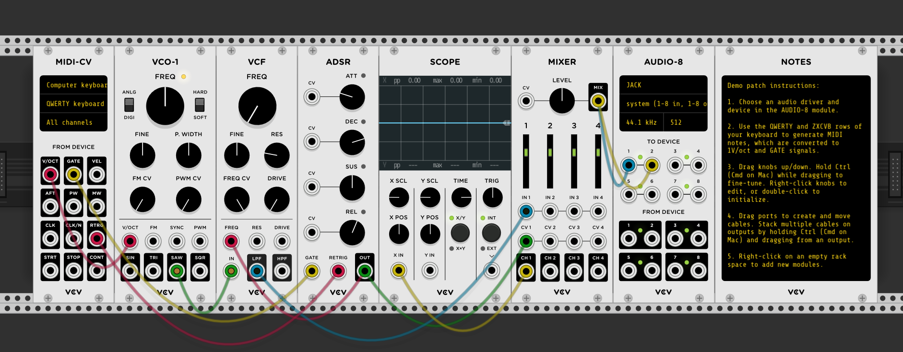

   * [Preface](#preface)
   * [Basic setup to get started](#basic-setup-to-get-started)
   * [Theory](#theory)
   * [Software](#software)
      * [DAWs](#daws)
      * [VSTs](#vsts)
      * [Other](#other)
   * [Hardware](#hardware)
      * [MIDI](#midi)
      * [Synths](#synths)
   * [Modular](#modular)
   * [List of All link mentioned](#list-of-all-link-mentioned)
      * [Software and tools](#software-and-tools)
      * [Cool People](#cool-people)
      * [Other Resources](#other-resources)
DELIMITEDFORTOC
# Preface

Hey there.

My name is Vega. I know there are plenty of tutorials and ways to learn online be it on YouTube, SkillShare, or online classes provided for free by various universities. The difference here is there is no bullshit, no babysitting, and lots of bias as a result of personal experience. My views of things like what sounds bad or what hardware you should buy to learn on will be expressed directly and bluntly. This isn't to say I won't explain my reasoning, just that I'm not going to be apologetic when I say a lot of the audiophile gear is trash or that hating on digital music is misguided - though I will still likely talk about  these things.

# Basic setup to get started

Here's the part where I'm supposed to explain how to read music or somethnig boring like that...
You know what? Screw. That. Let's. Make. Some. Noise.
To do that though we're gonna need just a few thins
Go download VCV Rack from https://vcvrack.com/ and depending on your OS you'll need some sound drivers, MAC guys, sorry, no idea. On Windows you'll want to use ASIO, if you dont know that is just go grab http://www.asio4all.org/ and use that,on linux you'll want to use Jack https://wiki.archlinux.org/index.php/JACK_Audio_Connection_Kit. On linux you may need to use a tool like Catia to actually connect the jack devices together (VCV to System Out)

Go ahead and fire up VCV and a template patch should have opened up that looks some thing like this:

# Theory

# Software

## DAWs

## VSTs

## Other

# Hardware

## MIDI

## Synths

# Modular

# List of All link mentioned
## Software and tools
\$ - Paid
! - Require paid software
* - Has paid features

https://github.com/cannc4/Siren -Siren- Tracker meets live coding
https://tidalcycles.org/index.php/Welcome -Tidal- Live coding enviroment
! https://github.com/carrierdown/mutate4l -Mutate4l- Live coding in Ableton Live
-ORCΛ- Live Coding in a game-of-life esque edditor

\* https://vcvrack.com/ -VCV Rack- Modular Synth Software
\* https://www.modulargrid.net/ -Modular Grid- an online tool for dreaming about hardware setups

\$ -Abletone Live-
\$ -Renoise-
\$ -Reaper
\$ -FL Studio-

## Cool People
https://twitter.com/RichardDevine
https://twitter.com/LOOKMUMNOCMPUTR

https://t.me/vcvrackchat

Neurotypique https://www.youtube.com/channel/UC4oBI5piGMznFMZdtEC0FhA

Omri Cohen, a Rack Master's YouTube Channel: https://www.youtube.com/channel/UCuWKHSHTHMV_nVSeNH4gYAg

Loopop
RedMeansRecording
AdamNeely
AndrewHuang
Rob Scallon https://www.youtube.com/watch?v=JeB3JnKp8To&list=FLFMnqfaTa1se1LfbCB3peJQ&index=4&t=116s, https://www.youtube.com/watch?v=48RVcbkhNHQ&list=FLFMnqfaTa1se1LfbCB3peJQ&index=26&t=879s,

Reddit: https://www.reddit.com/r/vcvrack/ , https://www.reddit.com/r/synthesizers/ , https://www.reddit.com/r/synthdiy/ , https://www.reddit.com/r/modular/

## Other Resources
https://learningmusic.ableton.com/

